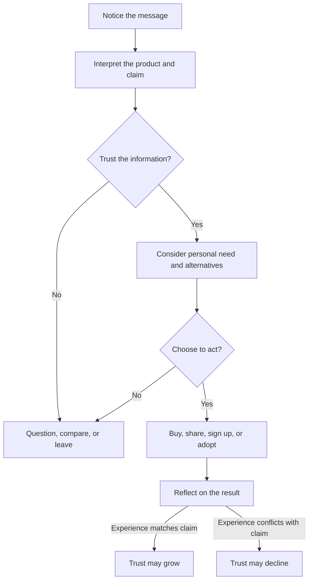
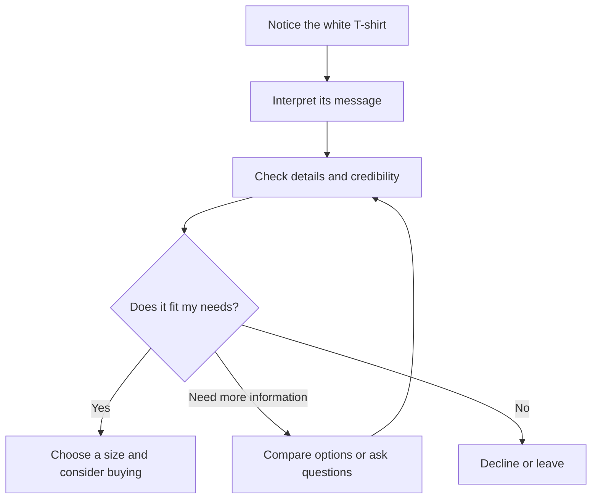

# Chapter 1: Persuasion and Human Decision-Making

Persuasion is part of ordinary life. A friend recommends a restaurant, a professor explains why a reading matters, and a package design suggests that a product is worth noticing. Designers, writers, and brands all use persuasion because communication does more than deliver information: it helps people decide what to notice, how to interpret it, whether to trust it, and what to do next.

## What Is Persuasion?

In plain language, **persuasion is the ethical attempt to influence how someone thinks, feels, or acts by presenting reasons, evidence, meanings, or experiences**. It does not guarantee agreement. The other person remains free to consider the message and accept, reject, or ignore it.

Persuasion can shape four connected parts of a decision:

- **Attention:** What gets noticed? A bold headline may make a plain white T-shirt stand out among many shirts.
- **Interpretation:** What does the thing seem to mean? The shirt might read as practical, luxurious, rebellious, or environmentally responsible depending on its presentation.
- **Trust:** Does the audience believe the claim and the communicator? Clear information, credible evidence, and consistent behavior can support trust.
- **Action:** What does the audience do? They might buy the shirt, compare alternatives, sign up for information, or decide not to proceed.

Persuasion is not limited to selling. A public-health message can persuade someone to get a vaccine, and a campus campaign can persuade students to recycle. In each case, the communicator is shaping a decision journey.

## Persuasion, Manipulation, and Coercion

These terms are related, but they are not interchangeable.

| Approach | How it treats the audience | Example involving a white T-shirt |
| --- | --- | --- |
| Persuasion | Gives the audience a meaningful chance to understand and choose | Explains the shirt's fabric, price, fit, and care instructions, then presents its everyday versatility |
| Manipulation | Tries to steer a decision through hidden, misleading, or unfair influence | Hides a recurring fee, uses a fake countdown, or implies that buying the shirt proves a person's worth |
| Coercion | Uses threats, force, or punishment to remove meaningful choice | Threatens a worker's job unless they buy the shirt |

The boundary is not simply whether influence is present. Influence is present in nearly all communication. The important questions are whether the message is truthful, whether relevant information is available, whether the audience can say no, and whether the method exploits a serious vulnerability.

An attractive photograph is not automatically manipulative. It becomes ethically troubling when the photograph creates a materially false impression, such as making a thin fabric appear opaque while the product description hides that it is see-through. Ethical persuasion respects agency: it makes a case without disguising the case.

## Cialdini's Principles of Influence

Robert Cialdini's work is commonly introduced through principles that describe patterns in how people respond to social situations. These principles are not magic buttons, and none of them proves that a claim is true. They can help a designer recognize why a message may feel compelling and also recognize when an appeal is being abused.

1. **Reciprocity:** People often feel inclined to return a benefit or favor. A useful sizing guide or genuinely helpful repair tutorial can create goodwill. The ethical limit is that a free resource should not be presented as a debt the audience must repay.
2. **Commitment and consistency:** After making a voluntary choice or stating a position, people often prefer actions that fit it. A shopper who chooses durable clothing may appreciate a shirt with transparent information about care and longevity. Designers should not turn a small click into a confusing chain of unwanted commitments.
3. **Social proof:** When uncertain, people often look at what others appear to choose or approve. Verified customer reviews can help someone judge fit. Manufactured reviews, undisclosed endorsements, and selective evidence undermine informed choice.
4. **Liking:** People are more open to messages from communicators they like, identify with, or find relatable. A warm, honest product story may make a brand approachable. It should not depend on flattery, stereotypes, or a simulated personal relationship that hides the sales purpose.
5. **Authority:** Expertise, credentials, and relevant experience can make information more credible. A textile specialist explaining fiber care may be useful. A lab coat, celebrity, or impressive title is not a substitute for relevant evidence.
6. **Scarcity:** Limited availability or time can increase perceived value and urgency. A truly limited production run may be worth explaining. A permanent "last chance" banner or invented shortage pressures people with false information.
7. **Unity:** People can feel connected to messages that express a shared identity or group membership. A local maker can invite customers into a real community of repair and reuse. The appeal becomes dangerous when it divides people, excludes outsiders, or treats group identity as proof that a purchase is right.

These principles can work together. A white T-shirt described as a limited release from a trusted local maker may use scarcity, authority, and unity at the same time. That combination is not automatically wrong; it raises the need for especially clear facts and a genuine reason for each claim.

| Principle | Mechanism | Ethical use | Misuse risk |
| --- | --- | --- | --- |
| Reciprocity | A genuine benefit can create goodwill and a wish to respond | Offer useful sizing or repair information with no hidden obligation | Turn a free sample or favor into pressure to buy |
| Commitment and consistency | People often align later choices with voluntary earlier choices | Help someone track a goal they chose | Escalate a small agreement into an unwanted commitment |
| Social proof | Others' choices can reduce uncertainty | Show verified, representative reviews | Use fake reviews, undisclosed endorsements, or selective evidence |
| Liking | Familiarity and identification can increase openness | Use a relatable voice while making the commercial purpose clear | Use flattery or manufactured intimacy to bypass judgment |
| Authority | Relevant expertise can make information easier to trust | Identify qualified experts and show supporting evidence | Treat status, costume, or celebrity as proof |
| Scarcity | Limited availability can make an option feel more valuable or urgent | State a real production limit or deadline accurately | Invent shortages or use endless false countdowns |
| Unity | Shared identity can create belonging and motivation | Invite people into a real, inclusive community | Exclude outsiders or imply group membership requires purchase |

## Other Useful Ideas

### Framing

The **framing effect** is the tendency for people to respond differently to equivalent information depending on how it is presented. The shirt itself has not changed, but the frame changes the question a person asks.

- "A white T-shirt made for everyday wear" frames it as practical.
- "A clean foundation for your wardrobe" frames it as versatile and identity-related.
- "A limited run from a neighborhood studio" frames it as local and scarce.

Framing is useful when it clarifies a real feature or possible use. It is misleading when it hides a relevant downside or makes an ordinary product sound extraordinary without evidence.

### Choice Architecture and Defaults

**Choice architecture** is the design of the environment in which people choose. Order, labels, comparison tools, and defaults all affect what is easy to notice or do. A store might show size information beside the shirt, make "no thanks" as visible as "add to cart," and leave optional newsletter signup unchecked.

Defaults are powerful because people often accept the path that requires the least effort. That can support good decisions, such as defaulting to a receipt-free purchase when the customer can easily choose paper. It can also become a dark pattern when an unwanted subscription is preselected or cancelation is made difficult. A useful test is whether the default serves the audience as well as the organization and whether changing it is clear and easy.

### Rhetorical Appeals and Elaboration

Classical rhetoric describes three useful kinds of appeal:

- **Ethos:** credibility and character, such as accurate product information and responsible behavior.
- **Pathos:** emotion, such as the comfort associated with a familiar shirt.
- **Logos:** reasoning and evidence, such as a comparison of fabric weight, price, and care requirements.

A strong message can use all three, but emotion should not replace facts. The **elaboration likelihood model** also reminds us that people sometimes think carefully about a message and sometimes rely on quick cues such as familiarity, appearance, or social proof. A designer should make important information available for careful evaluation instead of assuming that a polished surface is enough.

## A Simple Decision Journey

The following journey is not a claim that every person decides in the same order. It is a practical way to notice where design can help or mislead.

The final step matters. Persuasion does not end at the click or purchase. If the white T-shirt arrives with a poor fit, unclear care instructions, or quality that contradicts the presentation, the audience learns that the message was unreliable. Long-term trust depends on the experience matching the promise.

## The White T-Shirt: One Object, Several Frames

Imagine one plain white T-shirt with no change to its fabric, cut, or construction. Three presentations can invite different interpretations:

1. **The dependable basic:** A straightforward product photo, size chart, price, and care information emphasize usefulness and low uncertainty.
2. **The minimalist essential:** Spacious photography and language about simplicity frame the same shirt as a deliberate wardrobe choice. This can help an audience that values restraint, but it should not imply superior quality without evidence.
3. **The community uniform:** Photos of a real campus group wearing the shirt frame it as belonging and shared purpose. The group connection can be meaningful, but the message should not suggest that outsiders are lesser or that participation requires a purchase.

The physical product is unchanged. Attention, interpretation, trust, and action have changed because the surrounding signals changed. This is why branding and design matter: they organize meaning around an object. It is also why ethical responsibility matters: a frame should reveal a defensible possibility, not manufacture a false reality.

## Questions to Ask Before Trying to Persuade

- What decision am I asking someone to make, and why does it matter?
- What does the audience need to know to make a reasonably informed choice?
- Which parts of my message are facts, and which are interpretation or mood?
- Am I making the audience's choice clearer, or merely making refusal harder?
- Is any urgency, popularity, authority, or group identity claim real and relevant?
- Who could be especially vulnerable to this message or its consequences?
- Can someone say no, change their mind, or leave without unfair penalty?
- Will the actual experience of the product or service match the promise?

## Explore Further

For additional research, search for:

- Robert Cialdini principles of influence and ethical applications
- framing effect in psychology and behavioral economics
- choice architecture and dark patterns
- ethos pathos logos in rhetoric
- elaboration likelihood model and persuasive communication

## What You Should Remember

Persuasion helps shape attention, interpretation, trust, and action, but it should preserve meaningful choice. Cialdini's principles explain common social cues, while framing, choice architecture, and rhetoric show how messages and environments guide decisions. The same white T-shirt can mean different things in different presentations; ethical design makes those meanings useful and truthful rather than hiding important information or exploiting the audience.
=======
Imagine a plain white T-shirt. No logo, no pattern, no special story. Now imagine seeing it in three places: an everyday clothing catalog, a carefully styled fashion photograph, and a campus club's event announcement. The shirt stays the same. What you notice, what it means to you, and whether you want it may change.

That is where persuasion meets branding and design. A brand helps attach meaning to an offer; design makes parts of that meaning visible through words, images, layout, and interaction.

All T-shirt scenarios and sample advertising copy in this chapter are hypothetical teaching examples, not claims about actual products or studies.

## What Persuasion Does

**Persuasion is an attempt to influence what someone thinks, feels, or chooses through communication.** It can offer reasons, evoke emotions, or make information easier to notice. It does not guarantee agreement.

For a designer, four useful questions are:

- **Attention:** What will someone notice? A large photograph might draw attention to the shirt's shape before its price.
- **Interpretation:** What will they think it means? Styling the shirt with a simple outfit might suggest an uncomplicated wardrobe.
- **Trust:** What makes the message believable? Accurate measurements and clear return terms give someone information they can check.
- **Action:** What can they do next? A readable size guide can help them compare options, buy, or decide the shirt is unsuitable.

These are connected tasks, not a guaranteed sequence. Someone may check the price first, return to the photographs, or leave without buying. Ethical success can include helping someone recognize that an offer does not meet their needs.

This diagram is a simplified decision journey. A useful design supports every branch, including the exit.

## Persuasion, Manipulation, and Coercion

These concepts can overlap, but the distinctions help us evaluate a design:

- **Persuasion** tries to influence judgment. An ethical version supplies honest reasons and leaves room to disagree: show the shirt's measurements and explain how to compare them with a shirt you own.
- **Manipulation** steers a decision by misleading people, hiding relevant information, or exploiting vulnerabilities. A countdown that resets whenever the page reloads creates a false reason to hurry.
- **Coercion** uses force or credible threats to compel behavior. A supervisor threatening to cut an employee's shifts unless they buy the shirt would be using coercion.

Emotion alone does not make a message manipulative. A photograph of friends can honestly communicate the pleasure of spending time together. The ethical concern grows when the message deceives, exploits insecurity, or makes refusal costly. A technically available “no” is not enough if the interface hides it or the message threatens consequences.

## Cialdini's Principles of Influence

Psychologist Robert Cialdini's framework originally identified six major principles; he later added **unity**. The mechanisms below summarize his framework. They describe tendencies, not buttons that control everyone. See [Cialdini's overview at Influence at Work](https://www.influenceatwork.com/7-principles-of-persuasion/).

The applications and misuse examples are hypothetical design choices for our T-shirt.

| Principle | Mechanism | Ethical use | Misuse risk |
| --- | --- | --- | --- |
| Reciprocity | Receiving something can create a desire to give back. | Offer a useful clothing-care guide with no purchase obligation. | Imply that accepting free advice creates a debt to buy. |
| Commitment and consistency | People often want choices to align with earlier voluntary commitments. | Let shoppers who chose a simpler wardrobe goal save basic items for consideration. | Treat a saved shirt as a promise to purchase. |
| Social proof | Especially under uncertainty, people look to others' behavior for guidance. | Display authentic buyer reviews, including fit problems. | Invent reviews or conceal negative feedback. |
| Authority | Relevant expertise can make advice more persuasive. | Include a qualified textile specialist's actual assessment, if available. | Present a celebrity's fame as proof of fabric quality. |
| Liking | People are often more receptive to people they like. | Use a friendly presenter who explains the shirt accurately. | Fake personal friendship to pressure a sale. |
| Scarcity | Limited availability can increase perceived desirability or urgency. | Report a real stock limit for the selected size. | Invent shortages or deadlines. |
| Unity | A sense of shared identity can strengthen influence. | A real campus club can invite members to wear white shirts together. | Suggest that students who decline are disloyal or do not belong. |

Notice the difference between social proof and unity. Social proof involves looking at what others do; unity involves identifying with a shared group. Liking can mean enjoying a presenter's personality without feeling that you belong to the same community.

A principle does not establish product quality. Popularity cannot prove durability, and a stock shortage cannot prove that a shirt is worth its price. Pair persuasive cues with information that helps someone evaluate the actual offer.

## Beyond Cialdini: Two More Useful Ideas

### 1. Framing: What Kind of Choice Is This?

**Framing** means presenting information in a way that emphasizes a particular interpretation. Amos Tversky and Daniel Kahneman demonstrated that different descriptions of the same decision problem can shift preferences. Their work concerns decision framing; the branding examples below apply the broader idea of selective emphasis rather than reproduce their experiments. See [their 1981 paper, “The Framing of Decisions and the Psychology of Choice”](https://doi.org/10.1126/science.7455683).

Hold the shirt, price, and purchase terms constant. Change only the presentation:

| Frame | Sample copy | Design choice | Meaning emphasized |
| --- | --- | --- | --- |
| Everyday usefulness | “Start with a simple basic.” | Show the shirt in several everyday outfits. | Practical versatility |
| Personal style | “Make simplicity your signature.” | Use restrained typography and a carefully composed outfit photograph. | Deliberate self-expression |
| Shared identity | “Wear white for our club gathering.” | Show an actual club invitation with clear event details. | Participation and belonging |

The physical product has not improved. Each presentation invites a different answer to “Why would I want this?” Someone seeking an ordinary basic may find the first frame useful and the second unconvincing.

Framing becomes misleading when it implies unsupported facts. Minimal packaging does not establish environmental responsibility. A fashion photograph does not establish better stitching. If you claim the shirt is organic, ethically produced, or unusually durable, you need evidence beyond the design.

### 2. Elaboration Likelihood: How Much Thought Goes Into the Message?

Richard Petty and John Cacioppo's **elaboration likelihood model** explains persuasion in terms of how much people think through a message. At greater elaboration, the **central route** involves examining relevant arguments. At lower elaboration, the **peripheral route** relies more on cues or simple associations. Motivation and ability to consider the message matter; these are not fixed types of people. See [their 1986 account of the model](https://doi.org/10.1016/S0065-2601%2808%2960214-2).

Imagine shopping for the white T-shirt. When fit matters and you have time, you might study measurements, fabric information, and returns. While scrolling quickly, you might respond mainly to an appealing presenter or photograph. The same person can approach the same product differently in different situations.

For design, this suggests two responsibilities: make the main message easy to understand, and keep supporting details easy to find. Use an inviting photograph alongside readable specifications. Do not bury material information because a visitor might be in a hurry. Attractive presentation can invite attention, but it cannot supply missing evidence.

## Ethics Belongs in the Design

A purchase count alone cannot tell you whether persuasion helped the buyer. Consider whether people understood the total cost, chose knowingly, and could change their minds under the stated terms.

For the T-shirt page, make fees and return conditions visible before purchase. Avoid preselected extras, fake reviews, and buttons that shame someone for declining. Use readable text and clear labels so that understanding the offer does not depend on spotting faint fine print.

Be especially careful with belonging. Inviting students to wear white to a gathering can communicate a shared activity. Implying they must buy this particular shirt to have friends exploits a different pressure. If a shirt they already own works, say so.

## Questions to Ask Before Trying to Persuade

1. What decision am I trying to influence, and how could it benefit this person?
2. What does this audience need to know, including costs, limitations, and alternatives?
3. Which claims can I support, and what might my imagery imply without saying directly?
4. Am I using real expertise, reviews, availability, and community ties?
5. Can someone compare options, take time, and decline without punishment or shame?
6. Could this approach exploit financial stress, insecurity, or difficulty understanding the interface?
7. How will I check comprehension and satisfaction as well as purchases?

Try answering these questions for one row of the framing table. If the case for your design depends on the buyer misunderstanding something, revise it.

## Explore Further

These are **suggestions for external research**, not additional evidence already reviewed for this chapter. Use a library catalog or scholarly search tool:

- Search **Robert Cialdini Influence unity six seven principles**. Compare an earlier account with one that includes unity.
- Search **Tversky Kahneman 1981 framing decisions psychology choice**. Identify what stayed constant and what changed between descriptions.
- Search **Petty Cacioppo elaboration likelihood model motivation ability**. Look for how evidence and presentation cues work under different conditions.
- Search **deceptive design patterns online shopping consumer research**. Find a documented example and explain how the interface limits informed choice.

Check authorship, publication context, and whether a source reports research or merely offers marketing advice. Do not assume a result from one setting predicts every audience's response.

## What You Should Remember

- Persuasion can shape attention, interpretation, trust, and action while leaving room for refusal.
- Manipulation undermines informed choice; coercion uses force or threats.
- Cialdini's principles describe useful influence tendencies, not guaranteed outcomes or evidence of quality.
- Framing changes what a shirt means; the audience's level of thought affects how they evaluate the message.
- Good design makes a truthful offer understandable and keeps the decision in the person's hands.
