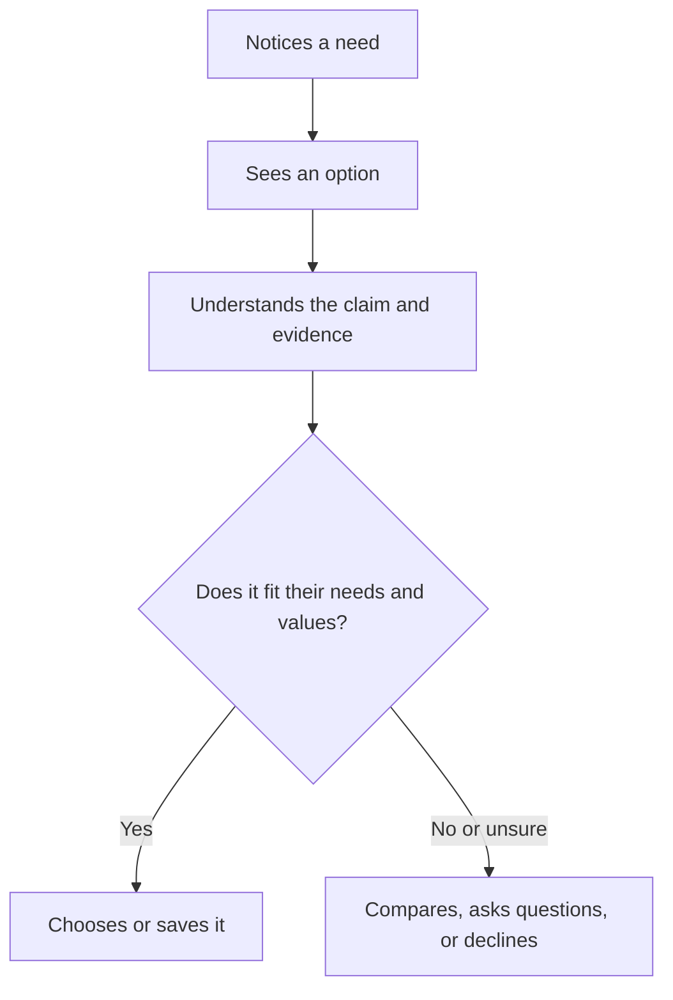

# Chapter 1: Persuasion and Human Decision-Making

Persuasion is part of ordinary life. A roommate recommends a movie, a professor explains why an assignment matters, and a brand asks us to choose one product over another. Learning about it does not mean learning to trick people. It means learning to communicate choices clearly and responsibly.

## What Is Persuasion?

**Persuasion is the ethical effort to shape another person's attention, interpretation, trust, or action by giving them reasons, evidence, and a meaningful way to choose.**

It can help someone notice a problem, understand why an option matters, or decide what to do next. Good persuasion respects the fact that the other person can say no.

For example, a clothing page might describe a plain white T-shirt as "a soft, heavyweight everyday layer," show its fabric details, and let a shopper compare sizes and prices. The page is trying to influence a decision, but the shopper still has useful information and control.

### Persuasion, manipulation, and coercion

These ideas are related, but they are not the same.

| Approach | What it does | Does the person have a real, informed choice? |
| --- | --- | --- |
| Persuasion | Gives relevant reasons and presents an option clearly | Yes |
| Manipulation | Hides important information or exploits a weakness to get a result | Not fully |
| Coercion | Uses threats, force, or serious pressure | No |

Manipulation might mean using a fake countdown timer to rush a purchase or hiding cancellation instructions. Coercion is more direct: for example, threatening a penalty unless someone agrees. Ethical persuasion is transparent about important limits, costs, and alternatives. It helps people decide; it does not try to take decision-making away from them.

## Cialdini's Principles of Influence

Psychologist Robert Cialdini is known for describing recurring patterns that can influence decisions. His original, widely taught set contains six principles: reciprocity, commitment and consistency, social proof, liking, authority, and scarcity. He later discussed **unity** as an additional principle. These are not magic buttons. They describe common tendencies, so they should be used with evidence and care.

- **Reciprocity:** People often want to return a genuine favor. A store can offer a useful sizing guide without making the guide a hidden obligation to buy.
- **Commitment and consistency:** After people make a small, voluntary commitment, they often prefer choices consistent with it. Someone who saves a favorite shirt may be more open to receiving a restock alert.
- **Social proof:** When uncertain, people look to what similar people do or value. Verified customer reviews can reduce uncertainty; invented reviews are deceptive.
- **Liking:** We are more open to people or brands that feel familiar, respectful, or relatable. A friendly, inclusive product page can build liking without pretending to be a customer's friend.
- **Authority:** Relevant expertise can make a claim more believable. A textile expert explaining fabric care is more appropriate evidence than a celebrity making unsupported durability claims.
- **Scarcity:** Limited availability can make an option seem more valuable or urgent. It is ethical only when the limit is real and clearly explained.
- **Unity:** Shared identity can create connection: "made for campus commuters," for example. It becomes harmful when it pressures people to prove they belong by buying something.

## A Decision Journey

Design can support a decision at each stage, from first noticing an option to deciding whether it fits.

The important ethical detail is the last branch. A good design leaves room to compare, ask questions, or decline. It does not turn uncertainty into panic.

## Other Useful Ideas

### Framing

**Framing** is the way information is presented. The facts may stay the same, but the meaning people take from them can change.

The same white T-shirt could be framed as:

- a "minimal wardrobe staple" for someone building a small closet;
- a "breathable base layer" for someone planning to exercise; or
- a "blank canvas for screen printing" for a student club.

None of these descriptions changes the shirt. Each highlights a different use. Ethical framing does not hide information that would change a reasonable person's decision, such as shrinkage, fabric composition, or total cost.

### Defaults and friction

People often go with the option that is already selected or easiest to complete. This is called a **default effect**. Designers can also add or remove **friction**: extra steps, confusing forms, or hard-to-find choices.

An ethical clothing site might remember a shopper's chosen size so they do not need to select it again. An unethical site might pre-check an extra charge or make the unsubscribe button difficult to find. Convenience should help the person's goal, not quietly serve a different goal.

### Ethos, logos, and pathos

Rhetoric offers another practical set of tools:

- **Ethos** builds credibility: accurate product details and honest policies.
- **Logos** gives reasons and evidence: measurements, material information, and a price comparison.
- **Pathos** connects to feelings: showing how a shirt might feel comfortable, simple, or expressive.

Strong communication usually combines all three. Feeling interested is fine; being unable to check a claim is not.

## Principles, Uses, and Risks

| Principle or idea | Mechanism | Ethical use | Misuse risk |
| --- | --- | --- | --- |
| Reciprocity | A real favor can create goodwill | Offer a genuinely helpful fabric-care guide | Make a "free" gift feel like a debt |
| Commitment and consistency | Small voluntary choices can guide later choices | Let shoppers save a shirt or request a restock notice | Treat a small click as pressure to purchase |
| Social proof | People use others' experiences when uncertain | Display verified, relevant reviews | Use fake reviews or hide negative feedback |
| Liking | Familiarity and warmth can increase openness | Use respectful, clear language | Manufacture false intimacy or belonging |
| Authority | Credible expertise can support a claim | Identify qualified sources for material claims | Borrow status for claims the person cannot support |
| Scarcity | A real limit can create urgency | State a genuine production limit or sale end date | Use fake low-stock messages or reset timers |
| Unity | Shared identity can create connection | Speak to a real community without excluding others | Shame people into buying to prove membership |
| Framing | Emphasis changes how a choice is interpreted | Highlight a relevant benefit while giving full details | Hide costs, tradeoffs, or limitations |
| Defaults and friction | Easy paths strongly affect behavior | Make a helpful preference easy to keep or change | Preselect paid extras or make cancellation difficult |
| Ethos, logos, and pathos | Credibility, reasons, and emotion shape judgment | Pair accurate evidence with human-centered storytelling | Use emotion to distract from missing evidence |

## Questions to Ask Before Trying to Persuade

- What decision am I asking this person to make?
- What information would they need to make that decision freely?
- Is the claim accurate, specific, and possible to check?
- Would I be comfortable explaining this design choice openly to the audience?
- Does the design make declining, comparing, or changing one's mind reasonably easy?
- Who could be harmed, excluded, or pressured by this message?

If these questions reveal a problem, revise the message or the design before trying to make it more persuasive.

## Explore Further

If you want to research these ideas, search for:

- "Robert Cialdini principles of influence reciprocity social proof"
- "default effect behavioral economics examples"
- "ethos logos pathos rhetoric examples"
- "dark patterns consumer design ethics"

When reading, check who wrote the source, what evidence it uses, and whether it distinguishes research findings from marketing advice.

## What You Should Remember

Persuasion helps people notice, understand, trust, and act. It is ethical when it gives people truthful, relevant information and preserves their ability to choose. Principles such as social proof, scarcity, framing, defaults, and rhetoric can make communication more effective, but each can also be misused. The white T-shirt stays the same; the story around it changes what people notice. Use that power to clarify value, not to hide tradeoffs or pressure people.
