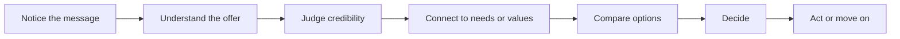

# Persuasion and Human Decision-Making

## What Is Persuasion?

Persuasion is the process of helping people notice, understand, trust, and act on an idea. It is not magic, and it is not only about selling. It is a tool for shaping attention, interpretation, trust, and action.

A good way to think about it is this: persuasion does not create a decision out of nothing. It helps people move from a problem, belief, or desire toward a clearer choice.

That is different from coercion, where force or pressure removes real choice. It is also different from manipulation, where someone hides the real purpose, uses deception, or exploits a person's confusion or vulnerability.

Ethical persuasion respects the audience. It gives people useful reasons, honest context, and room to say no.

## Why Persuasion Matters in Design

Designers often help people decide something: whether to click, trust, buy, join, donate, learn, or remember.

Persuasion becomes part of design when a message, interface, image, or product presentation helps someone:

- see the problem clearly
- understand the value
- feel confidence in the option
- imagine the next action

This is why persuasion and design are connected. A product can be useful, but if the story, layout, or context do not explain its value clearly, attention and trust can drift away.

## Persuasion Is Not Manipulation

Persuasion and manipulation can use some of the same tools, but they differ in purpose and respect.

| Persuasion | Manipulation |
| --- | --- |
| Gives people a clearer way to think about a choice | Tries to control the choice while hiding the real motive |
| Uses accurate information and fair framing | Uses deception, confusion, or missing information |
| Leaves room for disagreement or refusal | Pressures people so refusal feels difficult |
| Treats the audience as capable of judgment | Treats the audience as something to exploit |

For example, it is persuasive to say that a plain white T-shirt is made from soft cotton and works well as an everyday basic. It becomes manipulative if the seller invents fake scarcity, hides poor quality, or implies that people will be socially rejected without it.

## Robert Cialdini's Major Principles of Influence

Psychologist Robert Cialdini identified common patterns in how people respond to influence. These principles are useful, but they are not automatic tricks. Their ethical value depends on whether they help people make better choices or push people into worse ones.

| Principle | Mechanism | Ethical use | Misuse risk |
| --- | --- | --- | --- |
| Reciprocity | People often want to return a favor, gift, or helpful action. | Offer useful samples, guidance, or support with no hidden trap. | Use guilt or unwanted favors to pressure someone. |
| Commitment and consistency | People like to act in ways that match their values and earlier choices. | Help people follow through on goals they already care about. | Trap people into decisions they do not truly want. |
| Social proof | People look at what others do to understand what is normal or valuable. | Show real reviews, examples, or community behavior. | Fake popularity or exaggerate crowd approval. |
| Authority | People pay attention to credible experts or trusted institutions. | Show relevant credentials, experience, and evidence. | Pretend expertise or borrow credibility misleadingly. |
| Liking | People are more open to people, brands, or messages they like and trust. | Build connection through honesty, clarity, and shared values. | Use fake friendliness, flattery, or charm to lower skepticism. |
| Scarcity | People value things more when they believe availability is limited. | Explain real limits, deadlines, or inventory honestly. | Create false urgency or fear of missing out. |
| Unity | People respond to a sense of shared identity or belonging. | Connect a message to a genuine community or purpose. | Pretend closeness or pressure people through group identity. |

These principles explain why persuasion often works through context, not just facts. A white T-shirt can feel different if it is framed as a trusted basic, a limited drop, a community uniform, or a choice made by people the audience admires.

## Other Useful Ideas

### Framing

Framing means that the same information can feel different depending on how it is presented. "90% success" sounds more positive than "10% failure," even though both describe the same situation.

For a white T-shirt, "minimal everyday essential" frames the shirt as practical and calm. "Blank canvas for self-expression" frames the same shirt as creative and personal.

### Loss Aversion

Loss aversion is the idea that people often feel the pain of losing something more strongly than the pleasure of gaining something similar. This is why "do not miss your chance" can feel more urgent than "here is a benefit."

Used ethically, loss aversion can remind people of a real consequence. Used badly, it turns into fear-based pressure.

### Ethos, Pathos, and Logos

Classical rhetoric gives designers three helpful lenses:

- Ethos means credibility and trust.
- Pathos means emotion and human connection.
- Logos means reasoning and evidence.

A strong message often balances all three. A T-shirt brand might use ethos by explaining its materials, pathos by showing how the shirt fits someone's daily life, and logos by listing price, care instructions, and durability.

## A Simple Decision Journey

This journey shows that persuasion is not just the final push to buy or click. It starts with attention and moves through understanding, trust, relevance, and choice.

## Questions to Ask Before Trying to Persuade

Before asking someone to act, a designer should ask:

- What problem am I actually helping this person solve?
- What information does the audience need to make a fair choice?
- Am I making the offer clearer, or am I creating pressure?
- What assumptions am I making about the audience?
- Could a reasonable person say no without being punished, shamed, or tricked?
- Am I using evidence, or am I leaning on fear and emotion alone?
- What would a skeptical person notice immediately?

If a persuasive message cannot survive honest review, the message probably needs better thinking.

## White T-Shirt Example

Imagine the same plain white T-shirt shown in four different ways:

| Frame | Message | Persuasive idea |
| --- | --- | --- |
| Everyday basic | "Soft cotton. Clean fit. Easy to wear every week." | Clarity, usefulness, and low risk |
| Limited drop | "Available this weekend only in a small batch." | Scarcity, if the limit is real |
| Creative canvas | "A blank base for your own style." | Identity and self-expression |
| Trusted staple | "Chosen by students who want one shirt that works anywhere." | Social proof and practical belonging |

The shirt has not changed. The cotton, color, and shape may be identical. What changes is the audience's interpretation: basic, rare, expressive, or trusted.

That is the central lesson. Persuasion often changes the meaning around a product before it changes the product itself.

## Ethical Cautions

Persuasion becomes dangerous when it hides costs, invents urgency, imitates trust, or targets people when they are vulnerable. A persuasive design should help people make a decision they can still feel comfortable with later.

Ethical persuasion asks for attention without stealing judgment.

## Explore Further

For outside research, search for:

- Cialdini principles of influence
- ethical persuasion versus manipulation
- behavioral economics framing examples
- loss aversion in decision-making
- ethos pathos logos in rhetoric
- persuasion and user experience design

## What You Should Remember and Take

- Persuasion helps shape attention, interpretation, trust, and action.
- Persuasion is not the same as coercion or manipulation.
- Cialdini's principles describe common influence patterns, but they must be used honestly.
- Framing, loss aversion, and rhetoric help explain why the same facts can feel different.
- A plain white T-shirt can become many different "products" depending on the meaning built around it.
- Good persuasion respects the audience's ability to think, compare, question, and say no.
