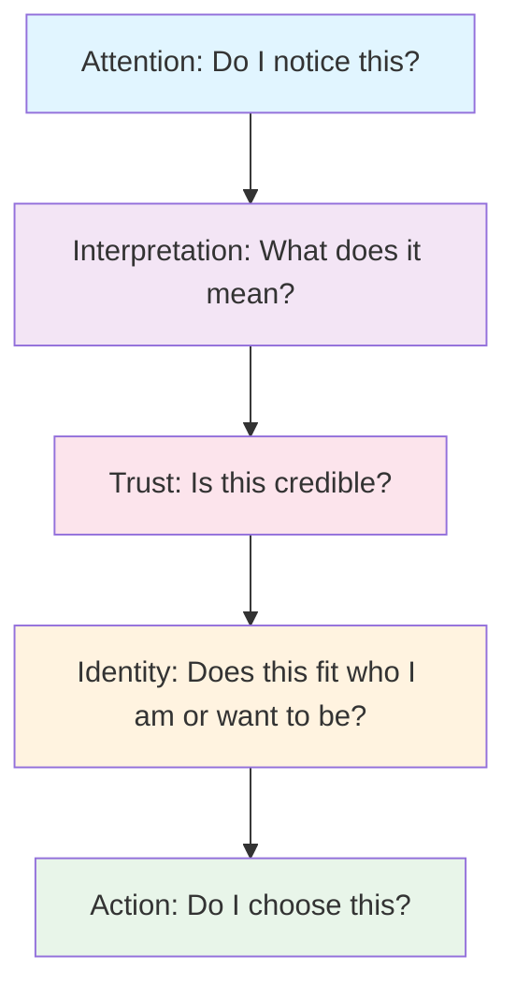

# Persuasion and Human Decision-Making

## What Is Persuasion?

Persuasion is the act of shaping how someone pays attention, interprets information, builds trust, and decides to act. It's not about forcing someone to do something. It's about making a case that lands—changing the frame around a choice so that option starts to look different, more attractive, or more true.

Think of persuasion as the art of presentation. The same object can look entirely different depending on how you show it, who shows it, and what story comes with it.

## Persuasion Is Not Manipulation or Coercion

This matters. Here's the difference:

**Coercion** takes away choices. It uses force, threats, or restrictions. You *have* to do it.

**Manipulation** uses deception. It hides information, lies, or exploits vulnerabilities. You're tricked into doing it.

**Persuasion** respects choice. It offers a case, an interpretation, a meaning. You *can* choose it because you've been given information and invited to see it a certain way. The person still has a real option to say no.

The T-shirt example: You can *force* someone to buy a T-shirt (coercion), *trick* them into thinking it's something it's not (manipulation), or *show them* how wearing it connects to something they care about—authenticity, status, identity, comfort (persuasion). Persuasion keeps the choice real.

## Robert Cialdini's Principles of Influence

Cialdini's framework identifies six (later seven) patterns in how people decide. These are *reliable* patterns—they work often enough that skilled communicators use them intentionally:

### 1. Reciprocity
People feel obligated to return favors. If you give something—time, attention, a sample—people tend to give back.

**In practice:** Provide value first. A free trial, a useful tip, honest feedback. People often reciprocate by buying, trusting, or listening more carefully.

### 2. Commitment and Consistency
Once people commit to something—even a small thing—they tend to follow through to appear consistent with their earlier choice.

**In practice:** Ask for a small commitment first ("Will you read this?", "Do you agree this matters?"). People then become more willing to commit to larger steps.

### 3. Social Proof
People look at what others are doing and assume it's the right choice. If everyone else is doing it, it must be okay.

**In practice:** Show that others like it, use it, or believe it. Testimonials, reviews, and visible adoption work because people trust the crowd.

### 4. Authority
People trust and follow experts or credible sources.

**In practice:** Establish competence visibly. Show credentials, knowledge, or clear track record. People are more persuaded by someone they perceive as authoritative.

### 5. Liking
People are more persuaded by people and ideas they like. Similarity, compliments, and attractiveness all increase liking.

**In practice:** Find common ground. Show genuine interest. Make the message appealing, not just correct. People buy from people they like.

### 6. Scarcity
People value things that are rare or becoming unavailable.

**In practice:** Limited availability, exclusive access, or time-sensitive offers create urgency. People fear missing out (FOMO is real).

## Two More Useful Ideas

### Loss Aversion (Behavioral Economics)
People feel the pain of losing something about twice as intensely as the pleasure of gaining the same thing. We're wired to avoid losses more than to pursue gains.

**In practice:** Frame your case in terms of what people risk losing, not just what they gain. "Don't miss out" often works better than "You'll get this."

### Framing (Rhetoric and Psychology)
The way you present information changes how people interpret it. "90% of people succeeded" and "10% of people failed" are the same fact, but they land differently.

**In practice:** Control the frame. Choose your language carefully. A "discount" frames price; "investment" frames value; "risk" frames loss.

## Principles in Practice: The Comparison Table

| Principle | Mechanism | Ethical Use | Misuse Risk |
|-----------|-----------|------------|------------|
| Reciprocity | People return favors | Provide real value first; build genuine relationships | Fake generosity; obligation disguised as kindness |
| Commitment | Consistency drives behavior | Ask for small commitments that align with values | Escalating demands; locking people into unfair deals |
| Social Proof | Others' choices guide ours | Show genuine adoption and satisfaction | Fake reviews; manufactured consensus |
| Authority | Experts are trusted | Build real competence; be transparent about limits | False credentials; appeals to unqualified "experts" |
| Liking | People buy from people they like | Find real common ground; be authentic | Manipulation through false friendship |
| Scarcity | Rarity creates urgency | Highlight genuine limitations | Artificial scarcity; false deadlines |
| Loss Aversion | Loss hurts more than gain | Frame real risks honestly | Exaggerate danger; create false panic |
| Framing | Language shapes meaning | Choose words that accurately reflect reality | Mislead with selective language |

## A Simple Decision Journey

Here's how persuasion actually works in someone's mind:

Notice: **attention comes first**. You can't persuade someone who isn't paying attention. Then interpretation, trust, and identity all matter before action happens.

## The T-Shirt Example: Three Frames

The same plain white T-shirt. Same fabric, same fit, same price. Three completely different presentations:

**Frame 1: Premium Basics**
- Framing: "Essential Luxury"
- Persuasion: authority (made by expert manufacturers) + quality (durable, timeless)
- Social proof: worn by minimalists and designers
- Message: "You have refined taste"
- Price anchor: $45

**Frame 2: Activism & Meaning**
- Framing: "Your Choice Matters"
- Persuasion: reciprocity (part of proceeds support the cause) + scarcity (limited run) + identity (you're part of a movement)
- Message: "Wear your values"
- Price anchor: $35 (with cause claim)

**Frame 3: Fast Fashion & Trend**
- Framing: "Right Now"
- Persuasion: social proof (everyone's wearing plain white) + scarcity (only in stock this week) + liking (celebrity wears it)
- Message: "You're current, you're in"
- Price anchor: $15

Same shirt. Three completely different stories. Three different kinds of people will believe each one.

## Questions to Ask Before Trying to Persuade

Before you use persuasion—in design, writing, or communication—ask yourself:

1. **Am I being truthful?** Is the frame accurate, even if selective? Does the core claim hold up?

2. **Am I respecting choice?** Are people getting real information? Could they reasonably say no?

3. **Am I exploiting a vulnerability?** Am I targeting someone's fear, shame, or insecurity unfairly?

4. **What would I want to know?** If I were on the receiving end, what information would I need to feel good about this choice?

5. **Could this backfire?** If the person later discovers I wasn't fully honest, will they feel betrayed?

6. **Who benefits most?** Am I trying to help them, or just help myself?

## Explore Further

If you want to go deeper:

- Search for "Robert Cialdini principles of influence" and look for his books or academic articles on persuasion and decision-making
- Look for behavioral economics papers on loss aversion and framing effects
- Research rhetorical strategies in advertising and political communication
- Study how different brands frame identical products differently

## What You Should Remember

Persuasion is everywhere. It's not evil—it's how we communicate, market, teach, and ask for what we need. But it has power, so it comes with responsibility.

The best persuasion is honest. It shows something true in a compelling way. It respects the other person's intelligence and their right to choose.

The tools—reciprocity, social proof, framing—are neutral. They can be used to help people make choices that serve them, or to exploit them. You get to decide which.

The T-shirt stays the same. The meaning changes. Understanding *how* meaning changes is the whole point.
