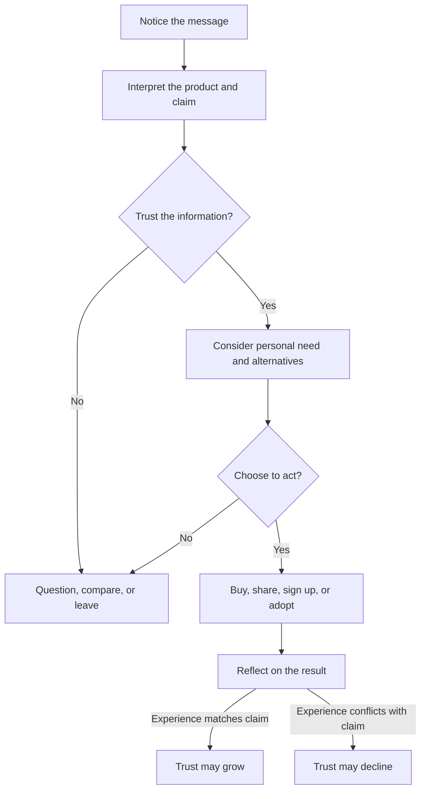

# Chapter 1: Persuasion and Human Decision-Making

Persuasion is part of ordinary life. A friend recommends a restaurant, a professor explains why a reading matters, and a package design suggests that a product is worth noticing. Designers, writers, and brands all use persuasion because communication does more than deliver information: it helps people decide what to notice, how to interpret it, whether to trust it, and what to do next.

## What Is Persuasion?

In plain language, **persuasion is the ethical attempt to influence how someone thinks, feels, or acts by presenting reasons, evidence, meanings, or experiences**. It does not guarantee agreement. The other person remains free to consider the message and accept, reject, or ignore it.

Persuasion can shape four connected parts of a decision:

- **Attention:** What gets noticed? A bold headline may make a plain white T-shirt stand out among many shirts.
- **Interpretation:** What does the thing seem to mean? The shirt might read as practical, luxurious, rebellious, or environmentally responsible depending on its presentation.
- **Trust:** Does the audience believe the claim and the communicator? Clear information, credible evidence, and consistent behavior can support trust.
- **Action:** What does the audience do? They might buy the shirt, compare alternatives, sign up for information, or decide not to proceed.

Persuasion is not limited to selling. A public-health message can persuade someone to get a vaccine, and a campus campaign can persuade students to recycle. In each case, the communicator is shaping a decision journey.

## Persuasion, Manipulation, and Coercion

These terms are related, but they are not interchangeable.

| Approach | How it treats the audience | Example involving a white T-shirt |
| --- | --- | --- |
| Persuasion | Gives the audience a meaningful chance to understand and choose | Explains the shirt's fabric, price, fit, and care instructions, then presents its everyday versatility |
| Manipulation | Tries to steer a decision through hidden, misleading, or unfair influence | Hides a recurring fee, uses a fake countdown, or implies that buying the shirt proves a person's worth |
| Coercion | Uses threats, force, or punishment to remove meaningful choice | Threatens a worker's job unless they buy the shirt |

The boundary is not simply whether influence is present. Influence is present in nearly all communication. The important questions are whether the message is truthful, whether relevant information is available, whether the audience can say no, and whether the method exploits a serious vulnerability.

An attractive photograph is not automatically manipulative. It becomes ethically troubling when the photograph creates a materially false impression, such as making a thin fabric appear opaque while the product description hides that it is see-through. Ethical persuasion respects agency: it makes a case without disguising the case.

## Cialdini's Principles of Influence

Robert Cialdini's work is commonly introduced through principles that describe patterns in how people respond to social situations. These principles are not magic buttons, and none of them proves that a claim is true. They can help a designer recognize why a message may feel compelling and also recognize when an appeal is being abused.

1. **Reciprocity:** People often feel inclined to return a benefit or favor. A useful sizing guide or genuinely helpful repair tutorial can create goodwill. The ethical limit is that a free resource should not be presented as a debt the audience must repay.
2. **Commitment and consistency:** After making a voluntary choice or stating a position, people often prefer actions that fit it. A shopper who chooses durable clothing may appreciate a shirt with transparent information about care and longevity. Designers should not turn a small click into a confusing chain of unwanted commitments.
3. **Social proof:** When uncertain, people often look at what others appear to choose or approve. Verified customer reviews can help someone judge fit. Manufactured reviews, undisclosed endorsements, and selective evidence undermine informed choice.
4. **Liking:** People are more open to messages from communicators they like, identify with, or find relatable. A warm, honest product story may make a brand approachable. It should not depend on flattery, stereotypes, or a simulated personal relationship that hides the sales purpose.
5. **Authority:** Expertise, credentials, and relevant experience can make information more credible. A textile specialist explaining fiber care may be useful. A lab coat, celebrity, or impressive title is not a substitute for relevant evidence.
6. **Scarcity:** Limited availability or time can increase perceived value and urgency. A truly limited production run may be worth explaining. A permanent "last chance" banner or invented shortage pressures people with false information.
7. **Unity:** People can feel connected to messages that express a shared identity or group membership. A local maker can invite customers into a real community of repair and reuse. The appeal becomes dangerous when it divides people, excludes outsiders, or treats group identity as proof that a purchase is right.

These principles can work together. A white T-shirt described as a limited release from a trusted local maker may use scarcity, authority, and unity at the same time. That combination is not automatically wrong; it raises the need for especially clear facts and a genuine reason for each claim.

| Principle | Mechanism | Ethical use | Misuse risk |
| --- | --- | --- | --- |
| Reciprocity | A genuine benefit can create goodwill and a wish to respond | Offer useful sizing or repair information with no hidden obligation | Turn a free sample or favor into pressure to buy |
| Commitment and consistency | People often align later choices with voluntary earlier choices | Help someone track a goal they chose | Escalate a small agreement into an unwanted commitment |
| Social proof | Others' choices can reduce uncertainty | Show verified, representative reviews | Use fake reviews, undisclosed endorsements, or selective evidence |
| Liking | Familiarity and identification can increase openness | Use a relatable voice while making the commercial purpose clear | Use flattery or manufactured intimacy to bypass judgment |
| Authority | Relevant expertise can make information easier to trust | Identify qualified experts and show supporting evidence | Treat status, costume, or celebrity as proof |
| Scarcity | Limited availability can make an option feel more valuable or urgent | State a real production limit or deadline accurately | Invent shortages or use endless false countdowns |
| Unity | Shared identity can create belonging and motivation | Invite people into a real, inclusive community | Exclude outsiders or imply group membership requires purchase |

## Other Useful Ideas

### Framing

The **framing effect** is the tendency for people to respond differently to equivalent information depending on how it is presented. The shirt itself has not changed, but the frame changes the question a person asks.

- "A white T-shirt made for everyday wear" frames it as practical.
- "A clean foundation for your wardrobe" frames it as versatile and identity-related.
- "A limited run from a neighborhood studio" frames it as local and scarce.

Framing is useful when it clarifies a real feature or possible use. It is misleading when it hides a relevant downside or makes an ordinary product sound extraordinary without evidence.

### Choice Architecture and Defaults

**Choice architecture** is the design of the environment in which people choose. Order, labels, comparison tools, and defaults all affect what is easy to notice or do. A store might show size information beside the shirt, make "no thanks" as visible as "add to cart," and leave optional newsletter signup unchecked.

Defaults are powerful because people often accept the path that requires the least effort. That can support good decisions, such as defaulting to a receipt-free purchase when the customer can easily choose paper. It can also become a dark pattern when an unwanted subscription is preselected or cancelation is made difficult. A useful test is whether the default serves the audience as well as the organization and whether changing it is clear and easy.

### Rhetorical Appeals and Elaboration

Classical rhetoric describes three useful kinds of appeal:

- **Ethos:** credibility and character, such as accurate product information and responsible behavior.
- **Pathos:** emotion, such as the comfort associated with a familiar shirt.
- **Logos:** reasoning and evidence, such as a comparison of fabric weight, price, and care requirements.

A strong message can use all three, but emotion should not replace facts. The **elaboration likelihood model** also reminds us that people sometimes think carefully about a message and sometimes rely on quick cues such as familiarity, appearance, or social proof. A designer should make important information available for careful evaluation instead of assuming that a polished surface is enough.

## A Simple Decision Journey

The following journey is not a claim that every person decides in the same order. It is a practical way to notice where design can help or mislead.

The final step matters. Persuasion does not end at the click or purchase. If the white T-shirt arrives with a poor fit, unclear care instructions, or quality that contradicts the presentation, the audience learns that the message was unreliable. Long-term trust depends on the experience matching the promise.

## The White T-Shirt: One Object, Several Frames

Imagine one plain white T-shirt with no change to its fabric, cut, or construction. Three presentations can invite different interpretations:

1. **The dependable basic:** A straightforward product photo, size chart, price, and care information emphasize usefulness and low uncertainty.
2. **The minimalist essential:** Spacious photography and language about simplicity frame the same shirt as a deliberate wardrobe choice. This can help an audience that values restraint, but it should not imply superior quality without evidence.
3. **The community uniform:** Photos of a real campus group wearing the shirt frame it as belonging and shared purpose. The group connection can be meaningful, but the message should not suggest that outsiders are lesser or that participation requires a purchase.

The physical product is unchanged. Attention, interpretation, trust, and action have changed because the surrounding signals changed. This is why branding and design matter: they organize meaning around an object. It is also why ethical responsibility matters: a frame should reveal a defensible possibility, not manufacture a false reality.

## Questions to Ask Before Trying to Persuade

- What decision am I asking someone to make, and why does it matter?
- What does the audience need to know to make a reasonably informed choice?
- Which parts of my message are facts, and which are interpretation or mood?
- Am I making the audience's choice clearer, or merely making refusal harder?
- Is any urgency, popularity, authority, or group identity claim real and relevant?
- Who could be especially vulnerable to this message or its consequences?
- Can someone say no, change their mind, or leave without unfair penalty?
- Will the actual experience of the product or service match the promise?

## Explore Further

For additional research, search for:

- Robert Cialdini principles of influence and ethical applications
- framing effect in psychology and behavioral economics
- choice architecture and dark patterns
- ethos pathos logos in rhetoric
- elaboration likelihood model and persuasive communication

## What You Should Remember

Persuasion helps shape attention, interpretation, trust, and action, but it should preserve meaningful choice. Cialdini's principles explain common social cues, while framing, choice architecture, and rhetoric show how messages and environments guide decisions. The same white T-shirt can mean different things in different presentations; ethical design makes those meanings useful and truthful rather than hiding important information or exploiting the audience.