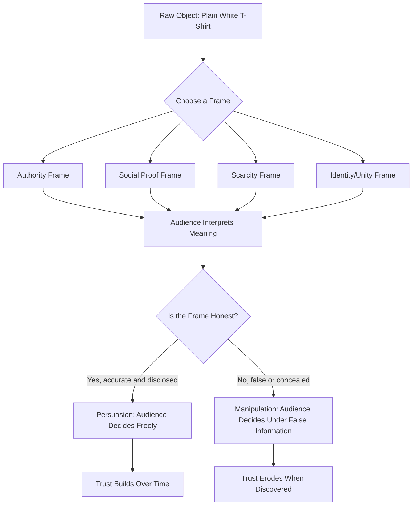

# Chapter 1: Persuasion — Shaping Attention, Interpretation, Trust, and Action

## Why Persuasion Deserves Serious Thought

Somewhere on a shelf in a college dorm is a plain white T-shirt. No logo, no story, no price tag glued to it yet. It's just cotton, cut into a familiar shape.

Now imagine four different versions of that exact same shirt:

- One is folded on a table at a thrift store, priced at $3.
- One hangs on a minimalist rack at a boutique, priced at $68, with a small tag that reads "Made in Portugal. 100% organic cotton."
- One is being worn by a musician you admire, in a photo captioned "my go-to shirt."
- One is on a mannequin next to a sign that says "Only 2 left."

The shirt hasn't changed. What changed is the *frame* around it — the context, the story, the signals of scarcity or status or craftsmanship that shape how you interpret it. That shift, from object to meaning, is the whole subject of this chapter.

**Persuasion** is the deliberate use of communication to shape what someone pays attention to, how they interpret it, whether they trust it, and what they do next. It's not a dirty trick bolted onto "real" communication — it's a core function of nearly all communication that isn't purely mechanical. A recipe instructs. A safety manual instructs. But an advertisement, a political speech, a nonprofit's fundraising letter, a designer's product page, a friend convincing you to try a new restaurant — these are all trying to move you toward a belief or an action. Understanding how that movement works is a basic form of literacy for anyone who will design, write, market, or lead in the 21st century.

This chapter treats persuasion as a *tool*, and like any tool, its value depends on who's holding it and why.

## Persuasion, Coercion, and Manipulation: Not the Same Thing

These three words get used interchangeably in casual conversation, but they describe meaningfully different relationships between a communicator and an audience.

- **Persuasion** works *through* the other person's reasoning and free choice. You offer reasons, framing, or emotional appeals, and the person remains free to evaluate and reject them. The boutique tag telling you the shirt is organic cotton is persuasion — it's true information, offered to help you decide.
- **Coercion** bypasses reasoning by removing choice, typically through force or threat. "Buy this shirt or I'll take your other clothes" is coercion. There's no real "yes" available.
- **Manipulation** sits in between, and is the trickiest to spot. It technically preserves the appearance of choice, but it works by exploiting psychological weaknesses, hiding relevant information, or using false framing to steer someone toward a decision they wouldn't make with full, clear information. Printing "Only 2 left!" on a shirt when there are actually 200 in the stockroom is manipulation — it uses a real psychological trigger (scarcity) but attaches it to a lie.

A useful test: **if the audience found out exactly how you were influencing them, would they feel respected or used?** Genuine persuasion usually survives that disclosure. Manipulation usually doesn't.

This distinction matters enormously for designers, marketers, and communicators, because the same psychological techniques can serve either purpose. Scarcity, social proof, and authority are neutral tools — the ethics live in how honestly they're applied.

## Robert Cialdini's Principles of Influence

Psychologist Robert Cialdini spent years studying what makes people say "yes," and organized his findings into a set of principles that remain the most widely cited framework in the field. Here they are, applied to our recurring T-shirt.

1. **Reciprocity** — People feel obligated to return favors. A brand that gives you a free tote bag with your shirt purchase, or a store that lets you sample a fabric swatch, is activating this instinct.
2. **Commitment and Consistency** — Once people commit to something small, they tend to act consistently with that commitment later. A shopper who fills out a "style quiz" on a clothing site becomes more likely to buy the shirt the quiz recommends — they've already invested in defining their own taste.
3. **Social Proof** — People look to others' behavior to decide what's correct, especially under uncertainty. "Bestseller" badges, customer photos wearing the shirt, and star ratings all lean on this.
4. **Liking** — People are more easily persuaded by those they like — often based on similarity, compliments, or cooperation. A brand run by someone who feels relatable, or an ad featuring people who look like the target customer, activates this.
5. **Authority** — People defer to perceived experts or legitimate authorities. "Recommended by textile engineers" or a shirt endorsed by a well-known designer borrows credibility.
6. **Scarcity** — People value things more when they seem limited or about to disappear. "Only 2 left" or "Limited drop" taps this — which is exactly why it's so easy to abuse.
7. **Unity** (added in Cialdini's later work) — People are more persuadable by those who share an identity with them — not just similarity, but a sense of shared "we." A shirt branded around a shared cause, alma mater, or subculture ("For people who grew up skating") invokes unity, which tends to be even stronger than simple liking.

These aren't manipulation tactics by default — they're descriptions of how human judgment actually works, largely because they were useful mental shortcuts for most of human history. The organic-cotton tag is authority. A friend's honest recommendation is social proof. The ethics depend on whether the underlying claim is true and whether the audience's interests are respected.

## Beyond Cialdini: Four More Concepts Worth Knowing

Cialdini's principles are the most famous framework, but they're far from the whole picture. A well-rounded designer should also understand these ideas.

### Framing Effects (Behavioral Economics)

How information is presented changes how it's evaluated, even when the underlying facts are identical. "90% cotton, sustainably farmed" and "not 100% synthetic" can describe the same shirt, but one frames it as an achievement and the other as a concession. Framing isn't lying — the facts can be entirely accurate — but it directs attention toward some facts and away from others.

### The Elaboration Likelihood Model (Psychology)

This model, developed by Petty and Cacioppo, describes two routes people take when processing a persuasive message. The **central route** involves careful evaluation of the actual arguments — someone reading a detailed breakdown of the shirt's fabric weight and stitching quality. The **peripheral route** relies on surface cues — an attractive layout, a likable spokesperson, an appealing color palette — when the audience is less motivated or able to think carefully. Neither route is inherently better; the point is that effective communicators calibrate which route their audience is likely using and design accordingly.

### Ethos, Pathos, and Logos (Classical Rhetoric)

Long before modern psychology, Aristotle identified three appeals a speaker can make: **ethos** (credibility of the speaker), **pathos** (emotional resonance with the audience), and **logos** (logical argument and evidence). A T-shirt ad that shows a founder's story (ethos), a warm image of a friend wearing the shirt at a reunion (pathos), and a fabric-durability chart (logos) is using all three appeals at once — which is often what strong persuasive communication does.

### Loss Aversion (Behavioral Economics)

People tend to feel the pain of a loss about twice as strongly as the pleasure of an equivalent gain. This is part of why "Only 2 left" is so effective — it's not just about scarcity signaling quality, it's about triggering the fear of missing out on something you could have had. Designers who understand loss aversion should also recognize how easily it tips into manipulation when the loss is fabricated.

## The Same Shirt, Four Frames

| Frame | Primary Technique | What It Emphasizes | Audience Feeling |
|---|---|---|---|
| Thrift store, $3 | Minimal framing | Utility, low stakes | "It's just a shirt" |
| Boutique, $68, "Made in Portugal, organic cotton" | Authority + Logos | Craftsmanship, ethical sourcing | "This is a considered purchase" |
| Musician's photo, "my go-to shirt" | Liking + Social Proof + Pathos | Identity, aspiration | "I could be like them" |
| "Only 2 left" | Scarcity + Loss Aversion | Urgency, exclusivity | "I might miss out" |

Notice that none of these frames change a single fiber of the shirt. They change what the *audience believes the shirt means* — which is the entire game of persuasion.

## How a Persuasive Frame Gets Built

## Ethical Cautions

- **Truth is not optional.** A scarcity claim, an authority claim, or a social-proof claim must be factually accurate. "Only 2 left" when there are 200 in stock is not clever marketing — it's a lie wearing a marketing costume.
- **Vulnerability changes the ethics.** A technique that's a fair nudge for a financially secure adult can be exploitative when aimed at children, people in financial distress, or people making decisions under high emotional stress.
- **Consent and transparency matter.** Persuasion that could survive being explained openly to the audience is on much firmer ethical ground than persuasion that depends on concealment.
- **Aggregate effects count too.** A single scarcity banner is minor. A design system built entirely around manufactured urgency, dark patterns, and constant psychological pressure is a different thing, even if each individual piece looks small.
- **Cialdini's principles are descriptive, not permission slips.** Knowing that people respond to authority doesn't make it ethical to fabricate authority.

## Questions a Designer Should Ask Before Trying to Persuade Someone

1. What am I asking this person to believe or do?
2. Is every factual claim in my message true and verifiable?
3. Would this message still work if the audience fully understood the psychological technique being used?
4. Am I giving the audience real information to evaluate, or just surface cues designed to bypass their judgment?
5. Who is most vulnerable to this message, and would I be comfortable if they were the one seeing it?
6. Does this decision genuinely serve the audience's interests, or only mine?
7. If this person found out later exactly how I persuaded them, would they feel respected — or used?

## Explore Further

If you want to go deeper, these search topics are a good starting point:

- Robert Cialdini "Influence: The Psychology of Persuasion" — the original source for the six/seven principles
- Elaboration Likelihood Model Petty Cacioppo — the central vs. peripheral processing framework
- Daniel Kahneman "Thinking, Fast and Slow" — foundational work on framing and loss aversion
- Aristotle's Rhetoric ethos pathos logos — classical rhetorical appeals
- "dark patterns" UX design ethics — how persuasive techniques become manipulative in interface design
- Prospect Theory Kahneman Tversky — the formal behavioral-economics model behind loss aversion

## What You Should Remember

- Persuasion shapes attention, interpretation, trust, and action through communication the audience remains free to evaluate and reject.
- Persuasion, coercion, and manipulation are distinct: coercion removes choice, manipulation fakes honest choice through concealment or exploitation, and persuasion respects the audience's judgment.
- Cialdini's seven principles — reciprocity, commitment/consistency, social proof, liking, authority, scarcity, and unity — describe real patterns in human decision-making, not manipulation tactics by default.
- Framing effects, the Elaboration Likelihood Model, classical rhetoric's ethos/pathos/logos, and loss aversion each add depth beyond Cialdini's framework.
- The same object — like a plain white T-shirt — can be framed in radically different ways without changing at all; persuasion lives in the frame, not the object.
- The core ethical test is simple to state and hard to fake: would this technique still work, and would the audience still feel respected, if they knew exactly how you were using it?
