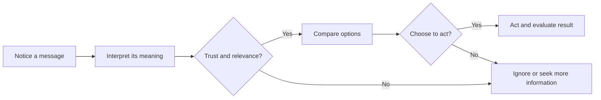

# Chapter 1: Persuasion and Human Decision-Making

Persuasion is part of almost every designed experience. A headline persuades someone to keep reading. A package persuades someone to pick it up. A product page persuades someone to trust a seller enough to buy. Understanding persuasion helps designers make these choices deliberately and responsibly.

## What Persuasion Means

Persuasion is the process of shaping another person's attention, interpretation, trust, or action through communication and experience. It does not guarantee a particular result. The other person still has the ability to think, question, accept, reject, or delay.

A persuasive message might:

- direct attention to a problem or possibility;
- give information a particular frame or meaning;
- provide reasons to trust a person, organization, or product; or
- make a possible action clearer and easier to take.

For example, a plain white T-shirt can be described as a practical everyday basic, a carefully made long-lasting garment, or a blank canvas for self-expression. The shirt itself may not change, but the words, images, evidence, and setting change what people notice and what they think the shirt means.

## Persuasion Is Not Manipulation

Persuasion and manipulation can both influence decisions, but they differ in important ways. Ethical persuasion gives people relevant information, respects their ability to choose, and makes claims that can be defended. Manipulation hides important information, exploits a vulnerability, creates a misleading impression, or pressures a person past meaningful choice.

Coercion is more extreme: it uses threats, force, or punishment to remove a person's practical freedom to decide. A designer should pay attention to the person's ability to say no. A clear product comparison can persuade. A fake countdown timer that resets whenever the page reloads is manipulation because it manufactures urgency instead of communicating a real limit.

A useful test is: **Would the audience still consider the message fair if they knew how it was designed to influence them?** This is not a perfect test, but it can reveal hidden pressure and weak evidence.

## Cialdini's Principles of Influence

Robert Cialdini's research and writing made several recurring influence patterns widely known. These principles describe tendencies, not laws. People do not respond identically, and a principle is not proof that a claim is true.

1. **Reciprocity:** People often feel inclined to return a useful gift, favor, or service. A free sample can create goodwill, but it should not be presented as a debt.
2. **Commitment and consistency:** After making a choice or stating a value, people often prefer actions that fit that earlier commitment. A goal-setting tool can use this to support follow-through; it becomes risky when a small harmless action is used to trap someone into an unexpected obligation.
3. **Social proof:** When uncertain, people often look at what similar others do. Honest reviews and clearly identified customer examples can reduce uncertainty; invented reviews and misleading popularity counts deceive.
4. **Liking:** People are generally more open to requests from people or organizations they like, recognize, or see as similar to themselves. Warm, respectful communication helps; manufactured intimacy or targeted flattery can exploit that openness.
5. **Authority:** Credentials, expertise, and relevant experience can help people evaluate a claim. Authority should be verifiable and relevant to the decision; a celebrity endorsement does not automatically establish technical expertise.
6. **Scarcity:** Limited availability can make an option seem more valuable or urgent. A genuinely limited production run can be explained; false scarcity pressures people to act before they can assess the offer.

Cialdini later discussed **unity**, or a sense of shared identity, as another influence principle. It can help a community coordinate around real shared values, but identity-based messages need care because they can exclude outsiders or turn disagreement into a test of belonging.

## Two More Useful Ideas

### Framing

Framing is the way a communicator selects and emphasizes some aspects of a situation. The facts may stay the same while the interpretation changes. Saying that a T-shirt is “95 percent cotton” emphasizes one fact; saying it contains “5 percent other fiber” emphasizes another. Neither wording is automatically dishonest, but a responsible designer gives the context needed to understand the claim.

Framing is unavoidable. The ethical question is what the frame helps people notice and what it leaves them unable to see. A product description should not highlight softness while concealing a major durability problem or an important care requirement.

### Loss Aversion and Choice Architecture

Loss aversion is the common tendency for people to experience a possible loss as more powerful than an equivalent gain. “Avoid missing the last shipment” may feel more urgent than “Receive a shirt this week.” Used carefully, a reminder can help someone act on a real deadline. Used carelessly, fear of missing out can make a person buy something they do not need.

Choice architecture is the design of the options and defaults around a decision. A form with a clear opt-in choice, readable prices, and an easy way to decline supports informed action. A confusing form, a preselected paid add-on, or a hidden cancellation path steers behavior by making one choice unnecessarily difficult.

## Principles, Mechanisms, and Risks

| Principle or idea | Mechanism | Ethical use | Misuse risk |
| --- | --- | --- | --- |
| Reciprocity | A useful gift can create goodwill and a wish to respond | Offer a sample or helpful guide with no hidden obligation | Make a gift feel like a debt or hide the sales purpose |
| Commitment and consistency | People tend to align later actions with earlier choices | Help someone set a voluntary, realistic goal | Use a minor commitment to pressure an unrelated purchase |
| Social proof | Other people's behavior helps resolve uncertainty | Show genuine, relevant reviews with context | Invent reviews or imply that popularity proves quality |
| Liking and unity | Familiarity, similarity, and belonging increase openness | Build respectful community around real shared values | Use flattery, stereotypes, or exclusion to gain compliance |
| Authority | Relevant expertise can make information easier to evaluate | Identify qualified sources and explain their relevance | Borrow status or celebrity to imply unsupported expertise |
| Scarcity and loss aversion | Limited options and possible losses increase urgency | State real inventory or deadline limits plainly | Fake countdowns, false scarcity, or fear-based pressure |
| Framing | Emphasis changes how people interpret the same information | Present accurate facts in a clear, useful context | Omit material facts or use selective wording to mislead |
| Choice architecture | Defaults and layouts shape which actions feel easy | Make the beneficial and reversible choice clear | Hide fees, preselect extras, or make refusal difficult |

## A Simple Decision Journey

A person rarely moves from seeing a message directly to acting. They notice something, interpret it, decide whether it is credible and relevant, compare options, and then choose whether to act.

The designer can support this journey with clear information and a usable path. The designer cannot ethically guarantee that every person should end at the same action.

## The White T-Shirt Example

Imagine the same plain white T-shirt photographed on a neutral background.

- **Practical basic:** “A dependable white layer for everyday wear.” The message emphasizes versatility and ease.
- **Craft object:** “A carefully constructed shirt designed for repeated wear.” The message invites attention to materials, construction, and durability, so it should provide evidence for those claims.
- **Community symbol:** “The shirt for people who choose less and make more.” The message uses identity and shared values, but it should not pretend that buying the shirt alone proves a person's character.
- **Limited release:** “Available in this first run while current stock lasts.” This can ethically use scarcity only if the limit is real and accurately described.

The physical object remains the same. Persuasion changes the surrounding meaning, expectations, and reasons for action. That is why design decisions deserve ethical scrutiny even when the product is ordinary.

## Questions to Ask Before Trying to Persuade

- What decision am I asking someone to make, and do they have a meaningful way to decline?
- What does the audience need to know to judge this fairly?
- Which facts am I emphasizing, and which relevant facts might disappear from view?
- Is my evidence accurate, current, and relevant to the claim?
- Am I using urgency, identity, authority, or social pressure in a way the audience would consider fair?
- Could a child, a stressed person, or someone with less expertise misunderstand this message?
- Will the audience benefit from the action, or mainly the organization making the request?
- Would I be comfortable explaining the persuasive technique openly?

## Explore Further

For deeper study, search for:

- Robert Cialdini's six principles of influence and his later discussion of unity;
- framing effects and prospect theory in behavioral economics;
- loss aversion and choice architecture;
- the elaboration likelihood model of persuasion;
- informed consent and dark patterns in user experience design.

Check the author, publication, date, and evidence when evaluating outside material. Search suggestions are starting points, not substitutes for source evaluation.

## What You Should Remember

Persuasion shapes attention, meaning, trust, and action while leaving room for choice. Cialdini's principles help explain common influence patterns, but they do not make every tactic ethical. Framing, loss aversion, and choice architecture show that the surrounding presentation matters as much as the object itself. Good design gives people reasons they can inspect, information they can use, and a real chance to decide. 
