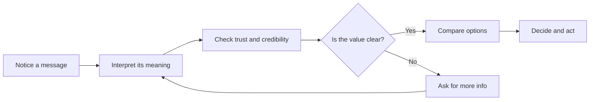

# Chapter 1: Persuasion and Human Decision-Making

## What is persuasion?

Persuasion is the process of shaping how people notice, understand, trust, and act on information. It is not just advertising or sales talk. It is part of everyday communication: a teacher clarifying a concept, a friend recommending a restaurant, a designer choosing the right visual signals for a product, or a brand trying to explain why a product matters.

At its best, persuasion helps people make better decisions by making relevant information easier to see, understand, and compare. At its worst, persuasion can hide important facts, pressure people, or exploit confusion.

A useful way to think about persuasion is this:

- attention: what gets noticed first
- interpretation: how meaning is assigned
- trust: whether the message feels credible
- action: what the person decides to do next

A good persuasive message does not force a person to act. It helps a person see a reason to act.

## Persuasion is not the same as coercion or manipulation

Persuasion is different from coercion and manipulation.

- Persuasion gives reasons, context, and evidence.
- Coercion uses pressure, threats, or force.
- Manipulation uses hidden influence, deception, or emotional pressure to bypass a person's careful judgment.

A persuasive message may still be strong, direct, and emotionally resonant, but it should respect the person's ability to choose. If someone is rushed, misled, or trapped, the communication is no longer just persuasion. It becomes pressure or exploitation.

This distinction matters for designers, marketers, and communicators. An ethical communicator tries to make information clearer and more relevant. An unethical communicator tries to confuse, frighten, or isolate the listener until they act without thinking.

## Robert Cialdini's major principles of influence

Robert Cialdini is often cited for identifying patterns that regularly shape human behavior. These principles are useful because they explain why people often respond to a message before they have consciously reasoned through everything.

### 1. Reciprocity

People feel obliged to return a favor or a kindness. If someone gives us something valuable, we often feel a need to repay it in some way.

Example: a clothing brand might include a genuinely useful wash-and-care guide with its plain white T-shirt. The guide can make a shopper more open to the brand, but it should not create a hidden obligation to buy.

### 2. Commitment and consistency

People prefer to act in ways that are consistent with what they have already said or done. Once a person makes a small public commitment, it becomes harder to back away from a larger one.

Example: a person who says, "I care about durable basics," may be more likely to consider the same white T-shirt when its real construction and care instructions support that claim.

### 3. Social proof

People look to others to decide what is normal, safe, or desirable. If many other people are doing something, it often feels more trustworthy.

Example: verified customer reviews saying that a white T-shirt holds its shape after washing can make the purchase feel less risky. Reviews must be real and representative.

### 4. Authority

People tend to trust experts, titles, and familiar institutions. A message often becomes more persuasive when it appears to come from a credible source.

Example: a textile specialist explaining the shirt's fabric weight and care needs can be useful; an impressive-looking title without relevant expertise is not.

### 5. Liking

We are more likely to say yes to people we like, connect with, or find relatable. Familiarity, similarity, and warmth all matter.

Example: a brand whose models and writing feel relatable may make a shopper more comfortable considering its white T-shirt.

### 6. Scarcity

People often value something more when it feels limited or hard to get. Scarcity creates urgency.

Example: a true notice that a particular run of white T-shirts is nearly sold out may help a shopper plan. A fake countdown timer turns scarcity into manipulation.

### 7. Unity

People are often more receptive to people and groups they see as part of "us"—a shared family, community, identity, or purpose. Unity is related to liking, but it is specifically about belonging to the same group.

Example: a campus organization may present the white T-shirt as a shirt for its volunteer day. That shared purpose can be meaningful, as long as the message does not suggest that someone must buy it to belong.

## Other useful ideas from psychology and communication

Cialdini gives a strong foundation, but persuasion also draws from other fields.

### Framing

Framing is how a message is shaped to influence interpretation. The same fact can look very different depending on how it is presented.

Example: "90% of customers are satisfied" sounds positive, while "10% of customers are dissatisfied" highlights risk. Both statements can be true, but they frame the same situation differently.

Framing matters because decision-making is rarely purely rational. People respond strongly to how information is organized, emphasized, and weighted.

### Loss aversion

People tend to feel the pain of losing something more strongly than the pleasure of gaining something equivalent. This makes threats, urgency, and risk warnings powerful.

Example: a promotion that says, "Don't miss the final chance" often works better than one that says, "You can save money if you buy now." The first message appeals to fear of loss.

### Rhetorical appeals: ethos, pathos, and logos

Persuasion usually works through more than one channel.

- ethos: credibility and trust
- pathos: emotion and identification
- logos: logic and evidence

A strong message often balances all three. A slogan can be memorable, but a product claim feels more convincing when it also seems credible and grounded in reason.

### Cognitive load

People do not process every detail equally well. If a message is crowded, confusing, or overloaded with unnecessary information, the audience may tune out or respond poorly.

A clear message reduces cognitive load. It helps people focus on what matters.

## A practical table: principle, mechanism, ethical use, misuse risk

| Principle | Mechanism | Ethical use | Misuse risk |
| --- | --- | --- | --- |
| Reciprocity | People feel they should repay kindness or value | Offer helpful information, samples, or service without pressure | Guilt-tripping people into buying or agreeing |
| Commitment and consistency | People like to stay consistent with their prior choices | Encourage thoughtful commitments, not forced ones | Trapping people in choices they did not intend to make |
| Social proof | People copy what seems common or accepted | Show real customer feedback and transparent evidence | Fake reviews, exaggerated popularity, social pressure |
| Authority | People trust expertise and status | Use credible expertise clearly and honestly | Pretending to be an expert or hiding conflicts of interest |
| Liking | People respond more to people they identify with | Build rapport through clarity, respect, and relevance | Manipulative flattery or fake familiarity |
| Scarcity | Limited availability creates urgency | Clearly state real constraints and deadlines | Artificial scarcity or fear-based pressure |
| Unity | Shared identity or purpose builds connection | Invite genuine participation in a group or cause | Making belonging conditional on a purchase |
| Framing | Context changes interpretation | Present options fairly and honestly | Distorting the decision by hiding alternatives |
| Loss aversion | Fear of missing out motivates action | Use urgency to help people act on real needs | Exploiting anxiety to create rushed decisions |

## A simple decision journey

This diagram is intentionally simple. Persuasion is not a magic switch. It usually works through a sequence of attention, interpretation, and trust before action happens.

## Questions to Ask Before Trying to Persuade

Before trying to influence someone, a designer or communicator should pause and ask:

- What problem is really being solved here?
- What does the audience actually need or value?
- Am I presenting the truth clearly, or am I hiding the harder parts?
- Am I using evidence, or am I relying on pressure?
- Is urgency real, or am I inventing a reason to rush?
- Am I helping the person decide, or am I steering them away from their own judgment?
- What would I think if this were described from the other side?

Good persuasion is not about making people choose your side without thinking. It is about making a good case in a way that is honest, clear, and respectful.

## White T-shirt example

A plain white T-shirt is a useful case study because the physical product does not change. The same shirt can be framed in many different ways.

### Option 1: The practical T-shirt

This version emphasizes comfort, cleanliness, and versatility. It is a reliable everyday item.

- message: "A plain, dependable shirt for daily wear"
- persuasion style: utility, simplicity, function
- emotional tone: practical and calm

### Option 2: The premium T-shirt

This version highlights quality, material, and status. It asks the customer to think of the shirt as an elevated essential.

- message: "A carefully made shirt for people who value quality"
- persuasion style: authority, scarcity, status
- emotional tone: confidence and exclusivity

### Option 3: The identity T-shirt

This version connects the product to social meaning, culture, or self-expression.

- message: "Wear a statement that reflects your values"
- persuasion style: identity, social proof, liking
- emotional tone: belonging and expression

### The same shirt, three frames

Imagine that each version is the same plain white, cotton T-shirt: same fabric, fit, price, and manufacturing. Only the communication changes.

| Frame | What the audience is invited to notice | Example headline | Ethical boundary |
| --- | --- | --- | --- |
| Practical | Its role as an easy everyday basic | "One clean, simple layer for busy mornings." | Do not imply exceptional durability unless it has been tested. |
| Premium | Care, materials, or construction | "An everyday essential, made with careful attention to detail." | Do not use luxury language to hide ordinary quality. |
| Identity | The meaning a wearer connects to it | "A simple blank canvas for your own style." | Do not claim the shirt proves someone is stylish, responsible, or part of a group. |

The shirt remains the same, but the framing changes what people notice and how they interpret it. This is a key idea in persuasion: the product is not only what it is physically; it is also the story, context, and value that surround it. Ethical framing adds perspective; it does not replace facts.

## Ethical caution

Persuasion is often strongest when it is honest and useful. It becomes troubling when it uses fear, confusion, or hidden manipulation to bypass a person's judgment.

A designer should ask not only, "Will this persuade people?" but also, "Is this fair? Is it truthful? Does it help people make a good decision?"

## Explore Further

If you want to extend this chapter, search for:

- Cialdini principles explained in plain language
- ethical influence vs manipulation
- framing effects in marketing and design
- loss aversion examples in everyday decisions
- rhetoric: ethos, pathos, and logos for beginners
- decision-making and cognitive bias in behavioral economics

These search suggestions can help you find explanations written for students and general readers without relying on invented sources or URLs.

## What You Should Remember

Persuasion is not about forcing people to obey. It is about helping people notice, understand, trust, and act on information in a meaningful way.

The main lesson is simple: the strongest persuasive communication is usually clear, credible, relevant, and fair. The same product can be sold in many ways, but the best persuasion does not hide the truth. It helps people see value without taking away their ability to decide for themselves.
