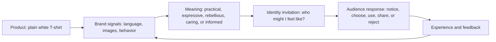

# Chapter 2: Brand Archetypes and Meaning

Products do not arrive in people's minds as neutral objects. A plain white T-shirt can suggest practicality, discipline, rebellion, comfort, or creativity depending on the story and signals around it. **Brand archetypes** are a framework for planning those signals. They help a brand choose a recognizable pattern of character, motivation, and story so that an audience can quickly understand what the brand seems to stand for.

The practical question is:

> What does the audience get to feel, imagine, or become by choosing this brand?

An archetype does not replace product quality or evidence. It gives those facts a meaningful context. A shirt still needs a comfortable fit and accurate description, but its name, photography, language, packaging, and community can invite different interpretations of the same physical item.

## Archetypes as a Branding Framework

An archetype is a generalized cultural and narrative pattern. In branding, it is a planning tool for making choices more coherent:

- **Motivation:** What does this brand want to help people pursue?
- **Behavior:** How does it speak, act, and solve problems?
- **Emotional promise:** What might the audience feel when interacting with it?
- **Identity invitation:** What kind of person or community might the audience imagine joining?

For example, a brand using the Sage pattern may emphasize learning, evidence, and clarity. A brand using the Jester pattern may emphasize play, surprise, and relief from routine. Neither pattern is inherently better. Each creates different expectations and attracts attention from different audiences.

Archetypes are especially useful when a team has many design decisions to make. They can help answer questions such as: Should the product photograph feel quiet or energetic? Should the copy teach, challenge, reassure, or entertain? Should the packaging feel carefully controlled or handmade? A clear archetypal direction gives these choices a shared logic.

## A Useful Set of Archetypes

The following set is broad enough for practical brand analysis. The descriptions are starting points, not complete definitions.

| Archetype | Central drive | Audience may feel, imagine, or become | Common signals |
| --- | --- | --- | --- |
| Explorer | Freedom and discovery | Independent, capable, and open to experience | Maps, movement, field stories, adaptable products |
| Sage | Understanding and truth | Informed, thoughtful, and better equipped to judge | Evidence, explanations, experts, clarity |
| Creator | Making something original | Expressive, inventive, and able to bring ideas into form | Process, craft, experimentation, distinctive details |
| Ruler | Order and responsibility | In control, accomplished, and well organized | Structure, standards, leadership, refinement |
| Caregiver | Protection and support | Looked after, useful to others, and part of a caring system | Warmth, service, reassurance, practical help |
| Rebel | Challenging the usual order | Independent, bold, and willing to resist convention | Contrast, provocation, direct language, disruption |
| Hero | Growth through effort | Stronger, more capable, and ready to overcome a challenge | Progress, discipline, achievement, action |
| Everyperson | Belonging and equality | Included, understood, and comfortable being ordinary | Familiar language, accessibility, shared routines |
| Innocent | Safety and optimism | Hopeful, uncomplicated, and able to trust | Simplicity, freshness, lightness, positive language |
| Jester | Enjoyment and play | Amused, relaxed, and free to be less serious | Humor, surprise, bright energy, wit |
| Lover | Connection and appreciation | Attentive, attractive, and emotionally engaged | Sensory detail, intimacy, beauty, devotion |
| Magician | Transformation and possibility | Able to see a new world or a new version of self | Wonder, before-and-after change, symbolic language |

These patterns can overlap. A design studio might combine Creator and Sage: it can make unusual work while explaining its decisions carefully. A community clothing project might combine Caregiver and Everyperson: it can offer practical support while making participation feel open to everyone.

## Archetypes Are Not Destiny

Archetypes are models, not literal personality diagnoses. They do not prove that a customer, designer, or organization has one fixed psychological type. A person may be adventurous in one setting, cautious in another, and playful with friends. A brand can also express several tendencies over time.

Context matters. The meaning of independence, beauty, authority, or community changes across cultures, generations, places, and situations. A symbol that feels welcoming to one audience may feel exclusive to another. A team should test its assumptions with real audience members rather than treating an archetype worksheet as universal truth.

There are other limits to remember:

- An archetype cannot repair a poor product or justify an unsupported claim.
- A brand should not reduce an audience to a stereotype.
- A recognizable pattern should leave room for contradiction and growth.
- Different audiences may interpret the same signal differently.
- The framework should serve strategy, not become a label that limits creative thinking.

The goal is not to announce, "This brand is a Hero." The goal is to make deliberate choices about the experience the brand creates and then check whether audiences actually experience it that way.

## The Same White T-Shirt, Different Archetypes

Consider one plain white T-shirt. Its fabric, cut, and construction remain exactly the same. Only its positioning changes.

### 1. The Explorer T-Shirt

The shirt is photographed on a person moving through changing environments. The message emphasizes easy layering, reliable wear, and the freedom to pack lightly. The audience is invited to imagine becoming more prepared for the next experience. The product remains a white T-shirt, but the Explorer frame makes it a dependable companion for movement.

### 2. The Sage T-Shirt

The presentation includes a clear fabric breakdown, fit measurements, care instructions, and a comparison with other weights of cotton. The tone is calm and explanatory. The audience is invited to feel informed rather than swept up by a dramatic promise. The same shirt becomes an object of considered choice.

### 3. The Rebel T-Shirt

The shirt appears in stark, unconventional compositions with direct language questioning disposable trends. The position argues that a simple garment can resist unnecessary novelty. The audience is invited to imagine rejecting pressure to buy something new every season. The shirt becomes a statement about refusing excess, even though its physical form is unchanged.

### 4. The Caregiver T-Shirt

The message focuses on comfort, easy care, inclusive sizing information, and a repair or replacement process that is explained plainly. The audience is invited to feel supported and to imagine choosing a garment that fits real daily needs. The design is not sentimental by necessity; its care is demonstrated through useful behavior.

### 5. The Creator T-Shirt

The shirt is shown as a blank foundation for pins, dye, embroidery, or layered styling. The communication highlights process and possibility rather than a single finished look. The audience is invited to become a maker who adds meaning. The same shirt becomes a starting material for expression.

These positions are dramatically different, but none requires pretending that the shirt is a different object. Good archetypal branding selects a meaningful interpretation that the actual product and experience can support.

## From Product to Identity

The following model shows how a physical product can become part of a person's self-understanding. It is a planning model, not a prediction of every audience member's thoughts.

The loop matters. A brand can describe a T-shirt as durable, but repeated experience with weak fabric will challenge that meaning. An audience does not only receive an identity invitation; it tests the invitation against reality and against its own cultural context.

## Making Archetypes Practical

To use an archetype responsibly, start with the product and audience rather than with a mood board alone.

1. Identify a real product strength or behavior. For the shirt, this might be easy care, a carefully measured fit, or a flexible blank surface.
2. Identify the audience's situation. Are they trying to travel lightly, understand a purchase, express themselves, or find reliable comfort?
3. Choose a primary pattern that makes the strength easier to recognize.
4. Choose one or two supporting patterns only when they clarify the experience. Too many competing signals can make a brand feel vague.
5. Translate the pattern into behavior. A Caregiver brand should make support easy to access; a Sage brand should make information easy to verify.
6. Test the interpretation. Ask people what the brand seems to value and what it invites them to feel or do.

For example, calling a shirt "adventurous" is weak if its fit information is confusing and its return policy is difficult. Explorer meaning becomes more credible when the whole experience reduces friction for someone preparing to go somewhere new.

## Questions to Ask When Choosing an Archetype

- What does the audience get to feel, imagine, or become by choosing this brand?
- What real product strength or organizational behavior supports that promise?
- Which archetypal pattern best clarifies the audience's situation?
- What signals would make the pattern recognizable without becoming a stereotype?
- Which cultural assumptions are built into our images, language, and symbols?
- Could the audience interpret this pattern differently from the way we intend?
- What supporting archetype, if any, adds useful depth rather than confusion?
- What would this archetype require us to do, not merely say?
- How will we test whether people actually experience the intended meaning?

## What You Should Remember

Brand archetypes are practical models for organizing recognizable meaning around products and experiences. They are not fixed personality diagnoses, universal truths, or substitutes for product quality. The same plain white T-shirt can feel exploratory, informed, rebellious, caring, or creative when its surrounding signals change. The strongest archetypal choices connect a real product strength to a meaningful audience invitation, then remain open to cultural context and evidence from actual experience.