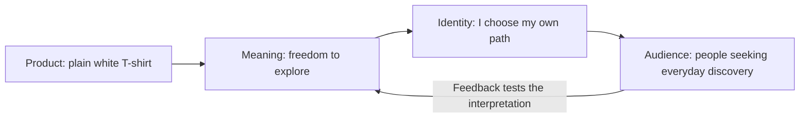

# Chapter 2: Brand Archetypes and Meaning

A plain white T-shirt can suggest fitting in, standing apart, starting an adventure, or expressing personal style. The fabric does not explain all those possibilities. The surrounding story gives the shirt a role in someone's life.

Chapter 1 explored how persuasion shapes attention, interpretation, trust, and action. Brand archetypes give us a practical vocabulary for the meanings we invite an audience to consider.

The central question is:

**What does the audience get to feel, imagine, or become by choosing this brand?**

“Become” describes an imagined identity or a way to express oneself. Buying a shirt does not automatically make someone courageous, creative, or caring.

## A Framework for Recognizable Meaning

**Brand archetypes are generalized cultural and narrative patterns used to organize a brand's meaning.** Think of familiar story roles: someone who seeks knowledge, someone who challenges authority, or someone who cares for others. A designer can draw on these patterns to connect an offer with a recognizable motivation.

The framework can guide a product's presentation, an organization's voice, or the experience of attending an event. It helps a team decide what to emphasize and how its choices should fit together. A Sage approach might make explanation central; a Jester approach might invite playful participation.

Margaret Mark and Carol S. Pearson apply archetypal thinking to branding in *The Hero and the Outlaw*. Their approach connects organizational identity with stories and values. See [Pearson's description of the book](https://carolspearson.com/books-page/the-hero-and-the-outlaw-building-extraordinary-brands-through-the-power-of-archetypes).

Here, we will use archetypes as a design framework, not a personality test or diagnosis. An archetype is also different from an audience profile: **Creator** names a narrative tendency, while **students seeking affordable ways to express their style** describes a possible audience and need. You still need research to learn what those students actually want.

## Twelve Common Archetypes

The following set provides useful starting points. Labels vary across versions of the framework: Rebel is often called Outlaw, and Everyperson also appears as Regular Guy/Gal. Pearson discusses these naming differences in [her overview of the twelve-archetype system](https://carolspearson.com/about/the-pearson-12-archetype-system-human-development-and-evolution).

The audience invitations and shirt applications below are our hypothetical design interpretations. They are not quotations, documented campaigns, or predictions of how everyone will respond.

| Archetype | Central meaning | What the audience might feel or imagine | Possible white T-shirt presentation |
| --- | --- | --- | --- |
| Explorer | Freedom and discovery | I can find my own way. | Photograph the shirt during a walk through an unfamiliar neighborhood. |
| Sage | Knowledge and understanding | I can make an informed choice. | Explain measurements and verified fabric details clearly. |
| Creator | Imagination and making | I can express an original point of view. | Show the unchanged shirt in several creatively assembled outfits. |
| Ruler | Order and leadership | I can feel composed and in charge. | Present a deliberate outfit with precise, orderly composition. |
| Caregiver | Care and support | I can look after someone. | Show the shirt being selected as a thoughtful everyday gift. |
| Rebel | Resistance and change | I can reject expectations. | Frame the absence of a visible logo as a choice about self-expression. |
| Hero | Courage and achievement | I can meet a challenge. | Show a wearer preparing to practice a demanding skill. |
| Everyperson | Belonging and equality | I can participate as myself. | Show different people styling the same ordinary shirt. |
| Innocent | Hope and simplicity | I can enjoy something uncomplicated. | Use a clear photograph and reassuring, straightforward language. |
| Jester | Play and enjoyment | I can loosen up and have fun. | Pair the shirt with a playful visual joke. |
| Lover | Connection and appreciation | I can express affection or feel attractive. | Show the shirt in an intimate, thoughtfully styled everyday moment. |
| Magician | Transformation and possibility | I can imagine a different version of my day. | Show how lighting and styling change the mood around the same shirt. |

Some meanings sit close together. Explorer emphasizes discovering possibilities; Rebel emphasizes resisting an expectation. Creator emphasizes making or expressing something; Magician emphasizes a sense of transformation. These distinctions help sharpen a message without creating hard boundaries.

## From Product to Audience

An archetype connects a material offer with a possible meaning, then with an identity an audience may value. Here is one proposed Explorer interpretation:

The arrows show a design hypothesis, not an automatic psychological process. You might intend freedom, while a viewer sees an ordinary undershirt. Ask people what they notice and imagine before telling them which archetype you selected.

## One Shirt, Four Different Positions

**Positioning** means establishing the place you want an offer to occupy in an audience's mind. To see how much meaning can change, keep the shirt's fabric, cut, color, price, and purchase terms identical. Change only the words, images, and layout. Every headline below is original sample copy for this exercise.

### Explorer: An Invitation to Go Somewhere

**Sample headline:** “Take a different turn.”

Show a wearer pausing at a neighborhood intersection, with room in the photograph to suggest possible directions. Use curious, inviting language. The shirt becomes part of an imagined day of discovery, appealing to someone who wants a break from routine.

The audience gets to imagine being more independent and curious. The photograph does not justify claims about weather protection, athletic performance, or exceptional durability.

### Ruler: Deliberate Simplicity

**Sample headline:** “Set your own standard.”

Show the identical shirt in a carefully arranged outfit. Align the typography precisely and give the composition a sense of control. The proposed appeal is confidence through deliberate choices: the wearer appears to know what they want.

The audience gets to imagine being composed and self-directed. The styling does not make the shirt more expensive to manufacture or prove superior quality. Avoid suggesting that buyers are more worthy than people who dress differently.

### Rebel: Refusing to Be a Billboard

**Sample headline:** “Your identity needs no logo.”

Use a bold headline, an unconventional layout, and a direct photograph that makes the shirt's blank surface obvious. The absence of a visible logo becomes an invitation to question the expectation that clothing should advertise a label.

The audience gets to imagine resisting pressure and defining themselves. There is a useful tension here: a brand is selling the idea of independence from branding. Acknowledge that tension rather than pretending a purchase is necessary for freedom or that this campaign proves political commitment.

### Creator: A Starting Point for Expression

**Sample headline:** “The next idea is yours.”

Arrange photographs of the same shirt paired with different garments and accessories, like a page of outfit experiments. Keep the shirt itself plain and unchanged. Emphasize how the wearer can compose a look.

The audience gets to imagine being an active author of their style. The creative possibilities come from what someone does with the shirt; the purchase itself does not confer talent. Clearly distinguish the shirt for sale from any accessories pictured.

These versions offer discovery, control, resistance, and expression. None requires a different shirt. A useful review question is whether a viewer can explain the difference without seeing the archetype labels.

## More Than a Look

Archetypes become more useful when they guide behavior as well as advertising. Consider these hypothetical applications beyond clothing:

- A **Sage tutoring organization** might explain its methods and invite questions. Its claim to help people understand should be supported by how tutors teach.
- A **Caregiver campus welcome event** might provide clear arrival instructions, accessible seating, and patient hosts. A comforting poster would be insufficient if visitors were ignored.
- A **Creator workshop** might give participants choices and time to experiment. A rigid activity with only one acceptable result could undermine that invitation.

Typography and imagery can introduce a meaning. The actual experience determines whether the promise holds up.

## Archetypes Are Not Destiny

A person can want adventure on Saturday, stability on Monday, and belonging throughout the week. A brand can also contain multiple tendencies. For example, a hypothetical clothing brand might combine Creator expression with Everyperson accessibility. Choosing a leading archetype can help clarify a particular campaign; it does not require every interaction to perform the same role.

Avoid turning these patterns into stereotypes. Caregiver does not mean female, Ruler does not mean male, and Explorer does not require youth, wealth, or a particular physical ability. People should not have to fit an assumed demographic identity to recognize themselves in a story.

**Cultural context matters.** Do not assume that colors, gestures, clothing, humor, or images of authority mean the same thing everywhere. For example, in a hypothetical audience review, one viewer might read a formal portrait as dependable leadership while another reads it as social distance. Neither response can be settled by pointing to an archetype chart.

Learn from the specific communities you hope to reach. Test language and imagery with people who understand the relevant context, and leave room for disagreement within that audience. Treat religious, cultural, and community symbols as meaningful expressions that require understanding, rather than decorative shortcuts to mystery or authenticity.

Finally, an archetype cannot repair an unsupported promise. A Caregiver voice needs helpful conduct. An Innocent presentation cannot establish environmental safety. A Magician story must not imply impossible results. Use the framework to clarify what an offer can honestly mean.

## Questions to Ask When Choosing an Archetype

1. What does the audience get to feel, imagine, or become by choosing this brand?
2. What real need or situation makes that meaning relevant?
3. Which product qualities and organizational behaviors support the promise?
4. Which archetype best organizes the message, and would a second tendency add useful depth?
5. How might different audiences interpret the same words, images, and symbols?
6. Are we relying on stereotypes, status anxiety, shame, or an implied need to buy belonging?
7. Can people recognize the intended meaning without being told its archetype name?
8. What audience feedback would lead us to revise the direction?

For a short exercise, show two T-shirt concepts to a classmate without their headings. Ask what each seems to offer and who might find it relevant. Compare their reading with your intention. A mismatch gives you something concrete to revise.

## What You Should Remember

- Archetypes help organize recognizable meanings for products, organizations, and experiences.
- Ask what the audience can feel, imagine, or express through the brand.
- The same white T-shirt can suggest dramatically different identities through presentation alone.
- People and brands can contain multiple tendencies; culture and context shape interpretation.
- Use archetypes as flexible design hypotheses, supported by honest claims, consistent behavior, and audience feedback.
