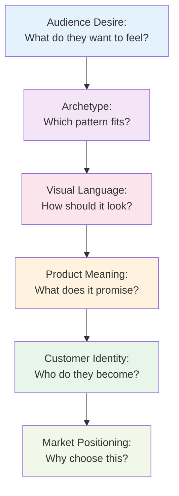

# Brand Archetypes and Meaning

## What Are Brand Archetypes?

A brand archetype is a pattern of meaning—a recognizable way of being that resonates across cultures and stories. It's a framework for understanding what a brand *promises* its audience: not just what it does, but who the audience becomes by choosing it.

Think of archetypes as cultural blueprints. The Hero, the Lover, the Sage, the Creator—these are patterns of behavior and meaning that show up everywhere: in mythology, literature, movies, and in how brands position themselves. A brand archetype helps you answer: "What does the audience get to *feel* or *imagine* or *become* by choosing this brand?"

## Archetypes Are Not Destiny

**This is important:** Archetypes are tools, not diagnoses. They're useful models, not rigid categories or truth claims about human nature.

A person is not "a Lover" and nothing else. A brand is not trapped in one archetype. Most people and brands contain multiple tendencies—playfulness and wisdom, care and rebellion. And archetypes work differently across cultures. What reads as "the Innocent" in one place might read differently elsewhere.

Use archetypes to guide decisions and conversations. Don't use them to box things in.

## Twelve Common Brand Archetypes

Here's a useful set of archetypes you'll recognize in the world around you:

### 1. The Hero
**Core promise:** "I will help you be brave and overcome challenges."

**Audience feeling:** Empowered, capable, strong.

**Examples:** Nike, Red Bull, Marvel (the hero's story).

### 2. The Sage
**Core promise:** "I will help you understand the world and make sense of it."

**Audience feeling:** Informed, wise, oriented.

**Examples:** TED Talks, The New York Times, academic publishers.

### 3. The Creator
**Core promise:** "I will help you make something new."

**Audience feeling:** Generative, authentic, expressive.

**Examples:** Lego, Adobe, Etsy.

### 4. The Lover
**Core promise:** "I will help you feel connected and passionate."

**Audience feeling:** Intimate, desired, alive.

**Examples:** Chanel, Harley-Davidson, romance in general.

### 5. The Caregiver
**Core promise:** "I will help you care for others and be supported."

**Audience feeling:** Generous, safe, nurturing.

**Examples:** Dove, Johnson & Johnson, Red Cross.

### 6. The Everyperson
**Core promise:** "I belong to you. You belong here."

**Audience feeling:** Included, relatable, comfortable.

**Examples:** Walmart, IKEA, Target.

### 7. The Innocent
**Core promise:** "I will keep you safe and happy."

**Audience feeling:** Optimistic, secure, joyful.

**Examples:** Disney, Coca-Cola, Hallmark.

### 8. The Jester
**Core promise:** "Let's have fun together."

**Audience feeling:** Playful, entertained, free.

**Examples:** Old Spice, Cards Against Humanity.

### 9. The Ruler
**Core promise:** "I will bring order and control."

**Audience feeling:** Powerful, organized, in command.

**Examples:** Rolex, Mercedes, IBM.

### 10. The Magician
**Core promise:** "I will transform your world."

**Audience feeling:** Amazed, powerful, magical.

**Examples:** Apple, Tesla, luxury brands.

### 11. The Explorer
**Core promise:** "I will help you discover and be free."

**Audience feeling:** Adventurous, authentic, liberated.

**Examples:** Patagonia, Harley-Davidson (again), National Geographic.

### 12. The Sage
**Core promise:** "I will help you understand."

**Audience feeling:** Informed, balanced, wise.

**Examples:** Wikipedia, academic institutions, think tanks.

## Archetypes in Practice: The Comparison Table

| Archetype | Core Promise | Audience Gets | T-Shirt Example |
|-----------|--------------|---------------|-----------------|
| Hero | Overcome challenges | Strength, capability | "Conquer Your Week" shirt for athletes |
| Sage | Understand the world | Wisdom, clarity | Minimalist, design-focused shirt |
| Creator | Make something new | Authenticity, expression | Blank shirt for customization |
| Lover | Connect & feel passion | Intimacy, desire | Sensual, luxury fabric shirt |
| Caregiver | Support others | Generosity, nurturing | Fair-trade, ethical-labor shirt |
| Everyperson | Belong & fit in | Inclusion, comfort | Plain, affordable, basic shirt |
| Innocent | Stay safe & happy | Optimism, joy | Cheerful colors, fun graphics |
| Jester | Have fun | Playfulness, freedom | Witty slogan, unexpected humor |
| Ruler | Control & command | Power, order | Premium, tailored, exclusive shirt |
| Magician | Transform reality | Wonder, power | Limited edition, collectible shirt |
| Explorer | Discover & be free | Adventure, authenticity | Performance fabric, travel-ready |

## A Diagram: How Archetype Becomes Brand

## The T-Shirt Example: Three Archetypes, One Shirt

Same plain white T-shirt. Three radically different meanings.

### Version 1: The Hero Archetype
**Positioning:** "Everyday Hero"
**Core message:** "Wear your courage."
**Audience:** People who see themselves as active, capable, taking on challenges.
**Design:** Minimalist logo suggesting strength or achievement. Durable, performance-grade fabric. Tagline: "Ready for anything."
**What the customer imagines:** Wearing this, they become someone who shows up prepared, who doesn't make excuses, who meets challenges head-on.
**Price point:** $35–45

### Version 2: The Everyperson Archetype
**Positioning:** "The Everyday Shirt"
**Core message:** "You belong here."
**Audience:** Anyone who wants comfort, affordability, and no fuss.
**Design:** Completely plain. Good quality, unbranded. Simple fit for everyone.
**What the customer imagines:** Comfort, belonging, non-pretension. I'm just like everyone else, and that's great.
**Price point:** $12–18

### Version 3: The Creator Archetype
**Positioning:** "Your Blank Canvas"
**Core message:** "Make it yours."
**Audience:** Artists, makers, people who customize and personalize everything.
**Design:** Premium blank shirt. Visible craftsmanship. Marketed as a base for personal expression. Available in natural fibers (organic cotton, linen blends). Tagline: "Create, express, be you."
**What the customer imagines:** I can make this unique. I can add my own meaning, my own art, my own statement.
**Price point:** $28–38

---

Same shirt. Three different meanings. Three different customer identities. Three different reasons to buy.

## Archetypes Are Not Destiny

Here's the dangerous part: archetypes can become a prison if you treat them like fate.

A brand doesn't have to stay in one archetype forever. A person doesn't have to be trapped in one pattern. The archetype is a lens, not a law.

Nike can be the Hero most of the time, but it can also channel the Creator (celebrating human potential for innovation) or even the Jester (unexpected humor in ads). The archetype guides the *core* message, but it doesn't eliminate nuance.

## Questions to Ask When Choosing an Archetype

Before you commit to an archetype for your brand, ask:

1. **What does my audience actually desire?** Not what I wish they desired—what do they actually want to feel?

2. **Does this archetype align with what we can actually deliver?** If we promise "Magician" but deliver ordinary, customers will feel betrayed.

3. **What other archetypes are my competitors using?** Is there a gap? Is there an opportunity to own a different meaning?

4. **Can we sustain this over time?** Archetypes require consistency. You can't switch from Hero to Innocent every quarter.

5. **Does this archetype respect my audience?** Some archetypes are more mature, some more playful. Does this fit?

6. **What meaning am I taking away from my audience by choosing this archetype?** Every yes to one thing is a no to others.

## Explore Further

For deeper thinking on archetypes, consider researching:

- Search for "Carl Jung archetypes" — the psychological foundation
- Look for "brand archetype frameworks" — there are several useful models beyond what we've covered here
- Study how specific brands position themselves through archetypes — choose brands you admire and see which archetypes they're using
- Research cultural differences in archetypes — they mean different things in different places

## What You Should Remember

Archetypes are storytelling tools. They help you understand what meaning your brand carries and what identity your audience gets to step into when they choose you.

The same physical product can mean completely different things depending on which archetype frames it. The magic isn't in the product itself—it's in the story you tell about what it means.

Choose an archetype that fits your actual audience, deliver on that promise consistently, and let your customers become the people they want to be through your brand.

And remember: archetypes are useful patterns, not rigid boxes. The best brands often blend multiple archetypes while having one core identity.
