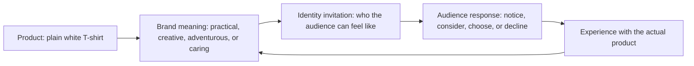

# Chapter 2: Brand Archetypes and Meaning

## More Than a Product

Two products can do the same basic job and still mean very different things. A plain white T-shirt covers the body either way. Yet one brand can make it feel like practical everyday clothing, another can make it feel like a creative blank canvas, and another can make it feel like a uniform for adventure.

This is where brand archetypes are useful. An archetype is a familiar cultural and narrative pattern that helps an audience quickly understand a brand's point of view. It gives a brand a recognizable role in a story: perhaps the helpful Caregiver, the curious Explorer, or the challenging Rebel.

Archetypes are not a formula for making people buy things. They are a way to ask a more useful design question:

> What does the audience get to feel, imagine, or become by choosing this brand?

## Archetypes as a Branding Framework

In branding, an archetype can guide choices about voice, photography, product names, packaging, customer service, and the stories a brand tells. A Caregiver brand might emphasize reassurance and support. A Rebel brand might use direct language and challenge conventions. The product has not necessarily changed, but the meaning around it has.

Think of an archetype as a shared shortcut for interpretation. It can help a designer make consistent decisions, but it should never replace evidence about real people and their needs.

## A Useful Set of Common Archetypes

There is no single official list. The following set is common in brand discussions and is useful because each archetype suggests a different promise or emotional experience.

| Archetype | Central idea | What the audience may feel, imagine, or become |
| --- | --- | --- |
| Explorer | Freedom, discovery, and independence | "I can go farther and choose my own path." |
| Sage | Knowledge, truth, and understanding | "I can make a wiser decision." |
| Creator | Imagination, craft, and originality | "I can make something that is mine." |
| Ruler | Order, leadership, and control | "I can feel capable and in command." |
| Caregiver | Help, safety, and service | "I am supported, and I can support others." |
| Rebel | Liberation and disruption | "I can reject a rule that does not serve me." |
| Hero | Courage, achievement, and improvement | "I can meet a challenge." |
| Everyperson | Belonging, realism, and equality | "This is for people like me." |
| Innocent | Simplicity, optimism, and safety | "Life can feel clear and uncomplicated." |
| Jester | Play, humor, and enjoyment | "I can loosen up and have fun." |
| Lover | Connection, beauty, and intimacy | "I can express care, attraction, or appreciation." |
| Magician | Transformation, vision, and possibility | "Something ordinary can become remarkable." |

The language in the table is a starting point, not a script. A brand should make only promises it can honestly support.

## The Plain White T-Shirt: Same Product, Different Meaning

Assume every example below uses the identical plain white T-shirt: the same fabric, fit, price, and manufacturing. Only the way it is positioned changes.

| Archetype | Positioning for the identical shirt | Design and message choices | Meaning added around the product |
| --- | --- | --- | --- |
| Explorer | A light, reliable basic for an unplanned weekend away | Outdoor daylight photography; language about going, packing, and possibility | Freedom and readiness |
| Creator | A clean starting point for personal style and making | Studio photography; a message such as "Start with a blank canvas" | Self-expression and originality |
| Everyperson | An uncomplicated shirt for ordinary routines | Diverse everyday settings; plain, welcoming language | Belonging and usefulness |
| Rebel | A simple essential without unnecessary fashion rules | High-contrast images; direct language that questions trends | Independence and refusal of conformity |
| Caregiver | A comfortable everyday layer designed with care in mind | Warm imagery; clear care instructions and easy-to-read information | Reassurance and support |

Notice that the shirt itself is not magically more adventurous, creative, or rebellious. The brand is inviting the audience to connect the shirt with a possible experience or identity. That invitation must stay honest. For example, an Explorer message should not claim the shirt is suitable for harsh outdoor conditions unless the product has actually been designed and tested for that use.

## From Product to Identity

The loop matters. A brand can suggest meaning, but customers judge that meaning through their real experience. If the shirt feels uncomfortable or the service is poor, the brand story will lose credibility.

## Archetypes Are Not Destiny

Archetypes are models, not literal personality diagnoses. A person is not "an Explorer" in every situation, and a brand is not limited to a single role forever. Someone may want a practical Everyperson T-shirt for class, a Creator T-shirt for a design project, and a Lover-style gift for a friend.

Brands can also combine tendencies. A small outdoor company might be mostly Explorer while using Caregiver language about helping beginners feel prepared. The combination should be clear rather than confusing.

Cultural context matters too. Images, humor, status signals, colors, and ideas of independence do not carry exactly the same meaning for every community. Designers should listen to the people they hope to serve instead of assuming a familiar archetype works everywhere.

## Concrete Uses Beyond Clothing

Archetypes can guide more than advertising. Consider a campus tutoring center:

- A **Sage** approach could emphasize clear explanations, reliable resources, and confidence built through understanding.
- A **Caregiver** approach could emphasize patient support and a welcoming place to ask for help.
- A **Hero** approach could emphasize students building skills to meet a difficult academic challenge.

Each approach could be appropriate. The best choice depends on the center's real strengths and on what students need—not on which personality sounds most impressive.

## Questions to Ask When Choosing an Archetype

Before using an archetype, a designer should ask:

- What real need, tension, or hope does this product address?
- What does the audience get to feel, imagine, or become by choosing this brand?
- Does this archetype match the product's actual qualities and the organization's behavior?
- Which words, visuals, and interactions would make the meaning clear?
- Could this message exclude, stereotype, pressure, or confuse part of the audience?
- Does cultural context change how this archetype might be understood?
- Is one primary archetype enough, or is a second tendency genuinely useful?
- What evidence would show that the audience finds this positioning helpful and believable?

## Ethical Caution

An archetype should clarify a truthful value, not disguise a weak product or pressure someone into adopting an identity. A message such as "real adventurers wear this" can turn a simple clothing choice into an unfair test of belonging. It is more respectful to explain what the product actually offers and let the audience decide whether that meaning fits.

## What You Should Remember

Brand archetypes are familiar cultural patterns that help products and organizations feel recognizable. They are useful for building a consistent meaning around a product, from visual design to customer experience.

They are not fixed labels for people or guarantees of success. Use them as flexible tools: connect a real product to a truthful promise, respect cultural context, and ask what the audience is genuinely invited to feel, imagine, or become.
