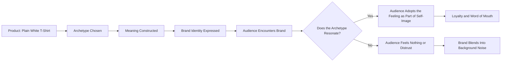

# Chapter 2: Archetypes — Giving a Brand Recognizable Meaning

## From Frames to Identity

In Chapter 1, the plain white T-shirt got framed four different ways — thrift-store bargain, boutique craftsmanship, musician's favorite, scarce limited drop. Each frame changed how the audience *interpreted* the shirt in the moment of deciding whether to buy it.

Archetypes work at a deeper, more durable level. A frame can change from one ad to the next. An archetype is closer to a personality a brand wears consistently, across years, across products, across every touchpoint — the tone of its copy, the shape of its logo, the kind of story it tells about itself. Where framing answers "how should I interpret this specific offer?", archetypes answer a bigger question:

**"What does the audience get to feel, imagine, or become by choosing this brand?"**

That's the question this whole chapter circles back to.

## What Archetypes Actually Are

The idea of archetypes as recurring narrative patterns comes originally from psychology, but in branding it has been adapted into something more like a storytelling toolkit than a clinical theory. A brand archetype is a **recognizable, culturally familiar character pattern** — the Explorer, the Sage, the Rebel — that a brand can borrow to give its identity instant emotional shorthand.

Why does this work? Because humans are extremely good at recognizing character types from stories, myths, and media we've absorbed since childhood. When a brand consistently behaves like an Explorer — restless, adventurous, allergic to conformity — audiences don't need a paragraph of explanation. The pattern is already familiar, so the meaning loads instantly.

Archetypes are useful for three practical reasons:

1. **Consistency.** They give a design team, a marketing team, and a leadership team a shared reference point, so a hundred small decisions (word choice, color, tone, imagery) can point the same direction without a rulebook for every case.
2. **Differentiation.** In a category where every competitor is describing the same functional benefits, an archetype gives a brand an emotional angle that's harder to copy than a feature list.
3. **Speed.** Because the patterns are culturally pre-loaded, an archetype communicates a lot of meaning very quickly — useful in a world of six-second attention spans.

## Archetypes Are Not Destiny

Here's the caution this chapter needs to make clearly: **archetypes are models, not diagnoses.**

They are not a literal claim about anyone's fixed personality — not the brand's, and not the audience's. A few things worth holding onto:

- **Real people and real brands blend multiple tendencies.** A single company might be mostly Sage (expertise, teaching) with real notes of Rebel (challenging industry norms). A person might buy Explorer-branded gear on weekends and Caregiver-branded products for their household. Nobody is "purely" one archetype, and treating the framework as if they are is a misuse of it.
- **Archetypes are cultural patterns, not universal truths about human nature.** What reads as "Rebel" in one culture or subculture can read as merely "impractical" or even "disrespectful" in another. The Hero archetype's association with individual triumph resonates differently across cultures that place more emphasis on collective achievement. Applying archetypes thoughtlessly, without attention to the specific audience and cultural context, produces branding that feels hollow or even alienating.
- **An archetype is a starting lens, not a cage.** The goal isn't to force a brand into rigid conformity with a character sheet. It's to use the archetype as a compass for consistency — something to check decisions against, not a script that removes judgment.
- **People are not their purchases.** Someone buying a Rebel-branded jacket is not thereby a rebellious person in any deep sense. They're responding to a feeling the branding offers. Confusing archetype-as-marketing-tool with archetype-as-truth-about-the-buyer is a common and shallow mistake.

Keep this caution in mind through the rest of the chapter: everything below describes patterns brands can borrow to create meaning, not boxes that people or organizations actually live inside.

## A Useful Set of Common Brand Archetypes

There are several overlapping frameworks in circulation; the twelve below are a widely used set, each defined by the core desire it appeals to and the feeling it offers the audience.

- **Innocent** — Desires: purity, optimism, doing the right thing. Offers the audience a sense of simplicity and trust.
- **Everyperson** — Desires: belonging, being down-to-earth. Offers the audience a sense that this brand is "for people like me," without pretension.
- **Hero** — Desires: mastery, courage, proving worth through action. Offers the audience a feeling of capability and triumph over adversity.
- **Rebel** — Desires: disruption, freedom from convention. Offers the audience a feeling of independence and defiance of the rules.
- **Explorer** — Desires: freedom, discovery, authenticity through new experience. Offers the audience a feeling of adventure and self-discovery.
- **Creator** — Desires: self-expression, originality. Offers the audience the tools or permission to make something of their own.
- **Ruler** — Desires: control, order, leadership. Offers the audience a feeling of status, stability, and command over their circumstances.
- **Magician** — Desires: transformation, making the seemingly impossible happen. Offers the audience a feeling of wonder and possibility.
- **Lover** — Desires: intimacy, connection, sensory pleasure. Offers the audience a feeling of being desired, appreciated, and connected.
- **Caregiver** — Desires: protecting and helping others. Offers the audience a feeling of being cared for and safe.
- **Sage** — Desires: understanding truth, expertise, teaching. Offers the audience knowledge and clarity to make better decisions.
- **Jester** — Desires: joy, living in the moment. Offers the audience a feeling of lightness, humor, and permission not to take things too seriously.

Notice the pattern in how each is described: not "what the brand is like" in isolation, but what the **audience gets to feel or become** by choosing it. That's the practical center of the whole framework.

## The Same Shirt, Three Archetypes (and a Fourth for Good Measure)

Let's return to the plain white T-shirt one more time. Four brands could sell the *identical* physical product — same cotton, same cut, same stitching — and build radically different identities around it using different archetypes.

**1. The Explorer Shirt**
Marketed as a rugged travel essential: quick-drying, packable, built for a shirt that's been "from basecamp to backstreet market." Copy emphasizes versatility across unpredictable conditions. Imagery shows the shirt being worn on a trail, at a hostel, on a ferry. The audience isn't buying fabric — they're buying a feeling of readiness for the unknown.

**2. The Sage Shirt**
Marketed around expertise and transparency: a detailed breakdown of thread count, the specific cotton-growing region, the engineering rationale behind the seam construction, a "why we chose this fabric" explainer. Copy is calm, informative, almost academic. The audience isn't buying a shirt — they're buying the confidence of an informed decision.

**3. The Rebel Shirt**
Marketed as a blank refusal of logo culture: "No logo. No noise. Just a shirt." Positioned against fast fashion and branding-as-status-symbol. Copy is terse, a little confrontational. The audience isn't buying cotton — they're buying a small act of defiance against a culture of visible branding.

**4. The Innocent Shirt**
Marketed around simplicity and goodness: "One shirt. Nothing to hide. Nothing you don't need." Emphasis on honest pricing, minimal packaging, a clean conscience. Copy is warm and plain. The audience isn't buying a garment — they're buying a small, guilt-free decision in a complicated world.

Four identical shirts. Four completely different reasons to buy one.

## Comparing the Four Approaches

| Archetype | Core Desire Offered | Tone of Voice | Visual Language | What the Buyer "Becomes" |
|---|---|---|---|---|
| Explorer | Freedom, discovery | Energetic, open-ended | Outdoor, motion, worn-in textures | Someone ready for the unexpected |
| Sage | Understanding, clarity | Calm, precise, informative | Clean specs, diagrams, neutral tones | Someone who made an informed choice |
| Rebel | Independence, defiance | Terse, confrontational | Stark, minimal, anti-polish | Someone who rejects empty status symbols |
| Innocent | Simplicity, trust | Warm, plain, gentle | Soft light, uncluttered, honest | Someone making an easy, guiltless choice |

## From Product to Identity: How Meaning Travels to the Audience

This is the core mechanism of archetype-based branding: the product itself is often nearly interchangeable, but the meaning built around it is what the audience actually forms a relationship with.

## Questions to Ask When Choosing an Archetype

1. What does our audience already want to feel more of in their lives — adventure, order, belonging, wonder, reassurance?
2. Which archetype's core desire genuinely overlaps with what our product can honestly deliver?
3. Are we choosing this archetype because it fits our actual values and capabilities, or because it's trendy?
4. Does this archetype make sense within our audience's cultural context, or are we borrowing a pattern that won't translate?
5. Can we sustain this archetype consistently across packaging, service, tone, and behavior — or is it just a marketing veneer over a business that acts differently?
6. Are we implying something false about the product's origin, quality, or effect in order to fit the archetype? (Recall Chapter 1: an archetype is not a license to lie.)
7. If a real customer met the people who built this brand, would the archetype still feel true?

## What You Should Remember

- Brand archetypes are culturally familiar character patterns that let a brand communicate identity quickly and consistently.
- Archetypes are models for making design and communication decisions — not literal personality diagnoses of the brand, the founder, or the customer.
- Real brands and real people usually blend several archetypal tendencies, and cultural context shapes how any given archetype will land.
- The practical question behind every archetype choice is: what does the audience get to feel, imagine, or become by choosing this brand?
- The same physical product — like a plain white T-shirt — can be positioned through completely different archetypes (Explorer, Sage, Rebel, Innocent, and more) without any change to the product itself.
- A good archetype choice must be sustainable and honest across the whole brand experience, not just a costume worn in the advertising.
