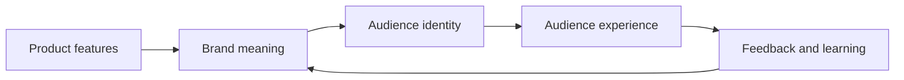

# Chapter 2: Brand Archetypes and Meaning

A product is never only its physical features. People also ask what it says about them, what kind of world it belongs to, and what they might feel by choosing it. Brand archetypes are a practical way to think about those meanings.

## What Is a Brand Archetype?

An archetype is a recognizable pattern of character, motivation, or story. In branding, an archetype gives a product or organization a consistent emotional direction. It helps answer questions such as:

- What does this brand value?
- What kind of role does it play in the audience's life?
- What does the audience get to feel, imagine, or become by choosing it?

An archetype is not a logo, a color palette, or a slogan by itself. It is a pattern that can guide those choices. An Explorer brand might use language about independence and discovery, while a Sage brand might emphasize understanding and evidence. Both could sell the same physical product, but they would invite different interpretations.

Archetypes help a team make related decisions consistently across a product page, package, store, social post, and customer experience. They are a lens for creating meaning, not a substitute for research about a real audience.

## A Useful Set of Common Archetypes

The following twelve archetypes are a working vocabulary. They are broad patterns, so a real brand can combine them or express one differently in different cultures and situations.

| Archetype | Core desire | Audience promise | Possible failure |
| --- | --- | --- | --- |
| Explorer | Freedom and discovery | You can go beyond the familiar | Treat every problem as an excuse to escape |
| Sage | Understanding and truth | You can make a wiser choice | Sound distant, overly academic, or certain about everything |
| Creator | Making something original | You can express and build | Favor novelty over usefulness |
| Ruler | Order and control | You can lead or belong to a well-run world | Become elitist, rigid, or status-obsessed |
| Caregiver | Protection and support | You will be looked after | Become paternalistic or imply helplessness |
| Rebel | Liberation and change | You can challenge the usual rules | Turn disagreement into a performance |
| Hero | Achievement and courage | You can overcome a meaningful challenge | Create exhausting pressure to prove worth |
| Everyperson | Belonging and realism | You can fit in without pretending | Become generic or claim to represent everyone |
| Innocent | Safety and optimism | Life can feel simple, honest, or hopeful | Ignore complexity or make unrealistic promises |
| Jester | Play and delight | You can enjoy the moment | Make serious situations seem trivial |
| Lover | Connection and appreciation | You can feel close, desirable, or devoted | Reduce identity to approval or attractiveness |
| Magician | Transformation and possibility | You can experience a new way of seeing or being | Use vague promises or imply impossible results |

These labels are not a ranking. A Caregiver is not morally better than a Rebel, and a Ruler is not automatically authoritarian. The value of a framework is that it makes choices discussable and testable.

## Archetypes Are Not Destiny

Archetypes are models, not literal personality diagnoses. They do not prove that a customer, designer, or organization has one fixed personality. People contain multiple motives, and those motives can change with context. Someone may want adventure on vacation, reliable guidance during a medical decision, and humor while shopping for clothes.

Cultural context matters too. A symbol of independence in one community may communicate irresponsibility in another. A playful tone may feel welcoming to one audience and disrespectful to another. Designers should treat archetypes as hypotheses about meaning, then test whether the intended audience actually reads the message that way.

A brand can also combine tendencies. A technical clothing company might be an Explorer in its promise of movement and a Caregiver in its attention to comfort and safety. The combination should still be coherent: audiences need to understand which idea leads and which ideas support it.

## The Same Product, Different Meaning

Consider one plain white T-shirt with the same cut, fabric, and price. Its physical identity stays constant, but its symbolic identity can change dramatically.

### The Explorer T-Shirt

**Positioning:** “A reliable layer for wherever the day takes you.”

The photography might show the shirt in changing environments, while the writing emphasizes adaptability and movement. The audience is invited to imagine becoming more independent and ready for the unfamiliar. The message should still support its practical claims with accurate information about fit, care, and durability.

### The Sage T-Shirt

**Positioning:** “A considered basic, explained clearly.”

This version could foreground fiber content, construction details, care instructions, and a transparent explanation of how the shirt is made. The audience is invited to feel informed and capable of choosing well. The Sage approach is weakened by inflated technical language or unsupported claims of superiority.

### The Rebel T-Shirt

**Positioning:** “No unnecessary branding. No costume required.”

This version treats the absence of a visible logo as a statement against status display or disposable trends. The audience is invited to challenge expected signals of success. The message becomes hollow if it simply replaces one status code with another or pretends that buying a shirt is the same as changing a system.

### The Creator T-Shirt

**Positioning:** “Start with a blank surface.”

The shirt becomes a base for printing, dyeing, altering, layering, or styling. The audience is invited to imagine making something personal. In this case, useful information about the fabric's suitability for customization matters more than dramatic language.

### The Everyperson T-Shirt

**Positioning:** “The shirt that earns its place in your week.”

The communication emphasizes familiarity, affordability, and ordinary usefulness. The audience is invited to feel included rather than instructed to perform a rare identity. This approach should not pretend that one product works equally well for every body, climate, or lifestyle.

These are not different shirts. They are different systems of meaning around the same shirt. The more a position asks the product to symbolize, the more carefully the experience should support that symbolism.

## From Product to Audience Identity

Brand meaning often develops in a sequence. A physical product supplies features, the brand gives those features an interpretation, and the audience uses that interpretation to imagine an identity or role.

The loop matters. A brand cannot simply declare an identity and expect people to accept it. Their experience of the product, service, and community either strengthens or weakens the intended meaning.

## Using Archetypes Responsibly

Start with the product and the audience's actual situation, not with a fashionable label. Identify the practical value the product provides, then ask what emotional or social meaning grows naturally from that value. A durable shirt can support a message about long-term use; it does not automatically support a message about environmental virtue unless the relevant evidence exists.

Next, choose one leading archetype and a small number of supporting tendencies. Define the behavior that should follow from the choice. If the brand is a Sage, does it explain tradeoffs? If it is a Caregiver, does the service make people feel supported? If it is a Jester, can it be playful without becoming confusing?

Finally, check the message against the whole experience. Packaging, customer service, pricing, accessibility, and policies all communicate archetype. A brand that presents itself as a Caregiver but makes cancellation difficult creates a contradiction that no slogan can repair.

## Questions to Ask When Choosing an Archetype

- What does the audience get to feel, imagine, or become by choosing this brand?
- What real product benefit or behavior supports that promise?
- Which archetype best clarifies the brand's role, and which archetypes are only supporting influences?
- What evidence would show that the intended audience understands the message as we intend?
- How might this archetype be interpreted differently across cultures, communities, or situations?
- What stereotypes or exclusions could this framing accidentally reinforce?
- Does the product experience keep the promise after the audience chooses it?
- What would this brand refuse to do, even if doing so might create attention?

## What You Should Remember

Brand archetypes are useful patterns for organizing meaning, not rigid diagnoses of people or permanent identities for brands. They help designers connect product features to emotional expectations and audience identity. The same white T-shirt can become an Explorer's reliable layer, a Sage's informed choice, a Rebel's rejection of status signals, a Creator's blank surface, or an Everyperson's dependable basic. Good archetypal branding makes a clear promise, supports it with the actual experience, and leaves room for cultural context and human complexity.
