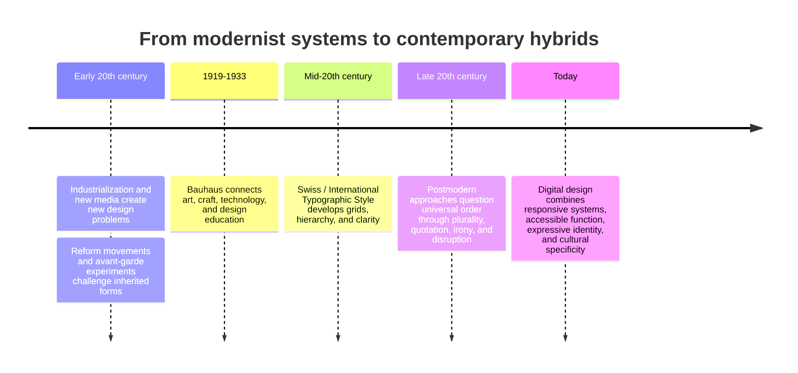

# Chapter 3: Modernism, Postmodernism, and Visual Language

Visual design carries ideas before a reader has finished reading the words. A page can feel orderly, official, playful, urgent, intimate, or strange because of its type, spacing, color, images, and structure. These choices form a **visual language**: a set of signs and habits that shape how an audience interprets a message.

One useful way to study visual language is to follow a continuing argument between order and disruption. Modernist designers often sought clarity, function, reduction, and systems that could work across contexts. Postmodern designers questioned whether any visual system could be truly neutral or universal. They reintroduced plurality, quotation, irony, historical references, and expressive typography. Contemporary design still moves between these positions.

## A Short Historical Path into Modernism

Modernism developed during a period of industrialization, urban growth, new technologies, mass production, and social change. Designers were responding to a world in which objects and information had to be produced and understood at larger scales. Older decorative traditions did not disappear, but many modernist designers asked whether design should honestly express materials, construction, technology, and use rather than imitate historical decoration.

Several developments helped prepare the ground:

- Arts and Crafts movements criticized careless industrial production and renewed attention to making and material quality.
- New printing, photography, transportation, and manufacturing systems expanded the speed and reach of visual communication.
- Avant-garde art movements experimented with abstraction, asymmetry, photomontage, and unfamiliar relationships between image and text.
- Designers increasingly treated typography, architecture, furniture, and everyday objects as connected parts of a designed environment.

This history is not a single straight line. Modernism contains different movements, disagreements, and local interpretations. Still, it helps to see why ideas such as standardization, functional planning, and visual economy became influential.

## Bauhaus

The Bauhaus was a German school founded in 1919 that brought together art, craft, architecture, and design. Its teaching emphasized learning through materials and making, then connecting that practical knowledge to broader questions of form and use. The school changed over time and included different teachers and approaches, so it should not be reduced to one look.

For a first reading, the Bauhaus is useful because it makes design feel like an organized problem rather than decoration added at the end. Questions about structure, materials, production, geometry, and everyday use become visible. A chair, building, typeface, or poster can be judged partly by how clearly it addresses its purpose and how responsibly it uses its materials.

The Bauhaus also helped popularize an educational model in which experimentation and technical skill could work together. Its influence traveled through people, teaching, objects, buildings, and publications, but its meaning changed in different places. Studying it requires attention to that history rather than treating the word as a synonym for minimalism.

## Swiss / International Typographic Style

The Swiss Style, also called the International Typographic Style, became especially influential in the middle decades of the twentieth century. It is associated with disciplined grids, sans-serif typography, asymmetrical layouts, careful alignment, photography, and a preference for clear communication. Designers often aimed to make relationships among information visible so that a reader could navigate quickly.

Its characteristic tools include:

- a **grid** that organizes columns, margins, images, and type
- **hierarchy** that distinguishes titles, headings, body text, and supporting information
- **reduction** that removes elements that do not help the message
- **clarity** through legible type, spacing, and explicit relationships
- **function** as a test of whether a visual decision serves the purpose

These principles are not a rigid recipe. A grid can support expressive work, and a simple layout can still communicate a political or cultural point of view. Claims of neutrality also deserve scrutiny: choices about language, audience, scale, and what information is omitted always carry values.

## The Postmodern Reaction

Postmodern design developed partly as a reaction against the certainty, restraint, universality, and order associated with some modernist approaches. Designers and theorists questioned whether one rational visual language could suit every audience and situation. They explored a more plural visual world in which references could be mixed and meaning could remain unstable.

Postmodern approaches may use:

- **plurality:** multiple voices, styles, histories, or identities in one work
- **irony:** a visible distance between a message and the way it is presented
- **disruption:** broken alignment, unexpected scale, interruption, or visual friction
- **quotation:** recognizable references to earlier styles, media, or popular culture
- **expressive typography:** type treated as image, texture, voice, or movement rather than only as a transparent container for words

Postmodernism is not simply the opposite of good organization. A designer may break a grid deliberately to signal conflict, humor, or multiple perspectives. The key question is whether the disruption creates a useful meaning or merely makes the work harder to use.

## The Tensions Are Still Here

The modernist and postmodernist tendencies are not sealed in history. They appear together in contemporary websites, apps, posters, stores, and product interfaces.

- A banking app may use a strict grid and restrained color to make financial information easy to scan, while its illustrations use a playful, distinctive style to make the service feel more human.
- A music website may prioritize clear navigation but use animated type, collage, and unexpected transitions to express an artist's identity.
- A public-service form may need functional hierarchy and accessible contrast even if its campaign materials use irony or visual disruption to gain attention.
- A fashion site may quote an older visual style while using responsive systems that reorganize the page for different screens.

Digital design makes these negotiations especially visible. A grid must adapt to phones, tablets, and large screens. A deliberately unusual interaction still needs to communicate what can be clicked or changed. A brand may want expressive difference, but users also need recognizable controls and readable content. Contemporary design is often a hybrid: systematic underneath, expressive on the surface, and constantly adjusting to context.

## Comparison Table

| Design tendency | Typical priorities | Possible strengths | Possible risk |
| --- | --- | --- | --- |
| Modernist | Grid, hierarchy, clarity, reduction, function | Fast scanning, consistency, legibility, easier maintenance | Can appear impersonal or hide whose needs define "universal" clarity |
| Postmodern | Plurality, irony, disruption, quotation, expressive typography | Makes identity, conflict, history, and difference visible | Can become confusing, self-conscious, or inaccessible |
| Hybrid contemporary | System underneath with selective expression and adaptation | Balances usability with character and cultural specificity | Can feel inconsistent if the relationship between system and expression is not intentional |

The table describes tendencies, not rules. A modernist-looking design can be emotionally powerful, and a postmodern-looking design can be carefully structured. Appearance alone does not reveal whether a design works; study its audience, purpose, and effects.

## How to Read a Design

When you encounter a poster, webpage, package, or interface, slow down before deciding whether you like it. Ask what the visual choices are doing.

1. **Start with purpose.** What is the design asking the audience to notice, understand, feel, or do?
2. **Trace the hierarchy.** What do you see first, second, and third? How do size, contrast, position, and spacing create that sequence?
3. **Look for the system.** Is there a grid, repeated alignment, consistent type scale, or pattern of components?
4. **Notice the exceptions.** Where does the design break its system? Is the disruption accidental, expressive, humorous, political, or functional?
5. **Examine the typography.** Is type meant to disappear into easy reading, or is it acting as image, voice, texture, or historical reference?
6. **Ask whose perspective is centered.** What language, bodies, histories, and assumptions are visible? What is missing?
7. **Test the experience.** Can the audience accomplish the task? Does the visual language support or interfere with access and understanding?

This process turns style into evidence. Instead of saying only "it looks modern" or "it looks chaotic," you can describe the decisions that produce that impression and judge whether they serve the design's purpose.

## A Timeline of Visual Language

This timeline is a simplified map rather than a complete history. Movements overlap, and their ideas continue to be reinterpreted.

## The Plain White T-Shirt in Two Visual Languages

The same plain white T-shirt can feel like two different products when its visual presentation changes.

### A Modernist Presentation

The shirt is shown in a precise studio photograph against a quiet background. A consistent grid places the product image beside a concise specification list. The type is highly legible, the color palette is restrained, and the page removes decorative elements that do not explain the shirt. Measurements, fabric, price, and care instructions are easy to compare.

This presentation makes the shirt feel dependable, efficient, and universal. It suggests that the product's value can be understood through its construction and function. The approach is useful when shoppers need to compare options quickly, but it should not pretend that a clean layout is culturally neutral or that function is the only kind of value.

### A Postmodern Presentation

The same shirt appears in a collage of contrasting references: a formal product image, a hand-drawn annotation, a cropped slogan, and a deliberately awkward scale shift. The typography changes size and texture, and the layout interrupts its own alignment. The text may question why a basic garment is treated as a status object or quote the visual language of older advertisements.

This presentation makes the shirt feel self-aware, expressive, and open to interpretation. It can invite the audience to think about fashion, identity, or consumer culture rather than simply evaluate fabric. It also needs enough structure that the price, fit, and purchase path remain findable. Disruption earns its place when it creates meaning, not when it makes basic information needlessly difficult.

The shirt did not change. The visual language changed the expectations surrounding it.

## Museum Research

Authentic examples make design history easier to understand. Use museum and institutional collections as places to find objects, images, catalog records, and curatorial explanations. Possible starting points include The Metropolitan Museum of Art, MoMA, Cooper Hewitt, the V&A, Bauhaus archives, university collections, national design museums, and other credible institutions.

Use searches such as:

- `Bauhaus typography collection`
- `Bauhaus furniture museum collection`
- `Swiss International Typographic Style poster collection`
- `modernist graphic design grid museum`
- `postmodern graphic design typography museum`
- `design history digital collection modernism`

When you find an object, verify the actual record yourself. Record the institution, object title, maker or designer when provided, date or period, materials or medium, and the collection's explanation. Do not assume that an image found in a search result is correctly labeled, and do not treat a museum's ownership of an object as proof that every interpretation of it is settled. Compare the visual evidence with the institutional description and note what remains uncertain.

## What You Should Remember

Modernism made systems such as grid, hierarchy, clarity, reduction, and function powerful tools for communicating in an industrial and mass-media world. Bauhaus and Swiss / International Typographic Style helped shape that conversation. Postmodern approaches challenged universal order with plurality, irony, disruption, quotation, and expressive typography. Contemporary design continues to negotiate these tensions. To read visual language well, describe the system, notice its exceptions, consider whose perspective it centers, and judge whether its choices serve both meaning and use.