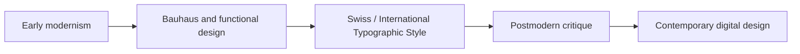

# Modernism, Postmodernism, and Visual Language

## Why design is never neutral

Visual design does more than decorate. It communicates mood, values, authority, and cultural assumptions. A layout can suggest trust, order, disruption, confidence, expertise, or play. The same product can feel very different depending on the visual language around it.

Design language is a system of choices: typography, spacing, grids, color, imagery, rhythm, and tone. These choices create a signal. People read them quickly, often without noticing it.

## A short history: from modernism to postmodernism

Modernism emerged in the early twentieth century as a response to industrialization, mass production, and the search for clarity and order. It valued rationality, function, and system. Designers wanted forms to be legible, efficient, and honest about purpose.

Two particularly influential strands were:

- Bauhaus: a school and design movement that connected art, industry, and craft
- Swiss / International Typographic Style: emphasizing grid systems, asymmetry, clear hierarchy, and disciplined typography

These styles shaped a lot of modern design thinking. They pushed designers to reduce clutter, structure information clearly, and build communication around logic and readability.

## Modernist principles

Modernism often emphasizes:

- grid and structure
- hierarchy
- clarity
- reduction
- function over ornament
- objective communication
- clear distinction between form and decoration

This approach can be powerful because it helps people find information quickly. It can also feel austere or emotionally cool if taken too far.

## The postmodern reaction

Postmodernism developed partly as a critique of modernist certainty. It questioned whether one style or one logic could speak for everyone. Instead, it embraced plurality, irony, fragmentation, quotation, contradiction, and expressive risk.

Postmodern design often uses:

- disruption of the grid
- layering and collage
- expressive typography
- witty references to older styles
- irony and contradiction
- identity and difference as design content

The point was not to eliminate order entirely. It was to challenge the idea that order alone is enough, or that a single universal style can represent every audience.

## The tension still exists

The debate between modernism and postmodernism continues in digital design today.

| Design tension | Modernist tendency | Postmodern tendency | Current digital example |
| --- | --- | --- | --- |
| Order vs disruption | Strong structure, clean system | Unexpected layout, contrast, asymmetry | Editorial landing pages with large type and layered imagery |
| Universality vs identity | One clear system for many users | Distinct voices, personalization, cultural references | Brand websites using niche references and audience-specific tone |
| Clarity vs expression | Reduce noise and direct attention | Let emotion, meaning, and personality appear | Product pages with bold typography and expressive motion |
| Grid vs anti-grid | Order and repeatability | Irregularity and visible experimentation | UI layouts that break the strict rhythm to emphasize a feature |
| Restraint vs abundance | Minimal, disciplined use of elements | Rich visual textures and layered meaning | Luxury sites mixing editorial imagery and dense information |
| Function vs irony | Utility first | Meaning through quotation and contrast | Brand campaigns that mix formal design with playful disruption |

## A timeline of design language

This is not a strict historical timeline so much as a pattern of design thinking. The important idea is continuity: modernist discipline and postmodern provocation still influence how digital products are shaped.

## How to Read a Design

When looking at a design, ask:

- What is the visual hierarchy?
- What appears to be most important, and why?
- Is the layout trying to feel controlled, efficient, emotional, or disruptive?
- What assumptions about the audience are built into the design?
- Are the choices meant to inspire trust, style, tension, or identity?
- Does the design feel universal and polished, or specific and expressive?

Good design is usually not random. It is a set of deliberate signals arranged to create a certain feeling and expectation.

## Museum Research

If you want to look for authentic examples, use museum and institutional collections rather than relying on memory or social media summaries. Search terms should point you toward original objects, archives, and scholarship.

Use search terms such as:

- Bauhaus design archive
- Swiss typography poster collection
- modernism graphic design museum collection
- postmodern design exhibitions
- design history institutional archive
- typography from the Bauhaus and International Style

Look for collections at reputable institutions such as:

- The Metropolitan Museum of Art
- MoMA
- Cooper Hewitt
- V&A
- Bauhaus-Archiv / Bauhaus Archive
- other university and museum collections with catalog records

Do not treat a search hit as evidence until you can verify the institution, object record, or catalogue entry.

## White T-shirt example

The same plain white T-shirt can look like different products depending on design language.

A modernist presentation might use a strict grid, simple sans-serif typography, carefully balanced negative space, and a quiet palette. It signals clarity, function, and discipline. The shirt feels efficient, premium, and controlled.

A postmodern presentation might layer playful type, unexpected composition, collage-inspired imagery, or a more ironic attitude toward the idea of a basic garment. The same shirt feels more expressive, culturally aware, and intentionally disruptive.

The product is the same. The visual story changes how the audience reads it.

## What You Should Remember

- Design language is a system of visual signals, not decoration alone.
- Modernism emphasized clarity, function, reduction, and order.
- Postmodernism reacted against certainty by embracing plurality, irony, and disruption.
- Contemporary design often mixes both approaches rather than choosing one absolute style.
- A visual system does not just present a product; it tells people what kind of meaning that product has.

## Explore Further

Search for:

- Bauhaus design principles
- Swiss typography history
- modernism vs postmodernism design
- editorial grid systems
- graphic design and cultural identity
- museum collections of modern and postmodern design
