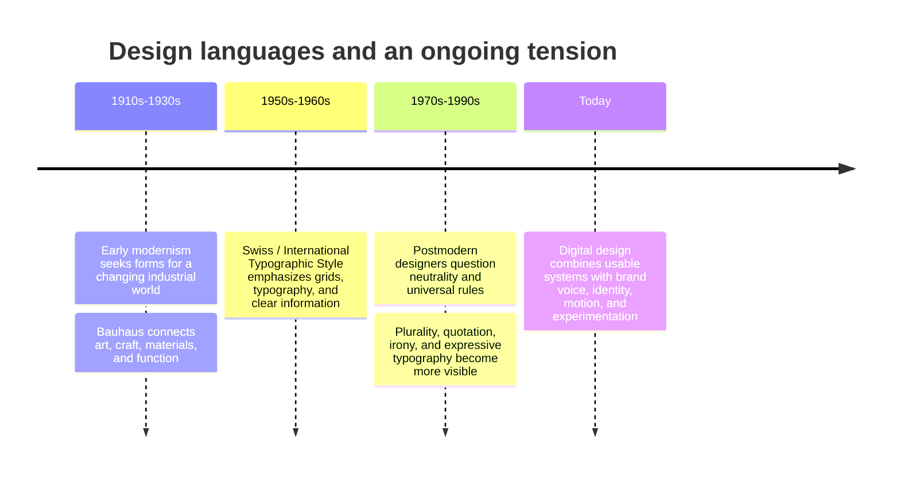

# Chapter 3: Design Language, Modernism, and Postmodernism

## Visual Design Carries Ideas

Visual design is not only decoration. A layout, typeface, color palette, image, and spacing system can suggest whether something is trustworthy, playful, exclusive, official, familiar, or experimental. These signals are part of a design language: the visual choices through which a product or organization communicates meaning.

Design languages are shaped by history. Two especially important traditions are modernism and postmodernism. They are not opposing teams that replaced one another once and for all. They are useful ways to understand a continuing tension in design.

## A Short Path into Modernism

Early twentieth-century modernism developed alongside rapid industrial, social, and technological change. Many designers wanted to move away from heavy historical ornament and create visual forms suited to a modern world. They often valued clarity, rational organization, new materials, and the idea that design could serve everyday life.

The **Bauhaus**, a German school active from 1919 to 1933, became an important symbol of this approach. It brought together art, craft, architecture, and industry. Bauhaus teaching explored how form, material, color, and function could work together rather than treating decoration as the main goal.

Later, the **Swiss / International Typographic Style** developed strongly in the mid-twentieth century. It is associated with structured grids, asymmetric layouts, sans-serif typography, photography, and carefully organized information. Its designers often aimed for communication that could feel clear, objective, and broadly understandable.

Modernism was not one identical look. Still, several principles commonly appear in modernist work:

- **Grid:** an underlying structure that aligns elements and creates order.
- **Hierarchy:** visual cues that show what to read or notice first.
- **Clarity:** information that is easy to find and understand.
- **Reduction:** removing elements that do not support the message.
- **Function:** form should help the object or message do its job.

## Modernism and Its Postmodern Reaction

By the later twentieth century, some designers questioned whether order, neutrality, and universal rules could really speak for everyone. **Postmodernism** partly reacted against modernist certainty, restraint, universality, and order. It made more room for conflicting references, local identity, humor, history, and visible expression.

Postmodern design can use **plurality** (more than one voice or style), **irony** (saying or showing something with a knowing twist), **disruption** (interrupting expected structure), **quotation** (borrowing or visibly referring to earlier styles), and **expressive typography** (type that performs emotionally instead of only delivering words quietly).

This does not mean postmodern design is simply messy or that modernism is always boring. A postmodern layout can be carefully planned, and a modernist layout can be expressive. The useful question is what a design's choices ask the audience to notice and feel.

| Tension | Modernist tendency | Postmodern tendency | A contemporary digital example |
| --- | --- | --- | --- |
| Order and disruption | Predictable alignment and stable navigation | Intentional interruption, surprise, or collision | A banking app may use a calm grid; an event site may animate type across the page. |
| Universality and identity | Broadly legible systems and neutral-looking information | Local voice, subculture, and distinct personality | A government form may prioritize common patterns; a music community may foreground its scene and language. |
| Clarity and expression | Minimal paths to key information | Mood, texture, and visual storytelling | A checkout page may remove distractions; a portfolio may use unusual motion to show its creator's style. |
| Grid and anti-grid | Repeated columns and consistent spacing | Overlap, irregular placement, and broken alignment | A dashboard often follows a grid; a campaign page may layer images and type. |
| Restraint and abundance | Limited colors and selected elements | Dense references, decoration, and multiple visual voices | A settings screen may stay spare; a streaming promotion may use rich images, stickers, and motion. |
| Function and irony | Direct communication of purpose | A self-aware or playful comment on the message itself | A transit app gives a route plainly; a social post may parody the language of an advertisement. |

## The Tension Continues Online

Modernist ideas are deeply useful in web and product design. Interfaces need readable labels, accessible contrast, understandable navigation, and a hierarchy that helps people complete tasks. A grid can make a responsive page easier to scan on a phone or laptop.

At the same time, digital products are not only forms and dashboards. A brand may use playful microcopy, oversized type, collage, animation, or a deliberately unusual layout to create character and signal who the experience is for. The challenge is balance: expression should not prevent someone from reading, navigating, or using the product.

For example, an online store can use a clear product grid and still have a memorable, expressive editorial section. A music app can use familiar controls for play and search while giving artists room for strong visual identities. History has not ended in one correct style; designers choose among these tensions based on audience, purpose, and context.

## One Shirt, Two Design Languages

Imagine the same plain white T-shirt, with identical fabric, fit, price, and manufacturing.

**A modernist presentation** might place the shirt on a white background with generous empty space. A simple grid organizes the page. Sans-serif type lists the size, material, price, and care instructions in a clear hierarchy. The shirt feels functional, direct, and dependable because the presentation reduces distractions.

**A postmodern presentation** might show the same shirt in an energetic collage with overlapping photographs, mismatched type styles, bright color, and a playful headline. It could reference old catalogues, street posters, or internet humor. The shirt may feel expressive, culturally connected, or surprising because the presentation makes the act of looking part of the experience.

Neither presentation changes the physical shirt. Each frames the audience's interpretation. The ethical limit is important: visual style should not imply a material quality, cultural affiliation, or performance claim that the shirt cannot honestly support.

## A Brief Timeline

## How to Read a Design

When you encounter a poster, website, package, or interface, do not begin by asking only whether you like it. Try these questions:

- What do I notice first, second, and last? What creates that hierarchy?
- Where is the grid, if there is one? Which elements follow it, and which break it?
- What has been reduced or left out? What has been made abundant or loud?
- How does the typography behave: quietly, formally, playfully, urgently, or emotionally?
- Does the design aim to feel universal and neutral, or specific and identity-based?
- What task does the design help someone complete? Does expression support or interfere with that task?
- What historical styles or visual references does it seem to use? Can I verify that connection?

These questions help you describe design decisions with evidence instead of only using words like "clean," "cool," or "weird."

## Museum Research

Use museum and institutional collections to find authentic examples. Do not assume that an image reposted on social media has a correct title, date, designer, or context. Find the collection record and verify the object yourself.

Try searches such as:

- `site:metmuseum.org modernist graphic design poster collection`
- `site:moma.org Bauhaus design collection`
- `site:cooperhewitt.org International Typographic Style collection`
- `site:vam.ac.uk postmodern graphic design collection`
- `Bauhaus archive typography collection`
- `Swiss Style graphic design museum collection`

The Metropolitan Museum of Art, MoMA, Cooper Hewitt, the V&A, Bauhaus archives, and other credible museums or design institutions can be good places to begin. When you find an object, record the institution, designer, title, date, materials or medium, and collection description as provided by that institution. Verify the actual record before using it in class work.

## What You Should Remember

Design language communicates ideas through structure, typography, images, color, and spacing. Modernist traditions often prioritize grid, hierarchy, clarity, reduction, and function. Postmodern approaches often make room for plurality, irony, disruption, quotation, and expressive typography.

Contemporary digital design continues to work with both sets of ideas. Strong design is not automatically minimal or automatically expressive; it makes intentional choices that serve people, communicate meaning, and fit the situation.
