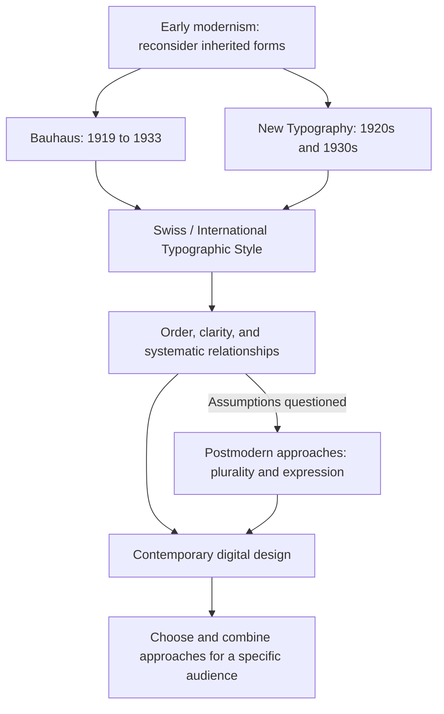

# Chapter 3: Visual Design Carries Ideas

Before you read a headline, a page has already offered clues. A precise grid can suggest order. Crowded lettering can suggest urgency, play, or conflict. Neither arrangement proves that the message is true, but each gives you a way to approach it.

**Visual language** is the system of relationships among typography, color, images, spacing, composition, and movement. Learning its history helps you make deliberate choices instead of treating a style as a collection of attractive effects.

## A Short Path into Modernism

Modernism includes several movements, rather than one look. As industrial production and modern urban life changed the conditions of design, designers reconsidered inherited forms and the relationship between appearance and use. New materials, methods, and audiences raised a practical question: what should design for a changing world look like?

In graphic design, the New Typography of the 1920s and 1930s challenged conventional symmetrical arrangements. Designers used asymmetry, blocks of type, and photomontage to organize information dynamically. Jan Tschichold's *Die Neue Typographie* appeared in 1928. This history complicates the idea that modernism always means quiet, centered minimalism. See [MoMA's account of the New Typography](https://www.moma.org/calendar/exhibitions/1013).

### Bauhaus: Learning through Making

Walter Gropius founded the Bauhaus in Weimar, Germany, in 1919. The school operated until 1933, moving to Dessau and later Berlin. It brought art, craft, and design into an experimental educational setting; its relationship with industrial production became increasingly important. Students investigated materials, color, and form alongside workshop practice. See [The Metropolitan Museum of Art's Bauhaus history](https://www.metmuseum.org/fr/essays/the-bauhaus-1919-1933).

For our purposes, the useful lesson is to connect visual decisions to materials, construction, and use. The Bauhaus was a changing school with different people and priorities, not a rule that every design must contain primary colors and geometric shapes.

### Swiss / International Typographic Style

Swiss graphic design gained international prominence in the 1950s and 1960s. The International Typographic Style is associated with systematic layouts, sans serif typography, photography, and carefully organized information. A **grid** supplies underlying alignments and proportions; it need not appear as visible lines. The aim was often precise, efficient communication. See [the Swiss National Library's overview](https://www.nb.admin.ch/de/der-internationale-stil-19501970), available in German.

Swiss design also contained differences. Designers in Basel and Zurich did not all use grids or typefaces in the same way. Treating it as one formula loses that variety. See [curator Barbara Junod's history of Swiss Style](https://www.aboutswitzerland.eda.admin.ch/en/swiss-style-forever-the-story-of-a-graphic-design-tradition).

Five practical ideas associated with modernist design are useful even when you do not copy a historical style:

- **Grid:** create relationships among elements so the layout feels coherent.
- **Hierarchy:** make relative importance visible through size, weight, position, and spacing.
- **Clarity:** help the audience find and understand relevant information.
- **Reduction:** remove elements that do not support the intended communication.
- **Function:** evaluate decisions in relation to what the design helps people do.

Reduction requires judgment. Removing a size guide would make a shirt page simpler but less useful. A restrained page can also conceal cultural assumptions about what its audience reads easily or considers trustworthy.

## Postmodernism: Questioning a Single Right Answer

Postmodern design partly challenged modernist confidence in order, progress, restraint, and universal solutions. The V&A describes the period around 1970–1990 as one of complexity, contradiction, and increased awareness of style itself. Designers mixed references, embraced theatricality, and questioned the idea of one correct visual language. See [the V&A's introduction to postmodernism](https://www.vam.ac.uk/articles/what-is-postmodernism).

Useful terms include **plurality**, allowing multiple voices or interpretations; **quotation**, borrowing recognizable visual conventions; and **irony**, creating tension between an apparent statement and an intended reading. Expressive typography and disrupted layouts can make the form part of the message.

Consider an invented shirt advertisement that gives an ordinary T-shirt a grand, ceremonial frame, then labels it “A monument to getting dressed.” The mismatch invites a joke about fashion's seriousness. This is original teaching copy, not a historical quotation.

Such techniques can invite participation and make a design memorable. They can also confuse or exclude viewers who do not recognize the reference. Expressive work still needs decisions about hierarchy and readability.

## Comparing the Tensions

These are tendencies for comparison, not rules that classify every historical object. The design suggestions are hypothetical applications.

| Tension | Modernist emphasis | Postmodern challenge | Question for a designer |
| --- | --- | --- | --- |
| Order and disruption | Consistent visual relationships | Interrupting expectations | What should be predictable, and where would surprise help? |
| Universality and identity | Broadly usable visual systems | Situated voices and cultural differences | Whose idea of “normal” does this layout assume? |
| Clarity and expression | Direct access to information | Form as a source of meaning | Can people understand the offer and still experience its personality? |
| Grid and anti-grid | Alignment and systematic structure | Collision, overlap, or apparent disorder | Which relationships remain legible when the surface breaks the grid? |
| Restraint and abundance | Selective elements and controlled variation | Layering and stylistic mixture | Does another element add meaning or only noise? |
| Function and irony | Emphasis on intended use | Questioning what counts as useful or serious | Will the joke obscure something the audience needs? |

An anti-grid composition can still be carefully planned. Likewise, a grid can organize an energetic design. The comparison describes productive tensions, not a contest with a permanent winner.

This is a selective map of influences and tensions. It does not show every movement or imply that one tradition disappeared when another emerged.

## The Tension Continues on Screen

A digital product can use repeatable components and a clear information hierarchy while expressing a distinctive identity. Consider three hypothetical examples:

- A **course registration page** uses aligned fields, readable labels, and clear deadlines. Disrupting the layout might interfere with the task; personality can appear in illustrations and welcoming language.
- A **music event page** uses layered imagery and oversized, expressive headings. Tickets, dates, and access information still need to be easy to find.
- A **clothing store** uses an experimental campaign page that leads into a predictable size selector and checkout. The visual intensity changes with the task.

On smaller screens, overlapping text may become unreadable. Motion may distract or cause discomfort. A restrained page can fail too, with faint text or unexplained icons. Check contrast, keyboard access, text resizing, and reading order instead of assuming a historical style guarantees usability.

These are applications of the chapter's framework, not claims that a particular live website belongs to one movement. History continues as designers combine, adapt, and dispute approaches.

## The Same White T-Shirt, Two Presentations

Keep the shirt, price, and terms unchanged. In a **modernist presentation**, place one clear product photograph beside aligned measurements, concise copy, and a visible purchase option. The intended meaning is dependable simplicity: this is an object you can evaluate.

In a **postmodern presentation**, repeat the photograph at different scales, add playful annotations, and contrast a grand headline with the shirt's ordinariness. The intended meaning is self-aware participation in fashion's image-making. Keep essential product details readable in both versions.

Neither presentation changes the stitching. One invites trust through organization; the other invites interest through expressive contradiction. Whether either succeeds depends on the audience and the task.

## How to Read a Design

1. **Describe before judging.** Record what you see: alignments, empty areas, type sizes, colors, cropping, and repeated forms.
2. **Trace the hierarchy.** What did you notice first, second, and third? What is difficult to locate?
3. **Look for a system.** Where do elements align? Which departures seem deliberate?
4. **Interpret the invitation.** Does the design suggest authority, intimacy, efficiency, resistance, or play? Point to visual evidence.
5. **Ask about context.** Who made it, for whom, in which medium, and for what purpose? Separate documented facts from your interpretation.
6. **Test the task.** Can the audience do what they came to do? Who might struggle, and why?

Instead of “This looks modern,” try “The aligned labels and repeated spacing make comparison easy.” That claim is specific enough to discuss and test.

## Museum Research

The following are **suggestions for external research**, not claims that a particular object has already been located. Start with an institution's official collection search:

| Institution | Search suggestions | What to investigate |
| --- | --- | --- |
| The Metropolitan Museum of Art | Bauhaus; modern design | Materials, making, and intended function |
| MoMA | New Typography; Jan Tschichold; graphic design | Asymmetry and information hierarchy |
| Cooper Hewitt | typography; poster; graphic design | The relationship between lettering, image, and audience |
| V&A | postmodernism; Memphis; graphic design | Quotation, theatricality, and mixed references |
| Bauhaus-Archiv | workshop; typography; preliminary course | Education and experimentation |
| Museum für Gestaltung Zürich | Swiss typography; Josef Müller-Brockmann; Emil Ruder | Grids, spacing, and contrasting approaches |

Choose two actual collection records. Verify each object's title, maker or attribution, date, medium, and collection identifier from the institution's record. Copy the real record URL rather than guessing one. If information is unknown or approximate, preserve that uncertainty. Check image reuse terms before reproducing an image.

Write one paragraph comparing what the objects do visually. Support your interpretation with visible details, and avoid treating a museum's possession of an object as proof of a stylistic label. A search-result thumbnail is a starting point, not a complete source.

## What You Should Remember

- Visual language carries ideas through relationships among words, images, and space.
- Bauhaus and Swiss typography offer influential approaches to making, structure, and communication.
- Postmodern approaches question universal answers through plurality, quotation, irony, and expression.
- Contemporary design continues to negotiate these tensions; no single style solves every task.
- Evaluate both meaning and usability, and verify historical examples through authentic records.
