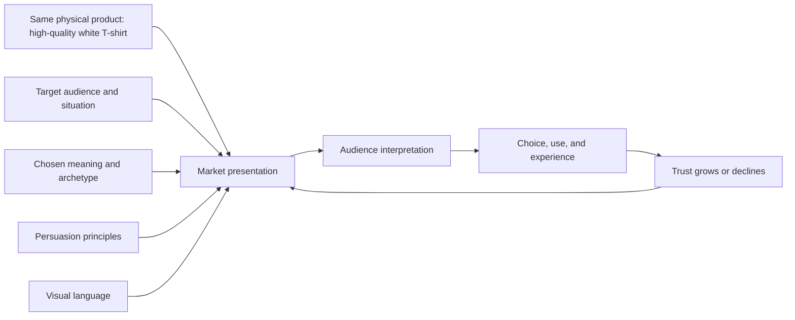

# Chapter 4: The Plain White T-Shirt Case Study

## One Shirt, Four Stories

Imagine an ordinary high-quality plain white T-shirt. It has the same fabric, cut, seams, and care requirements in every version below. We will change the audience, story, persuasive choices, and visual language, but we will not quietly turn it into a different physical product.

This is the central lesson of the case study: a market presentation does not merely describe an object. It helps an audience decide what the object means. The shirt can become a tool, a uniform, a statement, or an invitation to make something. Each interpretation may be useful, but each also creates ethical responsibilities.

The four concepts are intentionally different. Think of them as four creative teams receiving the same product brief and returning with four very different answers.

## Concept 1: The Reliable Companion

**Target audience:** Students, commuters, and travelers who want a dependable everyday layer without spending much time making a choice.

**Brand archetype:** Explorer, supported by Everyperson.

**Persuasive principles:** Social proof through verified customer feedback; authority through clear fabric, fit, and care information; commitment and consistency by connecting the shirt to a practical habit of packing and dressing simply.

**Visual language:** Functional and calm. Use a restrained layout, a route-like product story, clear measurements, and photographs showing the shirt in several ordinary settings. The structure should help someone compare sizes and imagine movement rather than create a luxury mood.

**Headline:** `One good layer. Wherever the day goes.`

**Short product story:** This is the shirt that earns its place in a small bag and a busy week. It works under a jacket, with jeans, or on its own. The story focuses on repeat use and the confidence that comes from knowing what to expect.

**Likely imagery:** A neatly packed bag, a train platform, a campus walkway, and a person wearing the same shirt in changing weather. The images should show the shirt clearly rather than turn travel into a vague adventure fantasy.

**Meaning the customer is invited to buy:** The customer is invited to buy readiness and freedom of movement, not a magical transformation. The shirt becomes a reliable companion for an active routine.

**Ethical risk or limitation:** Explorer language can exaggerate ordinary convenience into a promise of adventure. The presentation should not imply that buying the shirt makes someone brave, mobile, or interesting. It should disclose actual fabric performance and avoid invented durability claims.

## Concept 2: The Measured Essential

**Target audience:** Careful shoppers who value information, long-term use, and a quiet wardrobe system.

**Brand archetype:** Sage, with a touch of Ruler.

**Persuasive principles:** Authority through relevant product information; framing the shirt as a considered essential; choice architecture that makes size, price, care, and return information easy to find and compare.

**Visual language:** Restrained modernist and Swiss-influenced. Use a precise grid, strong hierarchy, generous but purposeful spacing, legible sans-serif type, neutral photography, and minimal decoration. Every element should have a job.

**Headline:** `A clear choice for everyday wear.`

**Short product story:** Instead of asking the shopper to fall in love with a fantasy, the presentation invites them to inspect the shirt. Fabric weight, measurements, construction details, care requirements, and price sit beside the product image. The message is that a simple choice can still be a thoughtful one.

**Likely imagery:** A front and back product view, close details of the collar and seams, a measured flat lay, and a compact comparison chart. The shirt is shown consistently so the viewer can judge it rather than decode a mood.

**Meaning the customer is invited to buy:** The customer is invited to buy clarity, control, and confidence in a well-understood object. The shirt becomes an example of deliberate consumption.

**Ethical risk or limitation:** A clean grid can create an impression of objectivity that the product has not earned. The design must not hide limitations behind polished order, use unexplained technical language, or imply that a restrained appearance proves superior quality. The "clear choice" still has to be genuinely clear.

## Concept 3: The Anti-Uniform

**Target audience:** People who are skeptical of trend cycles and enjoy challenging familiar advertising language.

**Brand archetype:** Rebel, supported by Jester.

**Persuasive principles:** Contrast and disruption to attract attention; irony to question fashion pressure; commitment and consistency by inviting the audience to act on a stated preference for less unnecessary consumption.

**Visual language:** Disruptive and postmodern. Combine an oversized product photograph with a tiny annotation, interrupt the grid, quote the tone of a glossy advertisement, and then undercut it with plain language. Use expressive typography and collage carefully enough that the product facts remain findable.

**Headline:** `It is just a white T-shirt. That is the point.`

**Short product story:** The presentation refuses to pretend that a basic garment will reinvent the wearer. It makes room for skepticism: the shirt is useful, well made, and ordinary. Its value comes from resisting the demand that every purchase be a dramatic identity event.

**Likely imagery:** A deliberately formal fashion pose beside an awkwardly cropped detail, scanned notes, crossed-out superlatives, and a plain product shot. The visual joke should be legible without mocking the audience.

**Meaning the customer is invited to buy:** The customer is invited to buy independence from hype and the pleasure of seeing through a sales performance. The shirt becomes a small refusal of excess.

**Ethical risk or limitation:** Irony can become another form of status signaling. A message that mocks fashion may still make buyers feel superior to people with different tastes. The concept should not shame consumption, pretend that the shirt has no environmental or labor implications, or use confusion as proof of intelligence.

## Concept 4: The Blank Beginning

**Target audience:** Students, makers, artists, and anyone who wants clothing to act as a surface for personal expression.

**Brand archetype:** Creator, supported by Magician.

**Persuasive principles:** Unity through a real community of making; liking through process-focused, human imagery; reciprocity through useful customization guides or workshops that help people use the product.

**Visual language:** Expressive and process-driven. Show sketches, dye tests, embroidery, patches, and imperfect worktables. Let typography shift between a clear product label and handwritten or experimental marks. Keep the shirt recognizable while allowing the surrounding system to feel made by people rather than generated from a single polished template.

**Headline:** `Start with white. Make it yours.`

**Short product story:** The shirt is not presented as a finished identity. It is a blank beginning for a class project, a first embroidery attempt, a local event, or a design that changes over time. The story celebrates what the wearer adds without claiming that creativity arrives automatically with the purchase.

**Likely imagery:** A sequence of the same shirt before and after customization, close views of hands at work, a range of finished examples, and notes explaining techniques. Include unfinished attempts so the invitation feels achievable rather than impossibly perfect.

**Meaning the customer is invited to buy:** The customer is invited to buy possibility, authorship, and participation. The shirt becomes material for a practice, not a finished badge of originality.

**Ethical risk or limitation:** "Make it yours" can conceal the labor, skill, and cost required to customize clothing. The presentation should provide realistic instructions, avoid appropriating cultural motifs without context, and make clear what the shirt includes before customization. It should invite creativity without suggesting that buying the blank makes someone an artist.

## Synthesis Table

| Concept | Audience | Archetype | Persuasion focus | Visual language | Meaning invited | Main ethical risk |
| --- | --- | --- | --- | --- | --- | --- |
| The Reliable Companion | Students, commuters, travelers | Explorer + Everyperson | Social proof, authority, consistency | Practical, calm, route-oriented | Readiness and freedom of movement | Exaggerated adventure or durability claims |
| The Measured Essential | Careful, information-seeking shoppers | Sage + Ruler | Authority, framing, choice architecture | Modernist, Swiss-influenced, gridded | Clarity and deliberate choice | Polished order disguising limits |
| The Anti-Uniform | Trend skeptics and irony-aware audiences | Rebel + Jester | Disruption, irony, contrast | Postmodern, collage, expressive type | Independence from hype | Superiority, confusion, or hidden impacts |
| The Blank Beginning | Makers, students, artists | Creator + Magician | Unity, liking, reciprocity | Process-driven, expressive, handmade | Authorship and possibility | Romanticizing customization or labor |

The table shows why there is no single best presentation in the abstract. Each concept solves a different communication problem. The Reliable Companion reduces uncertainty about fitting a shirt into daily movement. The Measured Essential supports comparison. The Anti-Uniform makes a cultural argument. The Blank Beginning invites participation. Their success depends on whether the physical product and the full customer experience support the meaning being offered.

## How the Presentation Is Built

The market presentation can be understood as a combination of five inputs. The product provides a material starting point, but the audience determines which meaning matters. Persuasion shapes attention and action, while visual language makes the position perceptible.

The feedback loop prevents a common mistake: treating a launch image as the whole brand. If the Explorer shirt shrinks after one wash, the promise of dependable movement weakens. If the Sage presentation hides a confusing return policy, its claim to clarity fails. If the Creator concept offers no useful support for customization, its invitation to participate feels hollow. Meaning is produced by the complete experience, not by a headline alone.

## A Designer's Final Check

Before choosing one of these presentations, ask:

- Is the physical shirt substantially the same product we describe?
- Which audience situation are we helping, and what evidence do we have that it matters?
- What meaning is the customer actually being invited to buy?
- Which persuasive principles are visible, and could any of them become pressure?
- Does the visual language help the audience understand the choice or merely create atmosphere?
- What important limitation might the story encourage people to overlook?
- Will the product, service, and after-purchase experience support the promise?

The strongest concept is not the most dramatic one. It is the one whose audience, archetype, persuasion, visual language, and actual product behavior agree with one another.

## What You Should Remember

One plain white T-shirt can be positioned as an Explorer's companion, a Sage's measured essential, a Rebel's anti-uniform, or a Creator's blank beginning. The product stays substantially the same; the audience, meaning, persuasive principles, and visual language change. Good synthesis makes those choices coherent and useful while naming the limits and ethical risks. A compelling presentation should help people understand what they are choosing, not make the story so powerful that the product and its consequences disappear.