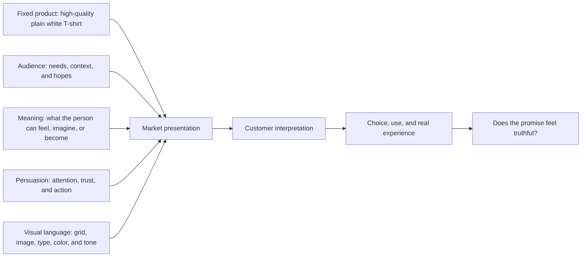

# Chapter 4: One White T-Shirt, Four Different Worlds

## The Fixed Product

Imagine an ordinary, high-quality plain white T-shirt. It has a comfortable fit, durable construction, and no logo. Across this chapter, its fabric, price range, and manufacturing stay substantially the same.

What changes is the presentation. The audience, brand archetype, persuasive choices, and visual language turn one basic garment into four very different invitations. This is the point: branding does not merely describe a product. It helps people interpret what the product might mean in their lives.

## 1. Field Notes: The Explorer Shirt

**Target audience:** Students and young adults who enjoy day trips, trying unfamiliar places, and the idea of being ready to go.

**Brand archetype:** Explorer.

**Persuasive principles:** Commitment and consistency (for people who see themselves as curious and independent), social proof through real customer travel stories, and honest scarcity if a production run is genuinely limited.

**Visual-design language:** Open space, practical labels, terrain-like textures, and muted natural colors. The layout is clear enough to read quickly but feels less polished than a luxury catalogue—more like a useful field guide.

**Headline:** *Leave room for the next turn.*

**Short product story:** This is the shirt you reach for before a train ride, a museum stop in a new neighborhood, or a long walk that was not on the schedule. It is not technical expedition gear. It is a dependable basic for people who want to stay open to the day.

**Likely imagery:** A folded shirt in a small weekend bag; daylight through a train window; a person walking through a city park. The shirt remains visible, but the images suggest movement rather than a studio pose.

**Meaning the customer is invited to buy:** "I am the kind of person who is curious, mobile, and ready to discover something."

**Ethical risk or limitation:** Do not imply that a standard cotton T-shirt provides outdoor protection or makes someone adventurous. Adventure is not a purchase requirement, and any scarcity claim must be true.

## 2. The Essential: A Modernist Basic

**Target audience:** People who value simple decisions, reliable information, and clothing that fits easily into an everyday wardrobe.

**Brand archetype:** Everyperson, with a small Sage tendency toward clear information.

**Persuasive principles:** Authority through accurate product specifications, reduced cognitive load through clear choices, and commitment and consistency for shoppers building a practical wardrobe.

**Visual-design language:** Restrained modernist / Swiss-influenced design. A grid organizes the page; sans-serif type creates strong hierarchy; a small palette, generous white space, and direct labels reduce noise.

**Headline:** *One shirt. Clearly made.*

**Short product story:** No costume, no complicated trend forecast, no mystery. The Essential is a plain white T-shirt presented with the details a customer needs: fit, material, care, and price. It makes the small choice feel calm rather than dramatic.

**Likely imagery:** Front, side, and close-up views against a plain background; a simple size guide; a close photograph of the fabric. The image system answers questions instead of creating spectacle.

**Meaning the customer is invited to buy:** "I can choose well without making my life more complicated."

**Ethical risk or limitation:** Minimal design can make an ordinary product look more precise or premium than it is. Clear design must be matched by equally clear facts, including limitations.

## 3. Blank Noise: The Creator Shirt

**Target audience:** Students, artists, and style experimenters who use clothing as part of self-expression.

**Brand archetype:** Creator.

**Persuasive principles:** Liking and identification through relatable makers; social proof through authentic customer styling; framing the blank shirt as possibility rather than emptiness.

**Visual-design language:** Layered studio materials, handwritten notes, cropped images, and adjustable type treatments. It is lively but still lets the shirt read as a white surface that can be styled in many ways.

**Headline:** *Start with a blank answer.*

**Short product story:** The shirt does not finish the look for you. That is its advantage. Wear it with paint-splattered pants, a careful jacket, a favorite pin, or nothing but clean jeans. The product becomes a starting point for a personal decision.

**Likely imagery:** A worktable with sketches and thread; different people styling the same shirt; a white shirt under a colorful overshirt. Avoid suggesting that buying a shirt automatically makes someone an artist.

**Meaning the customer is invited to buy:** "I have room to make this ordinary thing my own."

**Ethical risk or limitation:** The campaign could exploit creative identity by implying that originality can be purchased. Customer images and maker stories should be used with permission and should not be staged as fake community proof.

## 4. No Uniform: The Rebel Shirt

**Target audience:** People who are tired of trend pressure and enjoy humor, contradiction, and cultural commentary.

**Brand archetype:** Rebel, with Jester energy.

**Persuasive principles:** Framing, identity, liking, and loss aversion used carefully: the message can question the fear of falling behind, but it should not create a new fear of being uncool.

**Visual-design language:** Disruptive, postmodern design. Clashing scale, overlapping type, photocopy textures, intentionally awkward crop marks, and a collage that quotes the visual noise of fashion advertising. The anti-grid is deliberate, not accidental.

**Headline:** *The trend is a white rectangle.*

**Short product story:** Fashion insists that every season needs a new answer. No Uniform replies with one familiar shape and a raised eyebrow. The shirt is not revolutionary; it is a reminder that a person can step away from the pressure to perform a new identity every week.

**Likely imagery:** The shirt photographed beside exaggerated sale stickers, crossed-out trend words, or a playful pile of mismatched magazines. The visual noise becomes part of the joke, while the actual product remains easy to identify.

**Meaning the customer is invited to buy:** "I can resist a rule without needing another costume."

**Ethical risk or limitation:** Selling rebellion can become another form of conformity. The campaign should not shame people who enjoy fashion or make false claims about the industry to sound provocative.

## Synthesis: Four Presentations, One Product

| Concept | Audience and archetype | Persuasion focus | Visual language | Main invitation | Ethical watch-out |
| --- | --- | --- | --- | --- | --- |
| Field Notes | Curious day-trippers; Explorer | Identity, real social proof, truthful scarcity | Field-guide clarity, natural textures, open space | "I am ready to discover." | Do not promise technical performance or sell fake urgency. |
| The Essential | Practical everyday shoppers; Everyperson/Sage | Accurate authority, low cognitive load, consistency | Restrained modernist, Swiss-influenced grid | "I can make a simple, informed choice." | Do not let minimalism hide ordinary quality or missing information. |
| Blank Noise | Makers and style experimenters; Creator | Identification, authentic community proof, framing | Layered studio collage and flexible typography | "I can make it mine." | Do not sell creativity as a trait that comes with a purchase. |
| No Uniform | Trend-weary, humorous audiences; Rebel/Jester | Framing, identity, liking | Disruptive postmodern collage and anti-grid | "I can opt out of the pressure." | Do not turn rebellion into a new pressure or shame other choices. |

## How a Presentation Is Built

The diagram has an important final question. A brand can guide interpretation, but it cannot permanently control it. The real product and customer experience eventually test the story.

## What You Should Remember

The same white T-shirt can be presented as a companion for exploration, a rational everyday basic, a canvas for creativity, or a joke about trend culture. The physical product may stay nearly the same, but the audience, archetype, persuasive principles, and visual language change its meaning.

Strong branding combines these choices deliberately and ethically. It gives people a truthful invitation, not a false identity or a reason to feel pressured.
