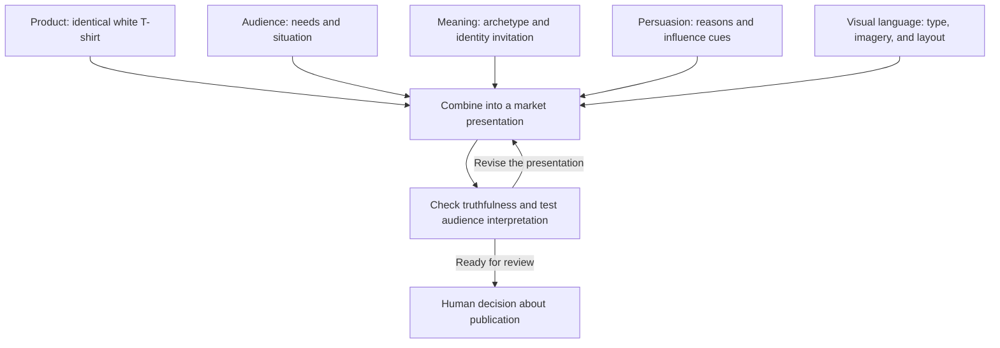

# Chapter 4: One White T-Shirt, Four Different Invitations

Put an ordinary white T-shirt on a table. Now imagine four teams entering the room. One sees a companion for exploration. Another sees a sensible decision. A third sees resistance to logo culture. The fourth sees a way to belong.

Everyone is looking at the same shirt.

This case study combines [persuasion](01-persuasion.md), [brand archetypes](02-archetypes.md), and [visual language](03-design-language.md). The challenge is to change the invitation without quietly changing the product.

## Keep the Experiment Honest

Our imaginary product is an ordinary, high-quality plain white T-shirt. Its fabric, construction, cut, available sizes, price, and purchase terms stay the same across all four concepts. “High-quality” is an assumption for the exercise; a real seller would need specific evidence to support a quality claim.

Every campaign name, headline, story, and scene below is invented for teaching. None represents a real brand, testimonial, or tested result. Accessories in the photographs are styling suggestions, not items included with the shirt.

For each concept, ask what someone is being invited to buy beyond the physical garment. The answer should describe a possible meaning, not a magical effect of ownership.

## Concept 1: The Open Route

**Audience:** People who want small adventures in everyday life, including students exploring a new neighborhood on a limited budget.

**Archetype:** Explorer. The emphasis is curiosity and choosing a direction.

**Headline:** “Your next turn is yours.”

**Short product story:** A familiar shirt for an unfamiliar afternoon. Pair it with what you already own, step outside your routine, and see where your curiosity takes you. The next discovery might be around the corner.

**Persuasion:** Framing presents the basic garment as part of an experience rather than an outfit problem. Commitment and consistency can support a voluntary invitation to plan a new walking route: someone who already wants to explore may see the styling as compatible with that intention. Planning a walk must not be treated as a commitment to purchase.

**Visual language:** An open, asymmetrical editorial layout, spacious margins, and a readable route-like line linking sections. The design suggests movement while keeping product information stable.

**Imagery direction:** Photograph the same shirt on someone studying a street map or looking down an unfamiliar side street. Avoid making adventure depend on expensive travel or extreme athletic ability.

**Meaning offered:** I can be curious and self-directed in ordinary life.

**Ethical concern:** Travel imagery cannot establish technical performance. Do not imply that the shirt is protective outdoor equipment or that exploration requires buying it. An honest invitation can acknowledge the clothes someone already owns.

## Concept 2: The Considered Basic

**Audience:** People who want to compare clothing efficiently and avoid buying something that will not fit their needs.

**Archetype:** Sage, emphasizing understanding and informed judgment.

**Headline:** “Know what you are choosing.”

**Short product story:** Start with the details: shape, measurements, care instructions, and price. Compare them with a shirt you already wear. Choose this one if it fits your wardrobe and your needs.

**Persuasion:** Support the central route of the elaboration likelihood model by making relevant information easy to examine. Authority could supplement that information only if an actual qualified person evaluates the product; this imaginary campaign has no expert endorsement to display. The foundation is understandable evidence, not an invented badge.

**Visual language:** Restrained modernist / Swiss-influenced design. Use a consistent grid, sans serif type, generous spacing, and a clear hierarchy from product name to photograph to specifications. One accent color can distinguish an action without competing with every detail.

**Imagery direction:** Front, back, and close-up photographs at consistent scales, plus an accurately labeled measurement illustration. Leave numeric measurements as verified production inputs rather than inventing them for the exercise.

**Meaning offered:** I can feel informed and deliberate about an ordinary purchase.

**Ethical concern:** Precision can create an impression of authority even when a claim is weak. Verify specifications, show total costs, and avoid presenting polished layout as proof of superior manufacturing.

## Concept 3: The Unbranded Statement

**Audience:** People who enjoy challenging fashion expectations and do not want a visible clothing logo to speak for them.

**Archetype:** Rebel, with a touch of Jester to keep the challenge playful.

**Headline:** “No logo. Plenty to say.”

**Short product story:** Here is a shirt that leaves the advertising space empty. Wear it with something unexpected, or with the same jeans again. You get to decide whether your outfit needs an explanation.

**Persuasion:** Framing turns the blank surface into a statement about self-definition. Liking may make the campaign more inviting through a humorous presenter, provided their performance is recognizable as advertising. The message offers an attitude to consider rather than an accusation that other shoppers are conformists.

**Visual language:** Disruptive, postmodern composition with collage, oversized type, contrasting letterforms, and an exaggerated empty “advertising space” frame. Use quotation and irony to comment on advertising itself. Keep the price, size choices, and purchase controls readable.

**Imagery direction:** Repeat the same shirt photograph in different crops against layered graphic backgrounds. Put annotations around the image, so viewers do not mistake them for printing on the garment.

**Meaning offered:** I can play with expectations and express independence.

**Ethical concern:** A company selling resistance is still selling something. Do not pretend a purchase proves independence, political commitment, or moral superiority. Disruption also fails if the audience cannot understand what is actually for sale.

## Concept 4: The Common Thread

**Audience:** Students interested in an informal gathering where participation matters more than having a particular fashion label.

**Archetype:** Everyperson, supported by Caregiver hospitality.

**Headline:** “Come as yourself. Wear white if you like.”

**Short product story:** Different people, different outfits, one easy point of connection. This plain white shirt is one option for the gathering. A white shirt you already own works too, and joining in does not depend on buying anything.

**Persuasion:** Unity connects the shirt with a real shared activity, if an organizer actually runs one. Social proof could come from genuine participants who consent to appear. For this fictional concept, proposed group scenes are creative directions, not evidence that a community already endorses the product.

**Visual language:** Warm, accessible photography with readable typography and a simple, consistent layout. Give event information and participation options as much clarity as the product offer.

**Imagery direction:** Show people wearing the identical shirt with varied outfits while talking or helping set up a gathering. Identify staged promotional images appropriately; do not present models as actual members giving testimonials.

**Meaning offered:** I can take part without needing to perform exclusivity.

**Ethical concern:** Belonging is easy to turn into pressure. Avoid making purchase a condition of friendship, admission, or recognition. An inclusive message needs an inclusive actual experience, including clear access information.

## Compare the Four Concepts

| Concept | Audience desire | Archetype | Persuasion approach | Visual language | Meaning beyond the shirt | Main risk |
| --- | --- | --- | --- | --- | --- | --- |
| The Open Route | Everyday discovery | Explorer | Framing; voluntary consistency | Spacious, directional editorial layout | Curiosity and autonomy | Implying performance or freedom that the shirt cannot deliver |
| The Considered Basic | A clear decision | Sage | Central-route evaluation | Restrained Swiss-influenced grid | Confidence through understanding | Using precision to disguise unsupported claims |
| The Unbranded Statement | Independence from fashion expectations | Rebel / Jester | Framing; liking | Disruptive postmodern collage | Playful resistance | Selling conformity to a new identity while promising escape |
| The Common Thread | Participation and connection | Everyperson / Caregiver | Unity; authentic social proof if available | Welcoming imagery and readable structure | Belonging without exclusivity | Turning an invitation into social pressure |

These are hypotheses about how meaning might work. A shopper could find the Explorer concept impractical, the Sage concept dull, the Rebel concept funny, or the Everyperson concept unconvincing. The archetype label does not settle the audience's response.

## How the Ingredients Combine

The product constrains the promise. The audience gives the promise relevance. Meaning gives it a direction. Persuasion and visual language help communicate it. Review checks whether those pieces actually fit.

## Try the Comparison Yourself

Give two concepts the same amount of space and show them without their archetype labels. Ask a few classmates what each seems to offer, what information they would need, and what feels exaggerated. Avoid asking only which version they would buy: someone can like an image while misunderstanding the offer.

Keep the product facts constant while you revise. If a concept only works after you add a charity donation, a special fabric, or a lower price, you have changed the offer and started a different experiment. Small classroom reactions are useful feedback, not proof of how an entire market will behave.

## What You Should Remember

- The same physical shirt can carry different meanings without acquiring different qualities.
- Audience, archetype, persuasion, and visual language should support one coherent invitation.
- Explorer, Sage, Rebel, and Everyperson concepts offer different reasons to care about an ordinary garment.
- Images, community cues, and technical presentation must not imply evidence you do not have.
- Test what people understand and imagine, then revise the presentation honestly.
