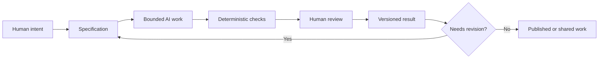

# Chapter 5: From Meaning to Method

The first four chapters used one plain white T-shirt to show that an object does not speak for itself. A designer, writer, or brand gives it a context. Persuasion shapes attention, interpretation, trust, and action. Archetypes organize a recognizable sense of character and identity. Visual language determines how that meaning looks, sounds, and feels.

Together, these three lenses form a useful control framework:

| Lens | Guiding question | Example for the white T-shirt |
| --- | --- | --- |
| Persuasion | What response are we trying to enable? | Help a careful shopper compare the shirt and decide with confidence |
| Archetype | What meaning or identity are we expressing? | Present the shirt as a Sage's measured essential |
| Design language | How should that meaning look and feel? | Use a restrained grid, clear hierarchy, and precise product photography |

The framework is not a formula that guarantees a good result. It is a way to make creative decisions visible. When a presentation feels confused, ask which lens is unclear. Perhaps the message asks for trust but uses suspicious urgency. Perhaps the brand claims to be a Caregiver but makes support difficult to find. Perhaps the meaning is thoughtful while the visual language is so chaotic that nobody can understand the offer.

## Directing AI with Three Lenses

AI can generate text, images, layouts, code, and alternatives quickly. Speed is useful, but it also creates a risk: an AI system may produce something fluent and attractive without understanding the purpose behind it. The three lenses help a person give direction that is more specific than "make it better."

Instead of asking an AI assistant to make a white T-shirt campaign, a designer can specify:

- **Persuasion:** Help first-time buyers compare fit, fabric, price, and care, then decide without pressure.
- **Archetype:** Use the Sage as the primary pattern, with a small amount of Everyperson warmth.
- **Design language:** Use a modernist grid, strong hierarchy, restrained color, and accessible text.
- **Boundaries:** Do not invent certifications, scarcity, customer reviews, or performance claims.
- **Output:** Produce three headline options, a short product description, and a comparison table in Markdown.

This direction gives the AI a purpose, a meaning, a form, and limits. It also gives the human something concrete to review. The same method works beyond branding. For a technical task, persuasion might mean helping a user understand a warning, archetype might mean expressing a calm and trustworthy product character, and design language might mean using a compact, readable interface.

## Why Work Needs a Specification

A **specification** is a written description of the intended result, its boundaries, and how success will be recognized. It might include the audience, required sections, file path, examples, exclusions, and acceptance criteria.

Specifications matter because AI generation is open-ended. Without a boundary, a request can drift toward whatever is easiest to produce or whatever pattern is most familiar in the training data. A specification gives the work a destination and gives the reviewer a standard.

A useful specification answers:

- What are we making?
- Who is it for?
- What must it include?
- What must it avoid?
- Where should it be created?
- How will we check it?

The specification should be detailed enough to guide work but not so rigid that it prevents judgment. For the white T-shirt case study, "create four versions" is a start. Naming the required audience, archetype, persuasive principles, visual language, headline, story, imagery, meaning, and ethical risk makes the task testable.

## Three Kinds of Checking

No single review method can answer every question. Good AI-assisted work combines different kinds of checking.

### Deterministic Checks

**Deterministic checks** produce the same answer when the same input is tested under the same conditions. They are excellent for cheap, repeatable facts:

- Does the required file exist?
- Are all required headings present?
- Is there exactly one Mermaid block?
- Are all five chapter links in the index?
- Does the document contain the expected table headers?

These checks do not decide whether a chapter is insightful or whether a claim is honest. They simply catch omissions and structural mistakes quickly. Automation can handle this part repeatedly without becoming tired.

### Probabilistic AI Review

An AI reviewer can help identify repetition, unclear explanations, missing perspectives, awkward transitions, or possible contradictions. That review is **probabilistic**: it may be useful, but it is not guaranteed to be correct or consistent. An AI can miss a subtle cultural problem, confidently approve an invented claim, or prefer smooth prose over accurate reasoning.

Treat AI review as another opinion and a source of questions. Ask it to point to evidence in the text, compare the result with the specification, and identify uncertainty. Do not treat its approval as proof that the work is true or finished.

### Human Judgment

People remain responsible for judgment, meaning, truthfulness, context, and final decisions. A human must decide whether the audience has been treated fairly, whether an example is culturally appropriate, whether a claim needs evidence, and whether the result actually helps someone.

This is not a ceremonial final glance. Human judgment belongs at important decision points throughout the process. The person who understands the assignment and its consequences is the person who can notice when a technically complete output is still wrong for the situation.

## Version Control as a Safety Net

When AI generates work, revision can happen quickly and in large amounts. **Git** provides traceability and recovery. A commit records a version of the project and a message about what changed. A branch lets a student develop one issue without mixing it immediately with unrelated work. A diff makes changes visible for review. Earlier commits provide a recovery point when a new experiment makes the work worse.

Version control does not judge the content for you. It creates a record that supports judgment. You can compare the first draft with the revised draft, identify which issue introduced a problem, and return to a known version without relying on memory. In a collaborative project, the history also helps others understand how the result developed.

The practical loop is simple:

1. Define the issue and specification.
2. Create a focused branch.
3. Ask the AI to produce or modify the bounded output.
4. Review the diff and run deterministic checks.
5. Make human editorial decisions.
6. Commit the reviewed result with a clear message.
7. Push, merge, and verify the result in the shared project.

## The Pit-Stop Model of Review

Think of automation as a race car that can keep running around the track. Automated checks are fast and consistent, but they do not decide when the car is headed toward the wrong destination. Human review is like a pit stop: a selected moment when people deliberately inspect the tires, fuel, damage, setup, and strategy before sending the car back out.

The metaphor has an important limit. Human review is not a one-time emergency repair after everything else is finished. A good team chooses meaningful pit stops: after the first generation, after a substantial revision, before publishing, and whenever a claim or audience risk appears. The aim is not to slow every action. It is to spend attention where judgment matters most.

## Complete Workflow

At every stage, the three lenses can sharpen the work. Intent asks what response matters. The specification records that intent in a usable form. Bounded AI work explores an answer. Deterministic checks confirm basic structure. Human review tests truthfulness, context, meaning, and quality. The versioned result preserves what was decided and makes future improvement possible.

## Questions for Next Week

- Which of the three lenses do you find easiest to use, and which one do you tend to overlook?
- What is one AI task you could improve by writing a clearer specification first?
- Which parts of that task could be checked deterministically?
- Where would an AI review be helpful, and where would it be unreliable?
- What human judgment would be impossible to delegate responsibly?
- How could a Git branch, commit, or diff make your next project easier to review?

## What You Should Remember

Persuasion asks what response a design should enable. Archetype asks what meaning or identity it expresses. Design language asks how that meaning should look and feel. Together they help people direct AI with purpose instead of relying on vague prompts. Specifications define the work, deterministic checks catch repeatable omissions, AI review offers useful but fallible suggestions, and human judgment remains responsible for truth, context, meaning, and final decisions. Git adds traceability and recovery so that fast generation remains reviewable and reversible.