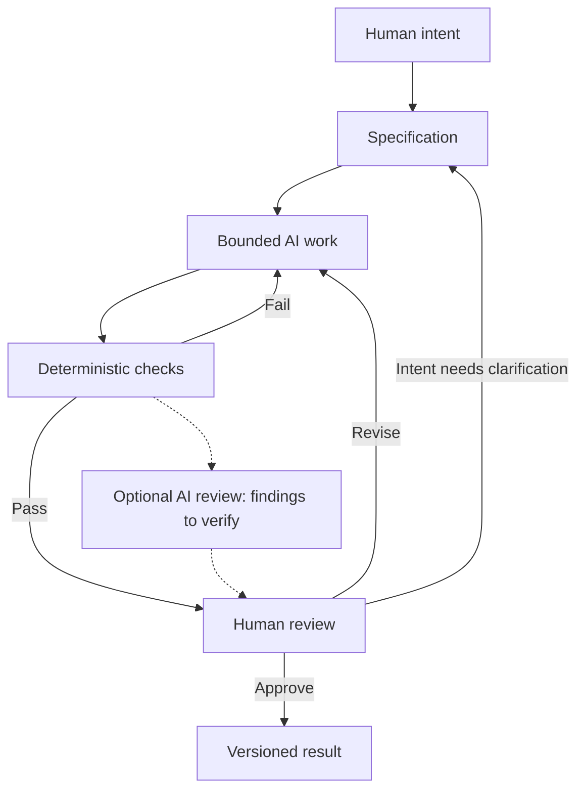

# Chapter 5: Directing the Work, Checking the Result

We have asked one white T-shirt to carry a surprising amount of meaning. It has suggested adventure, informed choice, resistance, and belonging. Its physical qualities stayed constant while the invitation changed.

The useful skill is learning to connect an intention with a set of choices you can explain. That skill becomes especially important when AI can generate more copy, layouts, or code than you can comfortably inspect line by line.

## Three Lenses, One Direction

| Lens | Guiding question | White T-shirt example | What to review |
| --- | --- | --- | --- |
| Persuasion | What response are we trying to enable? | Help someone compare fit before deciding. | Are reasons clear, claims supported, and refusal easy? |
| Archetype | What meaning or identity are we expressing? | Sage: the buyer as an informed decision-maker. | Does the invitation fit the audience without stereotyping it? |
| Design language | How should that meaning look and feel? | A restrained grid with readable specifications. | Does the visual hierarchy support understanding? |

Together, these lenses form a high-level control framework. They turn a vague request such as “make it compelling” into a direction with reasons behind it. They still leave room for creative decisions and for the audience to interpret the result differently.

For example, a Rebel campaign can use orderly product information. A Sage campaign can have warmth. Coherence means that the choices support the intended experience; it does not require every element to repeat a stereotype.

## Turn Intent into a Specification

A **specification** states what the work should accomplish and the boundaries it must respect. It should identify the audience, intended response, output file or format, required content, fixed facts, and acceptance criteria.

Compare these two requests:

**Vague:** Make an exciting advertisement for a white T-shirt.

**Bounded:** Draft one Markdown campaign concept for students interested in everyday exploration. Use an Explorer archetype and an open, readable editorial layout. Invite curiosity while acknowledging that no purchase is needed to explore. Keep the supplied shirt facts and price unchanged. Include a headline, short story, imagery direction, product-information plan, and ethical risk. Label fictional copy and do not invent reviews, environmental claims, performance data, or sources. Save only the requested draft file.

The second request gives AI room to generate language while protecting decisions that should not drift. A supplied fact sheet would still be needed for actual product claims; missing information should remain explicitly unresolved.

You can use the same approach for technical work. If a later task asks for a size-selector interface, specify how selection works, what happens when a size is unavailable, what keyboard users should be able to do, and which files may change. The creative direction explains the intended experience; functional criteria make implementation reviewable.

## Give AI a Bounded Job

AI can draft alternatives, identify inconsistencies, or propose revisions. Break a larger project into outputs small enough to inspect: one chapter, one campaign concept, or one interface behavior.

For each task, make three things explicit:

1. **Inputs:** the brief, verified facts, references, and current files.
2. **Allowed work:** the named output and changes needed to produce it.
3. **Evidence of completion:** required sections, relevant checks, and unresolved questions.

An instruction to improve a chapter should not silently become permission to redesign the whole repository. A request for campaign ideas should not silently become permission to publish them. Clear scope protects both the work and the person reviewing it.

## Three Kinds of Review

Different questions need different kinds of evidence. A fast automated check, an AI critique, and a human reading do complementary jobs.

| Review method | Useful question | Example | Important limit |
| --- | --- | --- | --- |
| Deterministic automated check | Does the output satisfy an explicit rule? | Do all five chapter files exist and contain text? | Presence does not establish quality or truth. |
| Probabilistic AI review | What potential problems deserve attention? | Where does the Explorer story imply unsupported performance? | AI can miss a problem or report one incorrectly. |
| Human judgment | Is this work appropriate, meaningful, and ready? | Does the invitation respect this audience's circumstances? | People also need evidence, time, and relevant perspectives. |

### Deterministic Checks: Cheap and Repeatable

A deterministic check applies a defined rule consistently to the same inputs in the same environment. For Markdown, useful checks can verify required files, resolve relative chapter links, detect trailing whitespace, or parse Mermaid syntax. These checks are inexpensive to repeat after changes.

Be precise about what was tested. Finding a Mermaid code fence does not establish that the diagram parses. A successful link check does not establish that the linked source supports the claim. A correctly named chapter can still contain an inaccurate explanation.

This repository's practical workflow checks for required nonempty textbook files and reports counts of issue references and Mermaid code fences. Those are useful structural signals. They cannot decide whether a chapter is thoughtful or whether its sources are accurate. Because the file check expects the complete book, intermediate chapters can fail it until the remaining chapters exist.

### AI Review: Useful, but Probabilistic

AI review is probabilistic: its judgments can vary, and a fluent explanation is not proof. It can help locate likely contradictions, unclear passages, missing requirements, or unsupported claims. It can also share assumptions with the AI that created the draft.

A useful review request asks for specific evidence: identify the sentence, explain the concern, connect it to a requirement, and suggest a revision. For the T-shirt campaign, ask which words imply a product quality that the fact sheet does not establish.

Then inspect the finding. An AI reviewer cannot verify a museum object by inventing a plausible collection link. Follow the actual institutional record. Treat uncertain findings as leads to investigate rather than facts to paste into the chapter.

### Human Review: A Deliberate Pit Stop

Imagine a race car with instruments continuously reporting conditions. The instruments are useful, but a pit stop creates a deliberate moment to inspect the car, replace what needs attention, and decide whether it is ready to return to the track.

AI-assisted work benefits from similar moments. Automation can keep running checks and preparing drafts while selected milestones receive focused human inspection: choosing the brief, approving a direction, reviewing a completed change, and deciding whether to merge or publish it. The metaphor does not mean speed is the highest goal or that unreviewed work should automatically go live.

At a review stop, ask what changed, what evidence supports it, and what remains uncertain. People remain responsible for judgment, meaning, truthfulness, cultural context, and final decisions. If a campaign represents a community, review may need that community's perspective, not just the designer's preference.

## Why Git Matters When AI Generates Work

Git records versions of tracked files in commits. A **diff** shows what changed between versions. A **branch** lets a bounded change develop separately, and a **pull request** presents it for review and discussion before merging.

This provides traceability: an issue describes the purpose, a commit records a change, and the pull request connects implementation with review evidence. Writing the relevant issue number in a commit message helps explain why that version exists.

Version history also supports recovery. If a revision weakens a chapter, you can compare it with an earlier committed version and restore selected content through a new change. Git cannot recover every unsaved idea or guarantee that a committed statement is true. Commit messages and review still need care.

Before committing AI-generated work, inspect the diff for changes outside the requested files. After merging, update your local checkout so the next task starts from the shared result. Use the repository's actual default branch: this repository uses `master`, even though the root exercise README uses `main` in its examples.

## A Complete Workflow

Drafts can be committed along the way; “versioned result” marks the reviewed outcome. Passing checks makes a draft ready for further review, not automatically ready for publication. The complete loop should preserve both the result and the reasons for accepting it.

## Questions for Next Week

1. Which T-shirt concept would you revise for an audience you know, and why?
2. Which AI-generated sentence is strongest, and which feels generic or unsupported?
3. What did you change after reviewing the draft, and what improved?
4. Which museum or institutional record will you verify to deepen Chapter 3?
5. What can the repository's automated checks establish, and what can they not establish?
6. Can you use an issue, commit, and pull request to explain how one chapter developed?
7. Where would you place a human review stop in your next AI-assisted project?

## What You Should Remember

- Persuasion sets the intended response, archetype organizes meaning, and design language gives it form.
- A bounded specification gives AI a useful job and makes the result easier to review.
- Deterministic checks test rules; AI review suggests concerns; humans evaluate meaning and evidence.
- Git makes committed changes traceable and recoverable, but does not guarantee their quality.
- Deliberate human review turns generated material into work you can explain and take responsibility for.
