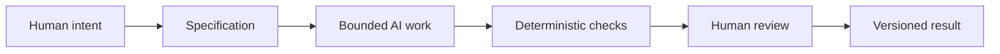

# Synthesis: Persuasion, Archetpyes, and Design Language

## A framework for guiding AI-assisted work

The three lenses in this guide work well together because each one answers a different question:

- Persuasion helps answer: What response are we trying to enable?
- Archetype helps answer: What meaning or identity are we expressing?
- Design language helps answer: How should that meaning look and feel?

Taken together, they form a useful control framework for creative and technical work. They help say what a product is for, what story it carries, and how that story should be communicated.

This framework is also useful when working with AI tools. A good AI prompt is not just a request for output. It is a bounded design task with direction, constraints, and context.

## Why specification matters

AI is useful because it can generate first drafts quickly, but it works best when the task is clear. If the task is vague, the model may produce broad, generic, or misleading work. A strong specification clarifies:

- the audience
- the purpose
- the constraints
- the desired tone
- the required format
- the evaluation criteria

A specification reduces ambiguity. It turns a fuzzy request into a workable brief.

## Why version control matters

Git matters because it creates a traceable history of decisions. When AI generates drafts, experiments, or revisions, version control makes it possible to review what changed, revert mistakes, and compare iterations without losing context.

This is especially valuable in practical work because AI output can be convincing even when it is weak. Version control gives a human a way to inspect revisions, restore earlier versions, and understand the path from intent to result.

Without version control, an AI-assisted workflow can become chaotic. A single unclear prompt or a mistaken output can be hard to untangle.

## Why deterministic checks are useful

Automated checks are valuable because they are cheap, repeatable, and predictable. In a technical workflow, a check might confirm that a file exists, that a build passes, or that a Markdown file is present and structured correctly.

These checks do not replace judgment. They reduce the cost of repeated validation. A deterministic check is useful because it can be run constantly without getting tired or distracted.

## Why AI review can help, but remains probabilistic

AI can be useful as a reviewer because it can scan for gaps, identify missing sections, suggest alternative phrasing, and compare a draft against a checklist. This makes it a fast assistant for editorial review.

But AI review is probabilistic, not deterministic. It can be good, wrong, confident, or vague. It may miss context, overgeneralize, or invent a pattern that sounds plausible but is not truly grounded in the source material.

This is why a human still matters at selected moments of deliberate review. A good rule is to treat AI as a fast helper, not an authority.

## The pit-stop metaphor

Think of human review like a race-car pit stop. A race car can keep moving, but at certain moments the team makes a deliberate stop for inspection, repairs, fuel, and judgment. In the same way, automation can keep running, but selected moments deserve careful human attention.

Humans are needed to check:

- meaning
- truthfulness
- intent
- appropriateness
- fairness
- context
- quality

A successful AI workflow is not “AI does everything.” It is “AI helps move work forward while humans keep responsibility for judgment.”

## The complete workflow

This is the practical lesson of the whole guide: a thoughtful process makes outputs better than raw speed alone.

## Questions for Next Week

- What kinds of AI work in your field need stricter specification?
- Where do you think AI review is most useful, and where does it become risky?
- How can version control improve trust in a team process?
- What would make a design brief more clear and less ambiguous?
- How do you decide when a draft is ready for human judgment?

## What You Should Remember

- Persuasion, archetypes, and design language are three ways of shaping meaning.
- A good specification is a boundary that makes AI output more useful.
- Git gives traceability and recovery.
- Deterministic checks help with fast validation.
- AI review is helpful but uncertain.
- Human judgment remains essential for context, truthfulness, and final responsibility.

## Final note

A strong system does not remove human thinking. It makes human thinking more intentional. That is the deeper lesson behind the textbook, the briefs, and the Git workflow itself.
